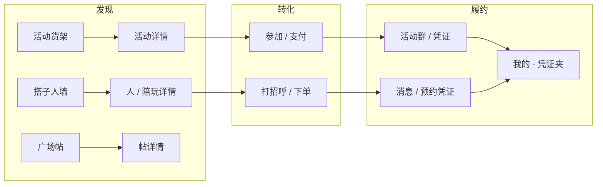

# 坐标系 · 导航、功能与结构框架

> 基于当前代码库梳理的产品架构说明。**文档同步：2026-09-29**  
> **文档体系**：[README.md](README.md) · 需求 [PRD.md](PRD.md) · 规范 [DevelopmentGuide.md](DevelopmentGuide.md) · 上线 [ReleaseReadinessAudit.md](ReleaseReadinessAudit.md) §0  
> 设计参照：[DESIGN_SYSTEM.md](../DESIGN_SYSTEM.md)、[BuddiesProductPlan.md](BuddiesProductPlan.md)、[TrustBehaviorModel.md](TrustBehaviorModel.md)。  
> Apple 侧灵感：App Store Today / Photos Zoom / PassKit / Settings Form / TabView（iOS 26）等原生模式。

---

## 1. 一句话产品结构

| 板块 | 卖什么 | 一句话 |
|------|--------|--------|
| **活动** | 场 | 发现一场局 → 读懂 → 参加 / 支付 |
| **搭子** | 人 | 找人玩：免费同好 / 付费预约 |
| **广场** | 内容 | 活动相关图文分享与复盘 |
| **消息** | 关系与履约沟通 | 好友 / 群聊 / 通话 |
| **我的** | 身份与资产 | 账号、订单、凭证、信任、设置 |

入口链路：

```
未登录 → Launch（信封 / 登录）→ 协议勾选与登录分离
已登录 → TabView 五 Tab
  └─ 首次进入活动 Tab → AppWelcomeGuideView（1 页意图选择，可跳过）
       └─ 完成后写入默认兴趣 + 可选 smart filter / 搭子 landing
       └─ 活动 Tab 条件显示「下一场」摘要 Banner（≤7 天窗口）
兴趣维护 → 我的 → 编辑资料 → InterestTaxonomyFormEditor
```

实现：`坐标系App` → `ContentView` → `AppModel` + 各 Feature `@Observable` Model。

---

## 2. 导航框架

### 2.1 一级：系统 TabView

| Tab | 符号 | 根视图 | 顶栏标题 |
|-----|------|--------|----------|
| 活动 | `calendar` | `ActivitiesView` | 动态分类（如「猜你喜欢」）+ 可点标题菜单 |
| 搭子 | `person.2` | `BuddiesView` | 「搭子」 |
| 广场 | `bubble.left.and.bubble.right` | `CommunityView` | 可按产品生命周期并入活动 Tab「活动分享」 |
| 消息 | `message` | `MessagesView` | 「消息」（未读 badge） |
| 我的 | `person.crop.circle` | `ProfileView` | 「我的」 |

顺序与 `ContentView` 一致：活动 → 搭子 → 广场 → 消息 → 我的。

顶栏共用 chrome：`Design/PlatformTabRootChrome.swift`  
（`inlineLarge` 大标题 + 空 `principal` + `platformTabRootToolbar`）

参考 Apple：**iOS TabView**（系统折叠 / Liquid Glass）、**Photos / Mail** 式 `inlineLarge` 标题。

### 2.2 二级：每 Tab 独立 NavigationStack

每个 Tab 根页各自持有 `NavigationStack(path:)`（多为 `TabNavigationState`），目的地在**栈根注册一次**。

| 模式 | 类型 / Helper | 用途 | Apple 参照 |
|------|---------------|------|------------|
| 活动 Zoom | `ActivityZoomSource` + `activityZoomNavigationDestination` | 发现卡 → 详情；凭证长条 → 展开票面 | Photos Zoom / matched geometry |
| 搭子 Zoom | `BuddyZoomRoute` + `buddyZoomNavigationDestination` | 人墙卡 → 资料 | 同上 |
| 圈子浏览 | `CircleBrowseRoute` + `circleBrowseNavigationDestination` | 俱乐部信息 / 成员 | 程序化 `path`，避免 Lazy 多层 Link |
| Sheet 内栈 | `independentNavigationSheetChrome` | Sheet 清继承标记后再注册目的地；关闭用 `\.dismiss` + `TabNavigationState` | Sheet 继承 Environment 陷阱 |
| 广场 | `NavigationPath` + 类型目的地 | 帖子 / 关联活动 / 内容库 | 标准 `navigationDestination` |
| 我的 | `ProfileRoute` | 钱包、订单、凭证、信任、设置 | Settings 式推入 |

**硬规则（与代码一致）：** 同一 `NavigationStack` 内同类型 `navigationDestination` 只保留栈根一份；Sheet 勿误用父栈「已注册」标记。

### 2.3 三级：Sheet / 半模态

| 场景 | 典型 Sheet |
|------|------------|
| 活动 | 发起 / 编辑、筛选、参加确认、支付、成功、举报、评论 |
| 搭子 | 筛选、邀约、预约下单、圈子加入、语音厅相关 |
| 广场 | 发分享、更多操作 |
| 消息 | 发起聊天、加好友、资料卡 |
| 我的 | 编辑资料、登录 / 创建账号、退款申请 |

### 2.4 跨 Tab 深链（`AppDeepLink` → `AppRouter` → `AppModel`）

待消费导航意图集中在 `Services/AppRouter.swift`：`AppDeepLink` 枚举统一活动 / 会话 / 预约 / 我的路由，`router.apply(_:selectedTab:)` 写入 pending 字段并切换 Tab。

| API | 切到 | 效果 |
|-----|------|------|
| `openActivity(_:)` | 活动 | 打开活动详情 |
| `openMessages(...)` | 消息 | 打开会话（可聚焦消息 / 通话） |
| `openMyBookings(...)` | 我的 | 陪玩凭证列表或单条详情 |
| `openClubDiscover()` | 搭子 | 免费同好页 + 俱乐部发现 |
| `beginComposeActivity()` / `beginEditActivity` | 活动 | 打开发起 / 编辑 |
| `openActivityGroupChat(for:)` | 消息 | 活动 → 群聊 |
| 通知深链 | 路由分发 | 活动 / 会话 / 预约 |

参考 Apple：**UNNotification** 深链进对应场景；多 Tab 用 pending 字段消费，避免跨栈硬推。

---

## 3. 核心板块与功能分类

### 3.1 活动（场）

**职责：** 发现与参加线下 / 组局面。

| 能力类 | 功能 |
|--------|------|
| 发现 | 分类标题菜单（猜你喜欢为首）、精选 Hero、推荐货架、搜索式筛选 |
| 详情 | Form 决策信息（时间地点费用名额）、评论、相关活动 / 同城俱乐部推荐；日历提醒仅已参加 / 主办可见 |
| 转化 | 参加确认、演示支付、加入活动群 |
| 主办 | 发起 / 编辑、管理名额与改期、取消与退款演示 |
| 凭证 | 参加后 App 内活动凭证（「我的」夹）；可选导出 Apple Wallet |

**结构节奏：** App Store Today 货架（Hero + 分区轨）→ Photos Zoom 进详情 → Settings Form 决策。

**关键路径：** `Features/Activities/`、`ActivitiesModel`、`Design/ActivityZoomNavigation.swift`

---

### 3.2 搭子（人）

**职责：** 找人玩。活动卖场，搭子卖人（见 [BuddiesProductPlan.md](BuddiesProductPlan.md)）。

```
找人玩
├─ 免费（同好）  打招呼 / 邀约去某场
└─ 预约（陪玩）  选档期 / 支付 / 履约
```

| 能力类 | 免费路径 | 预约路径 |
|--------|----------|----------|
| 浏览 | 精选横滑 + 附近双列墙 | 意图入口、热门、排行榜、更多服务者 |
| 匹配 | 兴趣 / 距离 / 活跃排序 | 擅长、档期、价、认证 |
| 行动 | 打招呼、邀约活动 | 私信、快速下单、履约凭证 |
| 次要 | 同城俱乐部 | 语音厅 |

**关键路径：** `Features/Buddies/`、`BuddiesModel`、`Features/Buddies/BuddyZoomNavigation.swift`

---

### 3.3 广场（内容）

**职责：** 活动相关种草 / 复盘流，**不做找人**。

| 能力类 | 功能 |
|--------|------|
| 信息流 | 图文帖列表、详情、点赞 / 收藏 / 评论 / 转发 |
| 创作 | 发分享（可关联活动） |
| 内容库 | 收藏的分享、赞过的、我的分享 / 转发、社区公约 |

**结构节奏：** 系统 `List` 信息流（接近 Apple News / 系统 Feed 密度），非货架。

**关键路径：** `Features/Community/`、`CommunityModel`

---

### 3.4 消息（沟通）

**职责：** 关系网与履约沟通通道。

| 能力类 | 功能 |
|--------|------|
| 收件箱 | 好友会话 + 群聊同一列表；搜索会话 / 历史 |
| 通讯录 | 好友列表、好友请求（角标） |
| 会话 | 文本时间线、快捷模版、群昵称等 |
| 关系 | 加好友（UID）、发起私聊 / 建群 |
| 通话 | 通话会话记录 / 演示页 |

**结构节奏：** Messages 式列表 + 会话栈；顶栏通讯录入口。

**关键路径：** `Features/Messages/`、`MessagesModel`、`PlatformMessagesChrome`

---

### 3.5 我的（身份与履约资产）

**职责：** 账号、商业、凭证、信任、合规设置。

| 能力类 | 功能 |
|--------|------|
| 身份 | 头像昵称、编辑资料、兴趣完善、访客 / 登录 |
| 商业 | 会员、钱包、订单（活动 + 陪玩） |
| 凭证 | 活动凭证夹、陪玩预约凭证、活动邀约；Zoom 展开 App 内票面；分享纪念票；Wallet 在「更多」 |
| 社交资产 | 俱乐部、内容库入口等 |
| 信任 | 行为信用私有看板、公开片段、安全签到、真人认证 |
| 设置 | 隐私、通知、青少年、退出等合规运维 |

**结构节奏：** Settings 式 `List` / `Form`；活动行程凭证为 **App 内票面**（`ActivityJourneyCredentialFace`）+ CredentialArt 彩绘；PassKit 链路仅负责可选导出。

**关键路径：** `Features/Profile/`、`Features/Profile/Credential/`、`Features/Trust/`、`Services/PassKit/`、`Design/CredentialArt/`

---

### 3.6 横切能力（非 Tab，全局支撑）

| 板块 | 作用 | 主要落点 |
|------|------|----------|
| **Launch** | 品牌信封、本地登录、半屏欢迎引导 | `Features/Launch/`、`AppWelcomeGuideView` |
| **信任账本** | 行为事件 → 四轴信用（非星级墙） | `Services/Trust/` + [TrustBehaviorModel.md](TrustBehaviorModel.md) |
| **钱包 / 支付 / 退款** | 演示支付、Pass、退款策略 | `WalletStore`、`RefundFlow`、PassKit |
| **位置 / 天气** | 附近排序、问候天气 | `LocationService`、`GreetingWeatherStore` |
| **通知** | 提醒与深链 | `NotificationService`、`AppNotificationRouter` |
| **同步编排** | 报名 / 发帖等域事件驱动群聊与统计 | `AppDomainEvent`、`AppSyncOrchestrator` |
| **设计系统** | 语义色、货架几何、Zoom / 票面组件 | `Design/`、`DESIGN_SYSTEM.md` |

---

## 4. 工程结构（代码地图）

```
坐标系/
├── ContentView.swift              # TabView 根视图
├── Design/                        # 平台 chrome、货架卡、Zoom、票面、Tab 根标题
│   ├── PlatformSemantics.swift    # 语义色 / 状态色 / 品牌 accent（无间距 token）
│   ├── PlatformMetrics.swift      # 间距 / 圆角 / 形状 token（静态，不探测 UIKit）
│   ├── PlatformChromeMeasurements.swift  # 系统控件边长：View 探针 + PreferenceKey（MainActor）
│   ├── PlatformListAvatar.swift
│   ├── PlatformToolbarChrome.swift
│   ├── PlatformConversationListChrome.swift
│   ├── PlatformActivityChrome.swift
│   ├── PlatformFeedback.swift
│   ├── PlatformTabRootChrome.swift
│   ├── CredentialArt/            # 行程凭证 SVG 着色（CredentialArtTheme 白名单）
│   ├── WalletPassFace.swift      # 「我的」夹长条预览
│   └── WalletPassStack.swift
├── Features/
│   ├── Activities/                # +Browse / +Participation / +ParticipationJourney / +Hosting / +DemoJourney；Detail / NextUp
│   ├── Buddies/                   # +Browse / +Organization / +Invites / +Bookings；BuddyZoomNavigation
│   ├── Community/                 # +Engagement / +Compose / +Moderation
│   ├── Messages/                  # +DirectChat … +Persistence（多扩展）
│   ├── Profile/
│   │   └── Credential/           # 活动行程凭证：票面 / 纪念分享 / CredentialArtCatalog
│   ├── Trust/
│   └── Launch/
├── Resources/CredentialArt/       # SVG 模板（ACCENT_* 占位符）
├── Models/
│   ├── AppPersistence.swift       # 目录升级；演示数据重置（持久化 I/O 走 Repository / @ModelActor）
│   ├── CommunityPhotoStore.swift  # 本地媒体底层；Feature 请经 LocalMediaLibrary
│   ├── ActivitiesSnapshotCatalog.swift
│   ├── MessagesSnapshotCatalog.swift
│   ├── BuddiesSnapshotCatalog.swift
│   ├── CommunitySnapshotCatalog.swift
│   ├── ProfileSnapshotCatalog.swift
│   ├── EngagementSnapshotCatalog.swift
│   ├── PersistenceSnapshotSeeds.swift
│   ├── EntityPresentation.swift # Activity 封面等 App 展示扩展
│   ├── Models.swift               # 非 SPM 实体（搭子墙、圈子、UI 筛选等）
│   └── SampleData.swift
└── Services/
    ├── AppModel/                  # Navigation / Activities / Profile / Moderation
    ├── AppDependencies.swift      # Features 注入门面
    ├── AppComposition.swift       # Repository / Store 装配（含 TrustBehaviorLedger）
    ├── LocalMediaLibrary.swift    # Feature 本地媒体门面 → CommunityPhotoStore
    ├── Persistence/               # @ModelActor 快照 I/O、旧 JSON 迁移、AppPersistenceHealth
    │   ├── DomainSnapshotModelActor.swift
    │   ├── RecentBrowseModelActor.swift
    │   ├── AppPersistenceHealth.swift
    │   └── PersistenceMigration.swift
    ├── SwiftDataSnapshotStore.swift   # MainActor Gateway + PersistenceWriteFailureReporter
    ├── SwiftDataSnapshotRegistry.swift
    ├── SwiftDataSnapshotRepositories.swift
    ├── WelcomeGuideStore.swift
    ├── ActivityCalendarStore.swift
    ├── ContentModeration.swift
    ├── MessagingDeliveryPolicy.swift
    ├── CommercePaymentPolicy.swift
    ├── Remote*Repository.swift
    └── API/                       # APIConfiguration、Endpoint 快照扩展、Shared Client
Packages/
└── CoordinateKit/
    ├── CoordinateModels/          # 实体 + 五域 Snapshot（Codable）
    ├── CoordinateDomain/          # SnapshotRepository、LocalPersistenceCoordinator、UseCases
    ├── CoordinateData/            # LocalSnapshotFileStore；六域 Local* / InMemory* 仓库
    ├── CoordinateNetworking/      # APIClient、APIEndpoint、APIError
    └── CoordinateFeatureFlags/    # FeatureFlags
Docs/                              # 本目录 + DESIGN_SYSTEM.md
```

### 数据层概览

| 层 | 内容 |
|----|------|
| 枢纽 | `AppModel`：选中 Tab、各域 Model、用户 / 鉴权；`AppRouter` + `AppDeepLink`；`WelcomeGuideStore` |
| 域 Model | `ActivitiesModel`、`BuddiesModel`、`CommunityModel`、`MessagesModel` |
| Repository | `CoordinateDomain` 协议 + `CoordinateData` 本地 I/O + App `Remote*` / `SwiftData*Repository` | 五域 + engagement 快照均已迁入 `CoordinateData`；App 层可选 SwiftData |
| 快照类型（SPM） | `CoordinateModels`：五域 `*Snapshot` + `Activity` / `ChatConversation` / `AppUser` 及消息实体；`.seed` 工厂在 `Models/PersistenceSnapshotSeeds.swift` |
| API | `APIClient` + `APIEndpoint`（活动 / 资料 / 消息 / 广场 / 搭子快照端点） |
| 偏好 Store | `MembershipStore`、`NotificationPreferencesStore`、`PrivacyPreferencesStore`、`YouthModeStore`、`LegalConsentStore`、`MembershipAdImpressionStore` | 会员 / 通知 / 隐私 / 青少年 / 协议 / 广告曝光 |
| 搭子 Model | `BuddiesModel+Browse` / `+Organization` / `+Invites` / `+Bookings` | 发现 / 圈子 / 邀约 / 预约扩展 |
| 广场 Model | `CommunityModel+Engagement` / `+Compose` / `+Moderation` | 互动 / 发帖 / 审核 |
| 消息 Model | `MessagesModel+DirectChat` / `+GroupChat` / `+ConversationDetail` / `+ConversationSharing` / `+Calling`；`+RichPayloads` / `+GroupAdmin` / `+FriendRequests` / `+FriendProfile` / `+Search` / `+Persistence` | 会话 / 群管 / 好友 / 搜索 |
| 活动 Model | `ActivitiesModel+Browse` / `+Participation` / `+ParticipationJourney` / `+Hosting` / `+DemoJourney` | 发现货架 / 参加候补 / 行程进度 / 主办 / 演示种子 |
| 组合根 | `AppDependencies`（Features 唯一注入入口）+ `AppComposition`（实现细节） |
| 持久化边界 | `PersistenceBoundary.swift`：`PersistenceDomain` × `PersistenceBackend` |
| SwiftData Schema | `AppSwiftDataSchemaV1` + `AppSwiftDataMigrationPlan`；`AppSwiftDataContainer.makeProduction()` |
| 实体 | `Activity`、`DiscoverBuddyItem`、圈子 / 语音厅、帖、会话、订单与凭证记录等 |
| 持久化 | 五域 + engagement → SwiftData `@ModelActor`；最近浏览 → `RecentBrowseModelActor`；JSON 回退走 `LocalSnapshotFileStore` |
| 并发 | 见下表「Repository 并发模型」 |
| 测试 / CI | Domain **50** + Networking **2** + App **49**（合计 **101**）；`.github/workflows/ios-test.yml` |

#### 持久化边界（`PersistenceBoundary`）

| 域 | 后端 | 是否拆真 `@Model` |
|----|------|-------------------|
| 五域 + engagement 快照 | `swiftDataSnapshotBlob` | 计划拆（过渡期 blob） |
| 最近浏览 | `swiftDataEntity`（`RecentBrowseItem`） | ✅ 已是 |
| 活动订单 / 钱包凭证 / 退款 / 信任流水 | `jsonFile` | ❌ 永久 JSON |
| 会员 / 通知 / 隐私 / 协议 | `userDefaults` | ❌ 偏好类 |

Schema 演进：改 `@Model` 字段时升 `AppSwiftDataSchemaVn` 并添加 `MigrationStage`。

#### DI 边界

- **Features**：`*Model` 构造参数全部必填；**零** `AppComposition`（CI 强制）
- **App / Preview / Tests**：`AppDependencies.live` / `.preview()` / `.inMemoryForTests()`
- **Views**：`@Environment` + `AppModel.preview`

#### Repository 并发模型

| 路径 | 读 | 写 | generation 失效 |
|------|----|----|----------------|
| SwiftData（默认） | `SwiftDataSnapshotGateway` MainActor 内存缓存；`bootstrap()` 经 `@ModelActor` 预热 | 同步 `save()` 先更缓存再 `Task { @MainActor in await actor.save }`；`saveAsync` 直写 actor 并校验 generation | `invalidatePendingWrites()` → `LocalPersistenceCoordinator`；`saveAsync` 在 actor 落盘前检查 |
| JSON 回退（`FeatureFlags.useSwiftDataSnapshots = false`） | 同步 `LocalSnapshotFileStore.load` | `Local*Repository.save` → `LocalSnapshotFileStore.save`（+ generation） | 同上 |
| 最近浏览 | `@Query` 读主上下文 | `RecentBrowseModelActor` 写入 / 清空 | 无（单写者 actor） |

启动顺序：`坐标系App` 注入 `ModelContainer` → `SwiftDataSnapshotRegistry.attach` → `ContentView.runDeferredStartup` 内 `bootstrapPersistence()` → 构造 `AppModel`。

跨 actor 只传 **Sendable Codable 快照**或 `ModelContainer`，不传 `@Model` 实例（Apple SwiftData 并发准则）。

域 Model 串联落盘：`MainActorPersistence.chained`；`SnapshotRepository` 标 `@MainActor`（`CoordinateDomain`）。`Remote*Repository` 与 `APIClient`（`Sendable`）见 [DevelopmentGuide §7.6–7.9](DevelopmentGuide.md#76-model-异步落盘-mainactorpersistence)。

#### UI 与 MainActor（与 [DevelopmentGuide.md §7](DevelopmentGuide.md#7-并发mainactor-与-ui) 一致）

|  Concern | 落点 | 规则 |
|----------|------|------|
| 组合根 / View 树 | `PlatformChromeRoot`（`坐标系App`） | `.environment(\.platformChromeMeasurements, …)` 覆写 EnvironmentKey 默认 |
| 系统控件边长 | `PlatformChromeMeasurements` | `@Environment(\.platformChromeMeasurements)` + PreferenceKey 探针 |
| 静态几何 token | `PlatformMetrics` | `grid` / `contentInset` / 圆角 / 比例；**禁止** UIKit 静态探测 |
| Sheet 回退 | `TabNavigationState` + `\.dismiss` | 不用自定义 dismiss Environment |
| PhotosPicker | `PlatformPhotosPickerCopy` + 预览与 label 分离 | 闭包内仅 `String`；见 DevelopmentGuide §7.7 |

当前为 **本地优先架构**：样例数据 + 本地持久化 + 可选远程活动目录同步；领域边界已按上表切开，接真实 API 时新增 `Remote*Repository` 即可，View 层无需改动。

### 当前分层架构

```
┌─────────────────────────────────────────────────────────┐
│  Features (SwiftUI Views + @Observable Models)          │
└───────────────────────────┬─────────────────────────────┘
                            │ any *Repository / @Environment
┌───────────────────────────▼─────────────────────────────┐
│  AppDependencies → AppRepositories / Store / UseCases    │
│  AppComposition（Repository 装配、SwiftData 注册细节）    │
└───────────────────────────┬─────────────────────────────┘
                            │
        ┌───────────────────┼───────────────────┐
        ▼                   ▼                   ▼
 CoordinateData      CoordinateDomain    CoordinateNetworking
 (Local/InMemory)      (协议 + UseCase)       (APIClient)
        │                   │
        └─────────┬─────────┘
                  ▼
           CoordinateModels
```

### 工程阶段（历史记录）

> 新功能开发以 [DevelopmentGuide.md](DevelopmentGuide.md) 与 [PRD.md](PRD.md) 为准；下表仅记录已完成的迁移里程碑。

| 阶段 | 状态 | 内容 |
|------|------|------|
| Phase 0 | ✅ | `SWIFT_STRICT_CONCURRENCY=complete`（App + SPM）；CI `check-imports.sh`（含 Features 禁 `CoordinateData`） |
| Phase 1.1 | ✅ 活动试点 | `CoordinateData` + `LocalActivitiesRepository` + `AppComposition` |
| Phase 1.2 | ✅ 五域齐全 | 消息 / 搭子 / 广场 / 资料 JSON I/O + `*SnapshotCatalog` |
| Phase 1.3 | ✅ 收尾 | JSON 经 `LocalSnapshotFileStore`；`EngagementRepository` → `CoordinateData`（`SnapshotFileActor` 未接线，见 Archive） |
| Phase 1.4 | ✅ 并发统一 | `@ModelActor` 快照读写；`SnapshotAsyncPersistenceBackend` + generation；`PersistenceMigration` |
| Phase 2 | ✅ | Model 瘦身 + Environment DI；活动/搭子 UseCase 下沉 Domain |
| Phase 2.1 | ✅ 活动参与 | `JoinActivityUseCase` 等 + `ActivitiesModel+Participation` 瘦身 |
| Phase 2.2 | ✅ 浏览 / 预约 | `FilterActivitiesBrowseUseCase` + `BuddiesBookingUseCases` |
| Phase 2.3 | ✅ Store 注入 | `ActivityEngagementStore` / `ProfileRecentBrowseStore` → `AppDependencies` + Environment |
| Phase 2.4 | ✅ 商业 / 信任 | 商业 Store → `AppDependencies` → `AppModel` / `@Environment` |
| Phase 2.5 | ✅ 偏好 Store | 偏好 Store → `AppDependencies` + `@Environment` |
| Phase 2.6 | ✅ 定位 / 天气 | `LocationService` / `GreetingWeatherStore` → `AppDependencies` |
| Phase 3.1 | ✅ 活动试点 | `DomainSnapshotEntity` + `SwiftDataSnapshotStore` |
| Phase 3.2 | ✅ 五域齐全 | 消息 / 搭子 / 广场 / 资料 SwiftData；`FeatureFlags.useSwiftDataSnapshots` |
| Phase 3.3 | ✅ engagement | 隐式兴趣快照迁入 SwiftData；Phase 3 闭环 |
| Phase 3 | ✅ | 五域 + engagement 均已 SwiftData |
| Phase 4.1 | ✅ Service DI | `RefundFlowService` / `ActivityPaymentStore` / `GreetingWeatherStore` 注入化 |
| Phase 4.2 | 持续 | 商业 JSON 保持（见 `PersistenceBoundary`）；快照 blob 逐步拆真 `@Model` |
| Phase 4.3 | ✅ Schema | `VersionedSchema` V1 + `SchemaMigrationPlan` + `AppSwiftDataContainer` |
| Phase 4.4 | ✅ DI 收口 | `AppDependencies`；Features 零 `AppComposition` |
| Phase 5.1 | ✅ Domain 单测 | `Packages/CoordinateKit` `CoordinateDomainTests` + CI `swift test` |
| Phase 5.2 | ✅ App 分层 | 去重 App 层 UseCase 重复测试；`CorePersistenceTests` 保留 Model 集成 |

### 状态字段表（易混项）

完整语义表见 **[PRD.md §6](PRD.md#6-状态与数据产品语义)**（单一事实源）。本节仅列工程侧扩展项：

| 字段 / 存储 | 位置 | 语义 |
|-------------|------|------|
| `pendingActivityID` 等 | `AppRouter` | 跨 Tab 待消费深链，消费后清空 |
| 日历 event 映射 | `ActivityCalendarStore` | activityID ↔ EventKit identifier |
| `BookingOrderStatus` | `CoordinateModels/BuddyRecords.swift` | 陪玩预约状态机；产品语义 **[PRD §6.3–§6.5](PRD.md#63-陪玩预约订单状态bookingorderstatus)** |

### 代码评审

PR / 发布自检见 **[DevelopmentGuide.md §9.2](DevelopmentGuide.md#92-pr-自检清单复制到-pr)**；产品验收见 **[PRD.md §8](PRD.md#8-v1-发布检查清单)**。

---

## 5. 用户主路径（漏斗）



**转化原则（设计系统）：** 详情首屏只留决策信息；长说明下沉；每屏只保留一个 Primary CTA（见下节）。

---

## 6. 各界面最重要操作（Primary CTA）

按「这一屏最该完成的事」定主按钮；实现上详情底栏用 `activityDetailBottomPrimaryCTA`，次要用 Secondary。

### 6.1 Tab 根页

| 界面 | 最重要操作 | 位置 / 说明 |
|------|------------|-------------|
| **活动** | **参加**（卡上） | Hero / 货架卡右下角；顶栏「发起活动」为供给侧次要主入口，「筛选」为条件入口 |
| **搭子 · 免费** | **打招呼** | 人卡 / 详情沟通入口；「邀约一起」为进阶转化 |
| **搭子 · 预约** | **预约 / 快速下单** | 卡上预约、详情底栏主钮 |
| **广场** | **发分享** | 右上角 `+`；空态同款 |
| **消息** | **进入会话** | 点列表行；右上「通讯录」是关系入口，不是本屏主转化 |
| **我的** | **编辑资料 / 身份行** | 点头像昵称进编辑；「开通会员」「我的钱包」为商业次级入口 |

### 6.2 关键详情 / 转化页

| 界面 | 最重要操作 | 角色 / 状态变化 |
|------|------------|-----------------|
| **活动详情** | **参加**（免费参加 / 确认支付等） | 已参加 → **打开我的行程**（底栏主钮）；群聊在「更多」→ **打开活动群**；主办 → 管理 + 行程 |
| **活动卡（发现）** | **参加** | 满员 → **加入候补**；已参加 → 展示「已参加」 |
| **同好详情** | **邀约一起**（主）+ **打招呼**（次） | 底栏双钮，邀约是转化主钮 |
| **陪玩详情** | **快速下单 / 预约陪玩**（主）+ **打招呼**（次） | 不可约时主钮禁用，先打招呼 |
| **帖子详情** | **互动**（赞 / 评 / 藏） | 顶栏更多；创作主入口在广场根页 |
| **会话详情** | **发送消息** | 底栏输入 / 发送 |
| **预约下单 Sheet** | **确认下单 / 支付** | 选档后确认 |
| **邀约 Sheet** | **发送邀约** | 选活动后确认 |
| **参加确认 / 支付** | **确认参加 / 支付** | 活动转化闭环 |

### 6.3 「我的」履约子页

| 界面 | 最重要操作 |
|------|------------|
| **活动 / 陪玩凭证展开** | **分享纪念票**（活动，memento 模式主 CTA）；**加入 Apple Wallet** 在「更多」；取消 / 退款为破坏性次要 |
| **订单列表** | **打开订单详情**（查看 / 退款入口） |
| **信任看板** | **去认证 / 签到** 等推进信用的动作 |
| **设置** | 无单一主 CTA；保存类在各编辑子页 |

### 6.4 漏斗对照

| 域 | 主路径 |
|----|--------|
| 活动 | 卡上参加 → 详情参加 → 进群 → App 内凭证 →（可选）Wallet / 分享纪念票 |
| 搭子 · 免费 | 打招呼 →（可选）邀约一起 → 消息 |
| 搭子 · 预约 | 预约 / 快速下单 → 支付 → 消息 / 凭证 |
| 广场 | 发分享 → 互动 |
| 消息 | 进会话 → 发送 |

文案锚点：`ActivityCardStatus` / `ActivityDetailCopy`、`BuddyDetailCopy`、`CommunityCopy`、`MessagesCopy`、`ProfileDashboardCopy`。

---

## 7. Apple 官方模式对照（借鉴说明）

以下为**产品 / 交互参照**，非逐文件开源复刻：

| 坐标系落点 | Apple 模式 / 文档方向 |
|------------|----------------------|
| 活动货架 + Hero | [App Store] Today 分区与大卡节奏 |
| Zoom 进详情 | Photos / SwiftUI `matchedTransitionSource` + `navigationTransition(.zoom)` |
| 可点大标题分类 | SwiftUI `toolbarTitleMenu` / `ToolbarTitleMenu`（Invites 等系统应用同类交互） |
| 详情与设置页 | Settings：`Form` / `List` / `LabeledContent` |
| 凭证与加钱包 | App 内票面 + CredentialArt；PassKit 导出与 `AddPassToWalletButton`（次要） |
| Tab 根标题 | `toolbarTitleDisplayMode(.inlineLarge)` + 系统 scroll edge |
| 消息列表 | Messages：会话列表 + 未读、系统 List 密度 |
| 信任与隐私 | 行为信用私有 / 公开展示分层（对齐 HIG 隐私最小化，非星级打卡墙） |
| 最近浏览 | SwiftData `@Model` / `@Query`（`RecentBrowseItem`） |
| 信任行为轴 | Swift Charts `BarMark`（`TrustAxisBars`） |
| 功能引导 | 活动 Tab 半屏欢迎引导（`AppWelcomeGuideView`）+ TipKit（筛选、发起等按行为出现） |
| 会员订阅 | StoreKit 2 `SubscriptionStoreView`；本地配置见 `坐标系/StoreKit/Configuration.storekit`（Scheme → Run → Options 中手动选择） |
| 启动舞台 | `MeshGradient`（`LaunchStageBackground`） |
| 详情滚动 / iPad | `onScrollGeometryChange` + `visualEffect` + `.inspector` |
| 广场互动符号 | `symbolEffect(.bounce)` |

设计约束见 `DESIGN_SYSTEM.md`：SwiftUI First、无品牌色板、系统容器优先、禁止自定义 toast / 装饰 glow。

---

## 8. 核心板块清单（速查）

1. **活动发现与参加** — 场、支付、群、凭证  
2. **搭子找人** — 免费同好 / 付费预约、圈子、语音厅  
3. **广场内容** — 分享流与内容库  
4. **消息与关系** — 会话、通讯录、通话  
5. **我的账户与履约资产** — 身份、订单、凭证、钱包、会员  
6. **信任与安全** — 行为账本、认证、签到  
7. **启动与鉴权** — Launch、本地登录、半屏欢迎引导  
8. **平台基建** — Design System、深链、通知、位置、域事件同步  

---

## 9. 与周边文档的关系

| 文档 | 回答什么 |
|------|----------|
| `Docs/README.md` | **文档索引 + 当前实现快照（改代码后先对这里）** |
| `PRD.md` | 功能需求、技控对照、验收与发布清单 |
| `DevelopmentGuide.md` | 分层、DI、导航、并发、测试、PR 自检 |
| `CONTRIBUTING.md` | 贡献入口与本地命令速查 |
| 本文 `AppArchitecture.md` | **整 App 导航、板块地图与各屏主 CTA** |
| `Vision.md` | **产品愿景 V1**（让一起玩，变得简单、自然、可信） |
| `UserJourneyTechControl.md` | 用户旅程与技控（产品视角） |
| `BuddiesProductPlan.md` | 搭子 Tab 产品第一性原理与 IA |
| `TrustBehaviorModel.md` | 信任账本事件与公私展示 |
| `Archive.md` | 已删除 API / 文件（勿在新代码引用） |
| `DESIGN_SYSTEM.md` | 视觉 / 组件 / 反模式与实现锚点 |

---

*文档随代码演进（2026-08-28）。需求见 [PRD.md](PRD.md)，开发规范见 [DevelopmentGuide.md](DevelopmentGuide.md)。若 Tab 增减、深链 API 或主 CTA 文案变更，以 `ContentView.swift` / `AppModel`、各 Feature 根视图与 PRD 功能表为准。*
