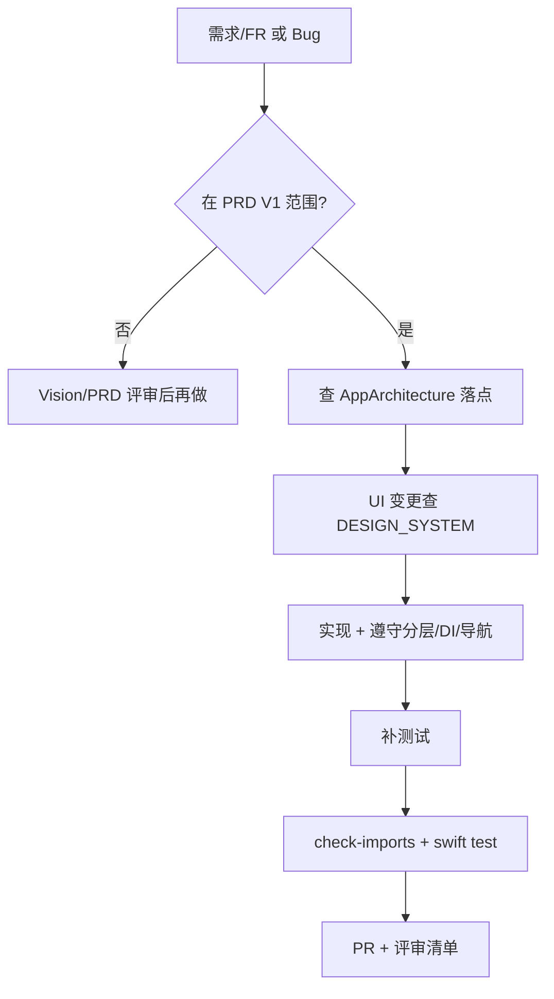

# 坐标系 · 开发规范与工作流程

> **版本**：2026-09-02（§6.4 活动行程凭证与 CredentialArt；§2 目录增补 Credential 路径）  
> **读者**：iOS 工程师、Reviewer、AI Agent  
> **配套**：[AppArchitecture.md](AppArchitecture.md)（结构地图）、[PRD.md](PRD.md)（做什么）、[DESIGN_SYSTEM.md](../DESIGN_SYSTEM.md)（怎么做 UI）

---

## 1. 开发前必读

| 顺序 | 文档 | 目的 |
|------|------|------|
| 1 | [PRD.md](PRD.md) | 功能是否在 V1 范围、验收标准、**Apple HIG 参照（§2.6）** |
| 2 | [AppArchitecture.md](AppArchitecture.md) | 代码落点、导航、持久化、DI |
| 3 | [DESIGN_SYSTEM.md](../DESIGN_SYSTEM.md) | 组件、CTA、反模式 |
| 4 | 域细则 | 搭子 → [BuddiesProductPlan.md](BuddiesProductPlan.md)；信任 → [TrustBehaviorModel.md](TrustBehaviorModel.md) |

**原则**：先对齐需求与架构，再写代码；UI 改动必须过设计系统自检；**所有 UI / UIKit 操作在 MainActor**（见 §7）。

---

## 2. 仓库结构

```
坐标系/
├── 坐标系/                    # App Target
│   ├── ContentView.swift      # Tab 根
│   ├── Design/                # 平台 chrome（无业务状态）
│   │   └── CredentialArt/     # 行程凭证彩绘（SVG 着色；CredentialArtTheme 为 Models 白名单）
│   ├── Features/              # 按 Tab 分域 View + @Observable Model
│   │   └── Profile/Credential/  # 活动行程凭证 UI（票面 / 分享 / 彩绘目录）
│   ├── Models/                # App 层实体、Catalog、SwiftData Schema
│   ├── Resources/CredentialArt/  # SVG 模板（ACCENT_* 占位符）
│   └── Services/              # 组合根、Store、API、AppModel
├── Packages/CoordinateKit/    # SPM：Models / Domain / Data / Networking / Flags
├── 坐标系Tests/               # App 集成测试
├── Scripts/check-imports.sh   # 模块边界 CI
└── Docs/                      # 产品 + 工程文档（本目录）
```

### 2.1 分层职责

| 层 | 目录 | 允许 | 禁止 |
|----|------|------|------|
| **Features** | `Features/*` | `CoordinateModels`、`CoordinateDomain` 协议、注入的 Store | `import CoordinateData`、`AppComposition`、直接 `UserDefaults` |
| **Design** | `Design/*` | SwiftUI、平台语义 | `import CoordinateModels`（白名单除外） |
| **Services** | `Services/*` | 装配、Store、Gateway、Remote 实现 | 巨型 View |
| **CoordinateModels** | SPM | Codable 实体、Snapshot | SwiftUI / UIKit |
| **CoordinateDomain** | SPM | 协议、UseCase、纯逻辑 | UI、具体 I/O |
| **CoordinateData** | SPM | Local/InMemory Repository、JSON I/O | SwiftUI |

**CI 强制**：`bash Scripts/check-imports.sh`

**Design 白名单**（可 `import CoordinateModels`）：

- `ActivityZoomNavigation.swift`
- `WalletPassFace.swift`
- `PlatformCatalogCards.swift`
- `PlatformMessagesChrome.swift`
- `Design/CredentialArt/CredentialArtTheme.swift`

新增白名单须：**评审理由** + 更新 `Scripts/check-imports.sh` + 本文档。

---

## 3. 依赖注入（DI）

### 3.1 组合根

```
坐标系App
  → AppSwiftDataContainer.makeProduction()
  → SwiftDataSnapshotRegistry.attach
  → bootstrapPersistence()
  → AppModel(dependencies: .live)
       → AppDependencies 工厂方法 → 五域 Model
```

| 入口 | 用途 |
|------|------|
| `AppDependencies.live` | 正式 App |
| `AppDependencies.preview()` | SwiftUI Preview |
| `AppDependencies.inMemoryForTests()` | 单测 / 集成测 |

### 3.2 规则

1. **Features 零 `AppComposition`**：构造参数全部必填，由 `AppDependencies` 工厂创建。
2. **View 读依赖**：`@Environment(AppModel.self)`、`@Environment(XxxStore.self)`、`@Environment(\.platformChromeMeasurements)`、`@Environment(\.profileRecentBrowseStore)`。
3. **协议类型**：写 `any ActivitiesRepository`，不写具体实现类型（除非工厂内）。
4. **Store 单例**：仅组合根持有；禁止 Feature 内 `XxxStore.shared`（迁移中的 legacy 逐步消除）。
5. **Preview**：`AppModel.preview` 或 `AppDependencies.preview().makeXxxModel()`。

### 3.3 新增 Store / Service 检查表

- [ ] 在 `AppDependencies` 增加属性
- [ ] `live` / `preview()` 分别装配
- [ ] `AppModel` 持有并下传或 `@Environment` 注入
- [ ] 窗口根 `PlatformChromeRoot`（chrome）；登录后 `signedInRoot` 注入 Model / Store（若 View 需要）
- [ ] 系统控件边长走 `PlatformChromeMeasurements`（若涉及顶栏圆钮 / 输入栏高度）
- [ ] 更新 [AppArchitecture.md](AppArchitecture.md) 工程表

---

## 4. 持久化

### 4.1 边界（`PersistenceBoundary.swift`）

| 类型 | 后端 | 新增数据时 |
|------|------|------------|
| 五域 + engagement 快照 | SwiftData blob（过渡） | 改 `*Snapshot` + Catalog repair |
| 最近浏览 | `RecentBrowseItem` @Model | 直接加字段 + Schema 版本 |
| 订单/凭证/退款/信任流水 | JSON 文件 | 永驻 JSON，**不**进 SwiftData blob |
| 会员/通知/隐私/协议 | UserDefaults | 新建 `*Store` + Preference 门面 |

### 4.2 SwiftData 演进

1. 改 `@Model` → 新建 `AppSwiftDataSchemaVn`
2. 注册到 `AppSwiftDataMigrationPlan.stages`
3. 容器工厂 `AppSwiftDataContainer` 指向新 Plan
4. 文档更新 [AppArchitecture.md](AppArchitecture.md) Phase 表

### 4.3 读写约定

- **同步读**：`SwiftDataSnapshotGateway.load()`（MainActor 缓存，bootstrap 后）
- **同步写**：`save()` 先更缓存，再经 `MainActorPersistence.chained`（见 §7.6）
- **写失败**：域 Model / 钱旁路 / 信任账本须 `PersistenceWriteFailureReporter.record`（汇入 `AppPersistenceHealth` 横幅）；禁止静默 `try?` 吞关键写
- **跨 actor**：只传 `Codable & Sendable` 快照，**禁止**传 `@Model` 实例
- **Repository 协议**：`SnapshotRepository` 及域协议标 `@MainActor`
- **Repository 工厂**：`@MainActor`（访问 `SwiftDataSnapshotRegistry`）
- **本地媒体**：Feature / View **经 `LocalMediaLibrary`（或 Feature Model）** 写盘；勿直接调 `CommunityPhotoStore`（底层实现）
- **信任账本**：`TrustBehaviorLedger` 由 `AppComposition` 注入 `TrustService`，勿新造 `.shared`

### 4.4 域事件

业务副作用（建群、刷新推荐、信任记账）走 `AppDomainEvent` → `AppSyncOrchestrator`，**禁止**在 Model 里直接调其他域 Model 的私有方法。

新增事件：

1. `AppDomainEvents.swift` 加 `case`
2. `AppSyncOrchestrator.handle` 分支
3. 必要时 `TrustBehaviorSyncService` 记账
4. `AppModel.wireFeatureCallbacks` 或调用点 `syncOrchestrator.handle`

---

## 5. 导航（SwiftUI）

### 5.1 硬规则

同一 `NavigationStack` 内，**同类型 `navigationDestination` 只在栈根注册一次**。

| 场景 | Helper |
|------|--------|
| 活动 Zoom | `activityZoomNavigationDestination` |
| 搭子 Zoom | `buddyZoomNavigationDestination` |
| 圈子 | `circleBrowseNavigationDestination` / `circleBrowseStackChrome` |
| Sheet 成员 | `circleMemberSheetNavigationDestination` |

### 5.2 Tab 栈

```swift
@State private var navigation = TabNavigationState()

NavigationStack(path: $navigation.path) {
    content
        .circleBrowseNavigationDestination() // 示例
}
.tabNavigationState(navigation)
```

### 5.3 Sheet 陷阱

Sheet **继承**呈现方 Environment。父栈已标记「目的地已注册」时，Sheet 内 `NavigationStack` 须：

```swift
NavigationStack(path: $navigation.path) {
    content
        .circleMemberSheetNavigationDestination()
}
.tabNavigationState(navigation)
.independentNavigationSheetChrome()
```

**关闭 Sheet**：子页用系统 `\.dismiss`；需回到圈子页时配合 `TabNavigationState`（`popLast()` / `reset()`），**禁止**自定义 dismiss 闭包 Environment。

### 5.4 路由类型

- 搭子墙卡 → `BuddyZoomRoute`（非裸 `DiscoverBuddyItem`）
- 圈子 → `CircleBrowseRoute`（不与 Zoom 混用）
- 跨 Tab → `AppRouter` / `AppDeepLink` pending 字段

---

## 6. UI / SwiftUI 规范

### 6.1 设计系统

- 新 Sheet → `platformSheet` 档位
- 轻反馈 → `platformLightFeedback`；结果 → `platformFeedbackAlert`
- 详情 Primary CTA → 每屏一个；见 [PRD.md](PRD.md) §3 / [AppArchitecture.md](AppArchitecture.md) §6
- Form/List 页：**不写**魔法 `padding`/`spacing`（见 DESIGN_SYSTEM §1.5）
- **系统控件边长**（顶栏 glass 圆钮、输入栏「+」高度）→ `PlatformChromeMeasurements`（§7.3），**禁止**在 `PlatformMetrics` 静态方法里探测 UIKit

### 6.2 文件体量

| 阈值 | 动作 |
|------|------|
| ~400 行 | 考虑拆 extension 或子 View |
| Model 多职责 | 按 `+Browse` / `+Participation` 拆 |
| View 含动作+内容 | 拆具名子 View（编排器持 `@State`）+ 可选 `*View+Actions` |

巨型文件拆分批次、验收与进度见 **[GiantFileSplitPlan.md](GiantFileSplitPlan.md)**（对齐 Swift API Design Guidelines：一文件一主类型）。

诚实门控收口后的剩余客户端 Wave（隐私 URL、Gateway 写串行、CI、reduceMotion、文本过滤）见 **[RemainingReleaseClientPlan.md](RemainingReleaseClientPlan.md)**。

### 6.3 Observation

- 域状态：`@Observable` Model + `@Environment(Model.self)`
- **不要**把高频写入 Store 标 `@Observable` 若会拆 Zoom transition（如 `ActivityEngagementStore`）

### 6.4 活动行程凭证（App 内主路径）

**产品定位**：行程页展示 **App 内凭证**（过程管理 + 纪念分享），**不是**系统 Wallet 官方 UI。PassKit 仅作可选导出（展开页「更多」→ `AddPassToWalletButton`）。

**双模式**（`ActivityJourneyCredentialPresentation`）：

| 模式 | 何时 | 票面 |
|------|------|------|
| `fulfillment` | 参加后至活动结束前 | 条码 + 订单号 + CredentialArt 头图 |
| `memento` | 待反馈 / 可回顾 / 已结束 | 无条码；主 CTA **分享纪念票**（9:16 `ImageRenderer`） |
| `voided` | 退款作废 | 作废 overlay（`ActivityJourneyPassChrome`） |

**文件地图**：

```
Features/Profile/Credential/
  ActivityJourneyCredentialModel.swift
  ActivityJourneyCredentialPresentation.swift
  ActivityJourneyCredentialFace.swift       # App 内票面（唯一）
  ActivityJourneyMementoShareCard.swift
  ActivityCredentialShareRenderer.swift
  CredentialArtCatalog.swift

Design/CredentialArt/
  CredentialArtTheme.swift                  # Models 白名单
  CredentialArtSVGLoader.swift
  CredentialArtHeroChrome.swift             # 头图渐变 / 字段分隔
  CredentialArtStripRenderer.swift          # Wallet strip PNG
  TintedCredentialArtHero.swift
  BundledCredentialArt.swift

Resources/CredentialArt/*.svg
Assets.xcassets/CredentialArt/*.imageset    # SVGView 失败回退

Services/PassKit/
  ActivityPassFieldBuilder.swift            # pass.json 字段单源
  PassFacePresentation.swift                # PassFaceModel（字段模型，非 View）
  WalletPassEventTicketAppearance.swift     # backgroundColor / labelColor
```

**第三方**：`SVGView`（exyte）在 Xcode 工程手动 link；改 `project.pbxproj` 时留意 SPM 依赖。

**彩绘细则**：见 [CredentialArt.md](CredentialArt.md)。

**已删除**：`WalletPassEventTicketFace` — 勿在新代码中引用（见 [Archive.md](Archive.md)）。

---

## 7. 并发、MainActor 与 UI

> **总原则（Apple [Swift Concurrency](https://developer.apple.com/documentation/swift/swift-standard-library/concurrency)）**：**所有 UI 相关操作必须在主线程 / `@MainActor` 上完成。**  
> 项目已启用 `SWIFT_STRICT_CONCURRENCY=complete`（App + SPM）；违反隔离的代码视为缺陷，不是「可忽略的警告」。

### 7.1 什么算「UI 操作」

| 类别 | 必须在 MainActor | 示例 |
|------|------------------|------|
| SwiftUI View / `ViewModifier` | ✅ | `body`、`onAppear`、`.task` 内改 `@State` |
| UIKit 类型读写 | ✅ | `UIApplication`、`UIWindow`、`UIButton`、`UIViewController` |
| 布局后读控件尺寸 | ✅ | `GeometryReader` + `PreferenceKey`、隐藏探针 View |
| `@Observable` 域 Model / Store（驱动 UI） | ✅ | `ActivitiesModel`、`AppModel`、`*Store` |
| Gateway / 组合根 | ✅ | `SwiftDataSnapshotGateway`、`AppDependencies` |
| SwiftData 磁盘写入 | ❌（用 actor） | `DomainSnapshotModelActor` |
| 纯业务 / Codable 快照 | 视情况 Sendable | Domain UseCase、`*Snapshot` |

**禁止**：在 `enum PlatformMetrics` 等**非隔离静态上下文**里 `UIButton(...)`、`UIApplication.shared`、对 MainActor 属性用 key path（如 `\.windows`）。

### 7.2 分层与 actor 分工

| 层 | 隔离 | 说明 |
|----|------|------|
| Features Views + `@Observable` Model | `@MainActor` | 默认；UI 状态唯一入口 |
| Design chrome | View 在 MainActor；静态 token 尽量无 UIKit | 见 §7.3 |
| `AppDependencies` / Repository 工厂 | `@MainActor` | 访问 `SwiftDataSnapshotRegistry` |
| `SnapshotRepository` 及域协议 | `@MainActor` | `load` / `save` / `loadAsync` 与 `@MainActor` Model 同隔离；见 §7.8 |
| SwiftData 快照 I/O | `@ModelActor` | `DomainSnapshotModelActor` |
| 跨 Task 传参 | `Sendable` | 只传 Codable 快照，不传 `@Model` 实例 |

`Task` 写持久化须串联 generation / `invalidatePendingWrites`（见 §4.3、§7.6）；**禁止**裸 `Task { }` 跨 actor 捕获 Repository。

### 7.3 系统控件尺寸：View 层实测（标准做法）

**需求**：顶栏 glass 圆钮边长（`navigationBarButtonSide`）、消息输入栏 large glass 高度等，须与系统控件对齐。

**正确做法**（`Design/PlatformChromeMeasurements.swift`，对齐 Apple PreferenceKey + 项目 EnvironmentKey 惯例）：

1. **`@Observable @MainActor` 存储**：`PlatformChromeMeasurements` 持有实测值；首帧公式 fallback。
2. **EnvironmentKey 惰性默认**：`@MainActor` store **不用** `@Entry`（默认初始化会落在非隔离上下文）；用 `EnvironmentKey` + `MainActor.assumeIsolated` 惰性单例（同 §7.4 `ProfileRecentBrowseStore`）。
3. **Window 根注入**：`坐标系App` → `PlatformChromeRoot { … }` 内 `@State` 单例，`.environment(\.platformChromeMeasurements, measurements)` 覆写默认。
4. **探针**：`background` 挂载；**构造参数**传入 store（勿在探针内 `@Environment` 读自身）。
5. **消费**：`@Environment(\.platformChromeMeasurements)` → `chrome.navigationBarButtonSide`。
6. **局部二次实测**：如 `PlatformMessageComposerBar` 对真实「+」钮再用 `ComposerToolHeightKey`。

```swift
// ✅ Window 根（坐标系App）
PlatformChromeRoot {
    ContentView()
}

// ✅ View 内消费
@Environment(\.platformChromeMeasurements) private var chrome
.frame(width: chrome.navigationBarButtonSide, height: chrome.navigationBarButtonSide)

// ✅ Preview 覆写
.platformChromeMeasurementsEnvironment()
```

```swift
// ❌ 禁止：静态 UIKit 探测
private static func resolvedNavigationBarButtonSide() -> CGFloat {
    let button = UIButton(configuration: .glass())
    ...
}

// ❌ 禁止：探针 overlay 内 @Environment(PlatformChromeMeasurements.self) 读自身
```

**`PlatformMetrics` 仍负责**：`grid`、`contentInset`、圆角、宽高比等**不依赖运行时控件实例**的 token；需要按钮边长时改为函数参数，例如 `walletPassStripBarHeight(navigationBarButtonSide:)`。

### 7.4 EnvironmentKey 与 Swift 6

| 场景 | 做法 |
|------|------|
| 可选引用（如 `TabNavigationState?`） | SwiftUI `@Entry`：`@Entry var tabNavigationStateRef: TabNavigationState? = nil` |
| `@MainActor` 类默认值（Store / chrome 实测） | `EnvironmentKey` + `nonisolated(unsafe)` 惰性缓存 + `MainActor` 默认工厂（见 `ProfileRecentBrowseEnvironment`、`PlatformChromeMeasurementsKey`） |
| Sheet 关闭 | 系统 `\.dismiss`；**禁止**自定义 `(() -> Void)?` dismiss Environment |
| 静态可变缓存（Metrics 字典） | `nonisolated(unsafe)` **仅**当类型**非** `Sendable` 且确认只在主线程读写；`Sendable` 常量用普通 `static let`（见 §7.8） |

### 7.5 编译与评审检查

- [ ] 无新增 `PlatformMetrics` / 静态上下文中的 UIKit 控件探测
- [ ] 无 `UIApplication` / `\.windows` key path
- [ ] 需系统控件尺寸处已读 `PlatformChromeMeasurements` 或局部 PreferenceKey
- [ ] 新 Store / Gateway 已标 `@MainActor` 或 `@ModelActor`
- [ ] Preview 需要 chrome 时已 `.platformChromeMeasurementsEnvironment()`
- [ ] Model `persist()` 使用 `MainActorPersistence.chained`（§7.6）
- [ ] `SwiftDataSnapshotGateway.save` 使用 chained（禁止裸 `Task { try? }`）
- [ ] 改 `@Model` / 持久化字段已升 `VersionedSchema` + `MigrationStage`（见 `AppSwiftDataSchema`）
- [ ] `PhotosPicker` label 仅捕获 `String` 等 `Sendable` 值（§7.7）
- [ ] 跨 Task 快照类型已 `Sendable`；`CoordinateModels` 新实体同步补全（§7.8）
- [ ] 本地 `xcodebuild … OTHER_SWIFT_FLAGS="-warn-concurrency"` 无新增 warning（§7.10）
- [ ] 交互动画优先 `PlatformMotion.withAnimation` / `platformAnimation`（减弱动态效果）

### 7.6 Model 异步落盘（`MainActorPersistence`）

域 Model（`ActivitiesModel`、`BuddiesModel` 等）在 `@MainActor` 上异步落盘时，**禁止**：

- 裸 `Task { try? await repository.replaceAsync(...) }`（非隔离 Task 会跨 actor 传递 `self` / Repository）
- 在 `extension Task` 里封装 helper（会与 `Task.checkCancellation()` / `Task.isCancelled` 类型名冲突）

**标准做法**（`Services/MainActorPersistence.swift`）：

```swift
func persist() {
    let snapshot = /* 从当前 @MainActor 状态组装 */
    let previousTask = persistTask
    let generation = persistenceGeneration
    persistTask = MainActorPersistence.chained(after: previousTask) {
        try? await self.repository.replaceAsync(with: snapshot, generation: generation)
    }
}
```

| 要点 | 说明 |
|------|------|
| `chained(after:operation:)` | 在 `@MainActor` 上等待上一笔 `persistTask` 完成后再写 |
| `operation` 闭包 | 必须标 `@MainActor () async -> Void` |
| 取消 | 内部 `try Task.checkCancellation()`，取消后跳过落盘 |
| `AppModel.persistProfile()` | 同一模式 |

`discardPendingPersistence()`：`persistTask?.cancel()` → `await persistTask?.result` → `repository.invalidatePendingWrites()`。

**Gateway 层**（`SwiftDataSnapshotGateway.save`）：同样用 `MainActorPersistence.chained` 串联写；禁止裸 `Task { try? await … }`。后台 flush 时 `SwiftDataSnapshotRegistry.awaitAllPendingSaves()`。

**改 SwiftData `@Model`**：必须新增 `VersionedSchema` 版本并在 `AppSwiftDataMigrationPlan` 注册 stage（见 `AppSwiftDataSchema.swift` 文件头步骤）。禁止删库 / seed 覆盖用户数据。

### 7.7 `PhotosPicker` 与 `@Sendable` label

`PhotosPicker` 的 `label` 闭包是 **`@Sendable`**。在闭包内读取 `@State` / `@MainActor` 属性或自定义 `View` 初始化器会触发 Swift 6 警告，乃至 Swift 6 语言模式错误。

**Apple 推荐结构**：

1. **预览图放在闭包外**（`Image(uiImage:)`、`ProfileCompletionAvatar` 等）
2. **闭包内只用预计算的 `String`**（在同级 `ViewBuilder` 用 `let title = …` 先算好）
3. **文案 helper** 放 `Design/PlatformPhotosPickerChrome.swift` → `PlatformPhotosPickerCopy`（纯 `String`，无 SwiftUI）

```swift
// ✅ 封面：预览与按钮分离
Section {
    if let coverPreview {
        Image(uiImage: coverPreview)
            .resizable()
            .scaledToFill()
            /* … */
    }
    let coverActionTitle = localCoverName == nil ? "添加封面图" : "更换封面"
    PhotosPicker(selection: $pickerItem, matching: .images) {
        Label(coverActionTitle, systemImage: "photo.on.rectangle.angled")
    }
}

// ✅ 资料头像：头像展示与选择分离
VStack {
    ProfileCompletionAvatar(name: name, photo: avatarPreview, side: side, completion: completion)
    let avatarActionTitle = avatarLocalName == nil ? "添加照片" : "更改照片"
    PhotosPicker(selection: $pickerItem, matching: .images) {
        Label(avatarActionTitle, systemImage: "photo.on.rectangle")
    }
}

// ❌ 禁止：闭包内读 @State / UIImage / 自定义 View
PhotosPicker(...) {
    EditProfileAvatarPickerLabel(name: name, photo: avatarPreview, ...) // @MainActor init
}
PhotosPicker(...) {
    Label(previewImages.isEmpty ? "添加" : "已选 \(previewImages.count)", ...) // 闭包内读 @State
}
```

| 场景 | 参考实现 |
|------|----------|
| 活动封面 | `ActivityComposeSheet` |
| 资料头像 | `EditProfileSheet` |
| 举报 / 投诉证据 | `ActivityReportSheet`、`BuddyOrgReportSheet` |
| 社区发帖媒体 | `CommunityComposeSheet` |

**禁止**在 `PhotosPicker` label 上链 `.platformContentSymbolStyle()` 等 `@MainActor` modifier；样式放在闭包外的行或父级 `Section`。

### 7.8 `Sendable` 模型与静态数据

跨 `Task` / `async` 边界的类型须 **`Sendable`**（Apple [Sendable](https://developer.apple.com/documentation/swift/sendable)）。

| 范围 | 规则 |
|------|------|
| `SnapshotRepository` 及 `{Domain}Repository` | 协议标 **`@MainActor`**；`Local*` / `InMemory*` / `SwiftData*` / `Remote*` 实现与域 Model 同 actor |
| `loadAsync` / `saveAsync` | 无 `asyncPersistenceBackend` 时直接在 `@MainActor` 调 `load()` / `save()`；JSON 回退走 `LocalSnapshotFileStore` |
| `CoordinateModels` | 新 `*Snapshot`、领域 struct / enum 默认补 `Sendable`（如 `Activity`、`ActivityCategory`） |
| `APIClient` | `CoordinateNetworking` 内 `struct APIClient: Sendable` |
| 演示种子 | `SampleData`、`PersistenceSnapshotSeeds` 等：`Sendable` 类型用普通 `static let`，**不要**多余 `nonisolated(unsafe)` |
| 含 `KeyPath` / 非 Sendable 的静态表 | 改为 **计算属性** `static var`（每次返回新数组），见 `TrustAxisScores.labels` |
| UI 专用目录 | 只被 SwiftUI / `@MainActor` Model 调用的组装逻辑标 `@MainActor`（如 `BuddyBrowseHomeCatalog`、`DiscoverBuddyItem.cardHobbyLine`） |

`SwiftDataSnapshotRegistry.attach`：`afterLoad` / `fallback` 等 `@Sendable` 闭包**不得**捕获 `@MainActor static` policy；在 `attach(container:)` 内用**局部 `let policy = AppXxxSnapshotPolicy()`** 再传入 `makeGateway`。

### 7.9 网络、EventKit 与非 SwiftUI UI

| API | 做法 | 落点示例 |
|-----|------|----------|
| `Remote*Repository` | 类标 `@MainActor`；`APIClient` 为 `Sendable` | `Services/API/Remote*.swift` |
| `PassKit` / `PKPassLibrary` | 封装 enum 标 `@MainActor` | `PassKitLoader` |
| `EventKit` | 日历读写 enum 标 `@MainActor` | `ActivityCalendar`、`ActivityCalendarStore` |
| `MKLocalSearch` / `openInMaps` | 搜索 Task 用 `Task { @MainActor in … }` | `ActivityNavigation` |
| `UIWindowScene` / `rootViewController` | helper 标 `@MainActor` | `MessagesInviteFriends` |
| `UILocalizedIndexedCollation` | 分节构建标 `@MainActor` | `FriendSection.build`、`PlatformContactsTableView` |
| `CLLocationManagerDelegate` | `nonisolated` 回调内**先提取** `Sendable` 值（`CLAuthorizationStatus`、`CLLocationCoordinate2D?`、`String`），再 `Task { @MainActor in }`；**禁止**把 `manager` 传入 Task | `LocationService` |
| 非结构化 fire-and-forget | `Task { @MainActor in … }`，勿裸 `Task { }` | `ProfileRecentBrowseStore`、`SwiftDataSnapshotGateway.save` |

### 7.10 本地编译验证（并发）

改公共 API、`Task`、`PhotosPicker`、`@MainActor` 隔离或 `CoordinateModels` 时，除常规 build 外应跑：

```bash
xcodebuild -project 坐标系.xcodeproj -scheme 坐标系 \
  -destination 'platform=iOS Simulator,name=iPhone 17 Pro' \
  build OTHER_SWIFT_FLAGS="-warn-concurrency"
```

**目标**：无新增 concurrency / MainActor / Sendable 相关 warning。PR 合并前应至少人工确认一次（CI 可后续接入同 flag）。

---

## 8. 测试

### 8.1 放哪测

| 类型 | 位置 | 何时写 |
|------|------|--------|
| 纯业务规则 | `Packages/CoordinateKit/Tests/CoordinateDomainTests/` | 新 UseCase / 状态机 |
| 持久化 / Model 集成 | `坐标系Tests/` | Repository 切换、编排 |
| UI | 手动 + Preview | 关键路径快照 |

### 8.2 要求

- 新 **UseCase** 必须有 Domain 单测（正常 + 失败分支）
- 修持久化 bug 应补回归测
- 使用 `AppRepositories.inMemoryForTests()` / `AppDependencies.inMemoryForTests()`

### 8.3 本地命令

```bash
# 模块边界
bash Scripts/check-imports.sh

# Domain 单测（约 50 例）+ Networking（约 2 例）
cd Packages/CoordinateKit && swift test

# App 测试（需 Xcode；本地可用 iPhone 17 Pro）
xcodebuild test -project 坐标系.xcodeproj -scheme 坐标系 \
  -destination 'platform=iOS Simulator,name=iPhone 17 Pro'

# 并发专项检查（改 Task / MainActor / PhotosPicker / Sendable 后建议跑）
xcodebuild -project 坐标系.xcodeproj -scheme 坐标系 \
  -destination 'platform=iOS Simulator,name=iPhone 17 Pro' \
  build OTHER_SWIFT_FLAGS="-warn-concurrency"
```

CI：`.github/workflows/ios-test.yml`（push/PR 到 main；模拟器名以 workflow 为准，当前为 `iPhone 16 Pro`）

---

## 9. 功能开发流程



### 9.3 搭子预约状态机 · Phase A

产品状态语义与四条 UX 决策见 **[PRD.md §6.3–§6.4](PRD.md#63-陪玩预约订单状态bookingorderstatus)**。实现任务按决策拆分为 **A0–A4**，清单与 DoD 见 **[PRD §6.5](PRD.md#65-phase-a-实现任务按-ux-决策拆分)**。

| 阶段 | 范围 | 主要落点 |
|------|------|----------|
| A0 | 校验收紧、解码默认、`booking_created` | `CoordinateDomain`、`BuddyRecords`、`BuddiesModel+Bookings` |
| A1 | D1 接单不自动弹支付 | `BuddiesModel+Bookings`、`ProfileOrdersView`、`*Copy` |
| A2 | D2 履约双 CTA、Pass 刷新 | `BookingCredentialExpandedView`、`PassStore` |
| A3 | D3 `refunding` | `BuddyRecords`、`RefundFlow`、`ProfileOrdersView` |
| A4 | D4 演示接单文案与开关 | `BuddyBookingFlowViews`、`FeatureFlags` |

**Phase B**（工程收口，见 PRD §6.5 注）：

| 阶段 | 范围 | 主要落点 |
|------|------|----------|
| B0 | `ApplyBookingStatusTransitionUseCase` 收口转移 | `CoordinateDomain/Buddies` |
| B1 | 支付 SLA（`paymentDueAt`、超时释放） | `BookingPaymentPolicy`、`ExpireOverdue…`、`BuddiesModel+Bookings` |
| B2 | 信任事件 `booking_accepted/declined/rescheduled` | `TrustModels`、`BuddiesModel+Bookings` |

**Phase C**（远程接单 · `FR-BUD-09`）：

| 阶段 | 范围 | 主要落点 |
|------|------|----------|
| C0 | 预约提交 / 查询 API | `APIEndpoint+Bookings`、`RemoteBookingSyncService` |
| C1 | 远程对账与轮询 | `ReconcileRemoteBookingRecordUseCase`、`BuddiesModel+RemoteBookings` |
| C2 | 与演示模拟互斥 | `FeatureFlags.useRemoteBuddies`、`*Copy` 远程文案 |

**Phase D**（B-30 / B-31 通知与 SLA）：

| 阶段 | 范围 | 主要落点 |
|------|------|----------|
| D0 | 待确认 SLA（30 分钟） | `BookingConfirmationPolicy`、`confirmDueAt`、`expireConfirmation` |
| D1 | 接单推送 + 深链 | `NotificationService`、`AppNotificationRouter` |
| D2 | 等待态文案 | `BuddyBookingFlowCopy`、`BookingCredentialExpandedView` |

编排收口：`BuddiesModel+BookingLifecycle`（转移 / SLA / 通知 / 任务取消）。

---

### 9.1 分支与 PR

1. 从 `main` 拉 `feat/xxx` 或 `fix/xxx`
2. 小步提交；**不要**未要求时 force push
3. PR 描述含：动机、验收标准、测试计划、截图（UI）
4. 确保 CI 绿

### 9.2 PR 自检清单（复制到 PR）

```markdown
## 自检
- [ ] 需求对应 PRD FR-___ / 或 Bug 说明
- [ ] Features 无 CoordinateData / AppComposition
- [ ] 导航用栈根 helper；Sheet 独立栈已处理 Environment；Sheet 关闭用 `\.dismiss`
- [ ] UI / UIKit 仅在 MainActor；系统控件尺寸走 `PlatformChromeMeasurements`（§7）
- [ ] Model 落盘 `MainActorPersistence.chained`（含 Gateway）；改 `@Model` 已升 Schema；`PhotosPicker` label 仅 `Sendable` 文案（§7.6–7.7）
- [ ] 跨 Task 类型已 `Sendable`；`-warn-concurrency` build 无新增 warning（§7.10）
- [ ] 新持久化字段符合 PersistenceBoundary；动画尊重 reduceMotion（`PlatformMotion`）
- [ ] UGC 文本经 `ContentModeration.scanText`（聊天 / 发帖 / 资料 / 活动）
- [ ] 隐私政策入口可打开托管 HTTPS（或离线兜底）；见 `LegalDocumentURLs`
- [ ] 域副作用走 AppDomainEvent（若跨域）
- [ ] Domain 单测（若新 UseCase）
- [ ] check-imports.sh 通过
- [ ] 单文件未无故超过 ~400 行
- [ ] 文档：行为变更更新 PRD/AppArchitecture
```

### 9.3 Agent / 本地开发约定

- **不要**在改完代码后自动 `xcodebuild`（除非明确要求「编译/跑测试」）
- 静态问题用 linter / `check-imports` 修
- 涉及 `navigationDestination`、公共 API、新文件时，提示人工编译确认

---

## 10. 命名约定

| 类别 | 约定 | 示例 |
|------|------|------|
| Model | `{Domain}Model` | `ActivitiesModel` |
| Model 扩展 | `{Domain}Model+{Concern}` | `BuddiesModel+Bookings` |
| View | `{Feature}{Role}View` | `ActivityDetailView` |
| Repository 协议 | `{Domain}Repository` | `ActivitiesRepository` |
| 本地实现 | `Local{Domain}Repository` | SPM `CoordinateData` |
| SwiftData 实现 | `SwiftData{Domain}Repository` | App `Services/` |
| UseCase | `{Verb}{Noun}UseCase` | `JoinActivityUseCase` |
| Store | `{Concern}Store` | `MembershipStore` |
| Snapshot | `{Domain}Snapshot` | `MessagesSnapshot` |
| Catalog 修复 | `{Domain}SnapshotCatalog` | App `Models/` |
| 路由 | `{Feature}{Role}Route` | `BuddyZoomRoute` |
| 行程凭证模式 | `ActivityJourneyCredentialPresentation` | `.fulfillment` / `.memento` / `.voided` |
| Credential 彩绘 | `CredentialArt{Scene}` | `CredentialArtTransit` |
| Feature Flag | `FeatureFlags.useXxx` | `useSwiftDataSnapshots` |

---

## 11. 常见错误与修复

| 症状 | 原因 | 修复 |
|------|------|------|
| `NavigationLink` 无反应 | Sheet 继承「已注册」标记 | `independentNavigationSheetChrome` |
| 紫色 duplicate destination | 子页重复注册 | 只用栈根 helper |
| Feature 找不到 Repository 方法 | 缺 `import CoordinateDomain` | 补 import |
| MainActor 隔离报错 | 非隔离上下文调 UI / Registry / `BuddyMatchScorer` | 调用方或 catalog 标 `@MainActor`；或移到 View 层 |
| `PhotosPicker` Sendable 警告 | label 闭包读 `@State` / `UIImage` / 自定义 View | 预览放闭包外；`let title` 预计算 `String`（§7.7） |
| `Task` 扩展与 `checkCancellation` 冲突 | `extension Task` 内 `Task.isCancelled` 解析到泛型 | 用独立 `MainActorPersistence` enum（§7.6） |
| Repository 跨 actor / data race | `any *Repository` 未标 `@MainActor`，`await` 时发送 existential | 协议标 `@MainActor`（§7.8）；`MainActorPersistence.chained` |
| `Sending 'manager' risks data races` | delegate 把 `CLLocationManager` 传入 `Task` | 先读 `authorizationStatus` / `coordinate` 再 `Task { @MainActor in }`（§7.9） |
| `nonisolated(unsafe)` 多余 | 类型已是 `Sendable` | 改回 `static let`（§7.8） |
| `@Sendable` 闭包捕获 static policy | `SwiftDataSnapshotRegistry` | `attach` 内局部 policy 实例（§7.8） |
| `EnvironmentKey` 跨 actor | `@MainActor static var defaultValue` | `MainActor.assumeIsolated` 惰性单例（§7.4）；勿 `@Entry` 包 `@MainActor` init |
| `PlatformMetrics` 测 UIKit | 静态上下文非法 | `PlatformChromeMeasurements` + Environment |
| `PlatformChromeMeasurements` fatal | 探针在 overlay 内 `@Environment` 读自身 | `PlatformChromeRoot` + 探针 background 参数传入；`EnvironmentKey` 默认（§7.3–7.4） |
| 不能对 `windows` 用 key path | Swift 6 MainActor 属性 | 显式循环或 View 层测量 |
| Design 不能 import Models | 分层 | 移 View 到 Features 或加白名单 |
| `isLifecycleEnded` 类型错 | 应用层缺 Domain 扩展 | `import CoordinateDomain` |

---

## 12. 文档维护义务

| 你改了… | 必须更新 |
|---------|----------|
| 废弃 / 删除 API 或文件 | [Archive.md](Archive.md) |
| 新功能 / 行为 | [PRD.md](PRD.md) FR 表 + 验收 |
| Tab / 导航 / 深链 | [AppArchitecture.md](AppArchitecture.md) |
| 搭子 IA | [BuddiesProductPlan.md](BuddiesProductPlan.md) |
| 信任事件 | [TrustBehaviorModel.md](TrustBehaviorModel.md) |
| 分层 / DI / 测试 / 流程 | 本文 |
| UI 组件 / token | [DESIGN_SYSTEM.md](../DESIGN_SYSTEM.md) |
| 行程凭证彩绘 | [CredentialArt.md](CredentialArt.md) |
| 任何新文档 | [Docs/README.md](README.md) 索引 |

---

*本文与 CI (`check-imports.sh`、`ios-test.yml`) 一致；冲突时以 CI 脚本与代码为准，并回写本文。*
