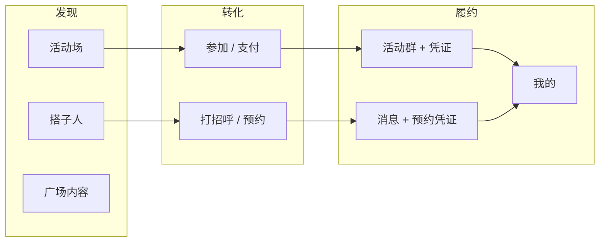

# 坐标系 · 产品需求文档（PRD · V1）

> **版本**：V1.1 · 2026-09-01  
> **读者**：产品、设计、工程、测试  
> **定位**：把 [Vision.md](Vision.md) 的愿景落成可验收的功能需求。  
> **平台基准**：以 [Apple Human Interface Guidelines](https://developer.apple.com/design/human-interface-guidelines/)、[SwiftUI](https://developer.apple.com/documentation/swiftui/)、[SwiftData](https://developer.apple.com/documentation/swiftdata/) 官方推荐为默认约束；UI 细则见 [DESIGN_SYSTEM.md](../DESIGN_SYSTEM.md)，工程落点见 [AppArchitecture.md](AppArchitecture.md)。

---

## 1. 文档关系（读哪份）

```
Vision（为什么做）
  └─ PRD（做什么、做到什么算完成）← 本文
       ├─ UserJourneyTechControl（用户 0→1 旅程与技控节点）
       ├─ BuddiesProductPlan（搭子域 IA 细则）
       ├─ TrustBehaviorModel（信任域事件与展示）
       ├─ DESIGN_SYSTEM（HIG 落地的组件与反模式）
       └─ AppArchitecture（怎么在代码里长出来）
            └─ DevelopmentGuide（工程规范与开发流程）
```

| 我要… | 打开 |
|--------|------|
| 判断功能是否该做 | 本文 §2.4 + §3 FR 表 |
| 技控节点落地 | 本文 §5 + UserJourney |
| 对齐 Apple 官方模式 | 本文 §2.5–§2.6 + DESIGN_SYSTEM |
| 写验收标准 | 本文 §5 技控对照 + §7 模板 + [UserJourneyTechControl.md](UserJourneyTechControl.md) |
| 搭子 Tab 信息架构 | [BuddiesProductPlan.md](BuddiesProductPlan.md) |
| 信任 / 信用展示 | [TrustBehaviorModel.md](TrustBehaviorModel.md) |
| 改导航 / 深链 / 代码落点 | [AppArchitecture.md](AppArchitecture.md) |
| 写 Swift / 提 PR | [DevelopmentGuide.md](DevelopmentGuide.md) |

### 1.1 官方文档索引（实现时查阅）

| 领域 | Apple 官方入口 | 本项目落点 |
|------|----------------|------------|
| 设计原则 | [HIG](https://developer.apple.com/design/human-interface-guidelines/) | DESIGN_SYSTEM §1 |
| 导航与模态 | [HIG · Navigation](https://developer.apple.com/design/human-interface-guidelines/navigation) / [Modality](https://developer.apple.com/design/human-interface-guidelines/modality) | AppArchitecture §2、DevelopmentGuide §5 |
| 无障碍 | [Accessibility](https://developer.apple.com/accessibility/) | 本文 NFR-A11Y |
| SwiftUI 结构 | [SwiftUI App organization](https://developer.apple.com/documentation/swiftui/managing-model-data-in-your-app) | `@Observable` + `@Environment` |
| 数据持久化 | [SwiftData](https://developer.apple.com/documentation/swiftdata/) · [VersionedSchema](https://developer.apple.com/documentation/swiftdata/versionedschema) | `AppSwiftDataSchema` |
| 钱包凭证 | [PassKit](https://developer.apple.com/documentation/passkit/) · [AddPassToWalletButton](https://developer.apple.com/documentation/passkit/addpasstowalletbutton) | `Services/PassKit/` |
| 订阅 / IAP | [StoreKit 2](https://developer.apple.com/documentation/storekit/) | `MembershipStore` |
| 通知与深链 | [UserNotifications](https://developer.apple.com/documentation/usernotifications/) | `AppNotificationRouter` |
| 隐私与权限 | [HIG · Privacy](https://developer.apple.com/design/human-interface-guidelines/privacy) | 权限链、Preference Store |
| 并发 | [Swift Concurrency](https://developer.apple.com/documentation/swift/swift-standard-library/concurrency) | `@MainActor`（UI）/ `@ModelActor`（SwiftData 写） |
| UI 控件尺寸 | SwiftUI Layout + PreferenceKey | `PlatformChromeMeasurements`（禁止静态 UIKit 探测） |

---

## 2. 产品概述

### 2.1 一句话

**帮用户发现合适的活动、找到合适的搭子，并用消息与履约凭证，把「想一起」变成「约上了」。**

（愿景句见 [Vision.md](Vision.md)：让一起玩，变得简单、自然、可信。）

### 2.2 V1 核心闭环



### 2.3 目标用户（V1）

| 角色 | 诉求 | 主路径 |
|------|------|--------|
| **参加者** | 周末有具体局可跟，少组局成本 | 活动发现 → 详情 → 参加 → 群聊 / 凭证 |
| **发起人** | 快速发局、管名额、取消有兜底 | 发起活动 → 管理 → 群聊同步 |
| **同好** | 不花钱找人玩、邀约去某场 | 搭子免费 → 打招呼 / 邀约 |
| **预约用户** | 花钱买到可预期陪伴 / 技能服务 | 搭子预约 → 选档 → 支付 → 履约凭证 |
| **内容消费者** | 看复盘 / 种草，关联活动 | 广场浏览 → 互动 → 可选跳转活动 |
| **履约管理者** | 订单、凭证、退款、信任可查 | 我的 → 钱包 / 订单 / 凭证夹 / 信任 |

### 2.4 V1 明确不做

| 不做 | 原因 |
|------|------|
| 通用社交网络 / 无限信息流 | 与「场 + 人」闭环无关；违背 HIG「聚焦首要任务」 |
| 公开多维星级墙评人 | 见 TrustBehaviorModel；避免商品化评人 |
| 产品预置场景树（「今晚吃饭」磁贴等） | 见 BuddiesProductPlan |
| 自定义导航栏 / Tab 栏视觉 | 违背 SwiftUI First；交给系统 TabView / toolbar |
| 真后端全量上线（V1 本地优先） | 架构已预留 `Remote*Repository` |
| 广场「找人」 | 广场只做内容，找人在搭子 Tab |

### 2.5 平台原则（Apple HIG 对齐）

以下原则**默认适用于所有 FR**；冲突时以 HIG + DESIGN_SYSTEM 为准。

| 原则 | HIG / 官方要求 | 坐标系落地 |
|------|----------------|------------|
| **SwiftUI First** | 优先系统容器与 API | `NavigationStack`、`TabView`、`Form`/`List`、`.sheet` |
| **一个主任务** | 每屏一个 Primary CTA | AppArchitecture §6；详情底栏单一主钮 |
| **可预测导航** | 用户始终知道在哪、如何返回 | 五 Tab 各独立栈；系统返回手势 |
| **模态有节制** | Sheet 完成短任务后关闭 | `platformSheet` 档位；避免全屏盖全屏 |
| **系统反馈** | 用 alert / confirmationDialog，非自定义 toast | `platformFeedbackAlert` / `platformLightFeedback` |
| **尊重无障碍** | VoiceOver、Dynamic Type、Reduce Motion | NFR-A11Y；Semantic label 必填 |
| **权限适时请求** | 在需要价值上下文中请求 | 定位 / 通知在欢迎引导**之后**链式申请 |
| **隐私最小化** | 只收集履约所需数据 | 信任公私分离；删号清本地账本 |
| **深色模式** | 系统语义色自动适配 | 不另建色板（DESIGN_SYSTEM §2.1） |
| **本地优先** | 离线可浏览已缓存内容 | Repository 本地读；远程失败保留本地 |

### 2.6 Apple 参照模式映射

产品验收时，用「像不像系统 App」自检，而非自造交互语言。

| 坐标系界面 | Apple 参照 | 必须遵守的系统行为 |
|------------|------------|-------------------|
| 活动 / 搭子发现 | **App Store Today** + **Photos** | 分区货架、Hero、横滑轨；Zoom 进详情（`matchedTransitionSource`） |
| 活动 / 搭子详情 | **Settings · Form** | `Form` + `LabeledContent` 决策行；长文下沉 Section |
| 五 Tab 根 | **系统 TabView** | `inlineLarge` 标题；Tab 折叠交给系统 |
| 消息收件箱 | **Messages** | 统一列表；左通讯录、右加号；无品牌气泡皮 |
| 广场 Feed | **News / 系统 List** | 标准列表密度；非电商货架 |
| 我的 / 设置 | **Settings** | `List`/`Form` 分组；destructive 用 `.destructive` role |
| 活动 / 陪玩凭证 | **Wallet / PassKit** | `AddPassToWalletButton`；夹 → 展开票面 → 系统 Wallet |
| 会员 | **StoreKit 订阅页** | 产品信息 + 恢复购买；无网演示走钱包兜底 |
| 欢迎引导 | **半屏 Sheet**（非全屏 onboarding） | 可跳过；与资料 bootstrap 状态分离 |
| 空态 | **ContentUnavailableView** | 系统图标 + 标题 + 可选主操作 |

---

## 3. 功能需求（按 Tab）

需求编号：`FR-{域}-{序号}`。状态：**✅ 已实现** · **🔄 演示/本地** · **📋 规划**

**列说明**：「Apple 参照」= 验收时对照 §2.6；「无障碍」= 该 FR 最低 a11y 要求。

### 3.1 活动（场）`FR-ACT`

| ID | 需求 | 验收要点 | Apple 参照 | 无障碍 | 状态 |
|----|------|----------|------------|--------|------|
| FR-ACT-01 | 发现货架：分类菜单、Hero、推荐轨、筛选 | 3 秒读懂主题/时间/距离；满员/已结束可见 | App Store Today | 卡片有 combined accessibility label | ✅ |
| FR-ACT-02 | Photos Zoom 进详情 | 返回不拆 transition；Reduce Motion 下降级为普通过渡 | Photos Zoom | 详情页 VoiceOver 先读标题与决策行 | ✅ |
| FR-ACT-03 | 详情决策卡 | Form 首屏仅决策信息；`LabeledContent` 承载键值 | Settings Form | 支持 Dynamic Type 不截断关键字段 | ✅ |
| FR-ACT-04 | 参加：确认 / 支付 / 候补 | 成功有凭证感；失败用系统 alert 说明原因 | 报名确认 Sheet | 主 CTA 有 accessibilityHint | ✅ |
| FR-ACT-05 | 参加成功 → 活动群 + 日历 + 行程 | 自动入群；成功 Sheet 主 CTA「打开我的行程」；群从消息 / 行程打开 | 订机票后「加日历」 | 日历按钮有 label | ✅ |
| FR-ACT-06 | 主办：发起/编辑/管理/取消 | 取消用 `.destructive`；退款说明 upfront | Settings 管理页 | 破坏性操作需 confirmationDialog | ✅ |
| FR-ACT-07 | 收藏、评论、举报 | 收藏影响推荐；举报进 moderation | 标准 List 操作 | 举报入口可被 VoiceOver 发现 | ✅ |
| FR-ACT-08 | App 内活动凭证 + 纪念分享 + 可选 Wallet | 参加后「我的」夹 Zoom 展开；履约态含条码；结束后 **分享纪念票**（9:16）；Wallet 在「更多」用系统按钮 | App 内凭证 + Share Sheet | 主 CTA 可访问；Add to Wallet 用 `AddPassToWalletButton` | ✅ |
| FR-ACT-09 | 隐式兴趣推荐 | 浏览/收藏/参加加权；日衰减 | 可解释推荐（「因为你喜欢」） | 推荐理由可读 | ✅ |
| FR-ACT-10 | 远程活动目录 | 失败静默保留本地 | Background URLSession 模式预留 | — | 🔄 |

**技控**：[UserJourneyTechControl.md](UserJourneyTechControl.md) 流程 A  
**代码**：`Features/Activities/`、`CoordinateDomain/Activities/`

---

### 3.2 搭子（人）`FR-BUD`

| ID | 需求 | 验收要点 | Apple 参照 | 无障碍 | 状态 |
|----|------|----------|------------|--------|------|
| FR-BUD-01 | 顶栏：免费 \| 预约 | 与活动分类同一 `platformTabRootTitleMenu` | App Store 分类菜单 | 分段可被 VoiceOver 朗读 | ✅ |
| FR-BUD-02 | 免费：精选 + 人墙 + 俱乐部 | 人无场景磁贴；双列网格 | Photos 人墙密度 | 人卡 label 含昵称与距离 | ✅ |
| FR-BUD-03 | 预约：精选 + 榜 + 人墙 | 筛选仅 Sheet；主 CTA「选档期」 | App Store 榜单 | 价格信息可读 | ✅ |
| FR-BUD-04 | Zoom 进人详情 | `BuddyZoomRoute`；栈根注册一次 | Photos Zoom | 同 FR-ACT-02 | ✅ |
| FR-BUD-05 | 打招呼、邀约活动 | 邀约选未结束活动 | Messages 发起会话 | 双 CTA 主次分明 | ✅ |
| FR-BUD-06 | 预约：选档、支付、凭证 | 冲突检测；**接单→再付**状态机（§6.3–§6.4）；禁止未接单支付 | StoreKit 结账流 | 支付结果 alert；待支付不自动弹 Sheet | ✅ |
| FR-BUD-07 | 俱乐部/工会 | `CircleBrowseRoute` 成员浏览 | 群组信息页 | 成员列表可遍历 | ✅ |
| FR-BUD-08 | 我的 → 陪玩预约 | 角标；深链进单条 | Reminders 列表 | 状态 badge 可读 | ✅ |
| FR-BUD-09 | 远程搭子快照 | 本地优先 | 同 FR-ACT-10 | — | 🔄 |

**细则**：[BuddiesProductPlan.md](BuddiesProductPlan.md)

---

### 3.3 广场（内容）`FR-COM`

| ID | 需求 | 验收要点 | Apple 参照 | 无障碍 | 状态 |
|----|------|----------|------------|--------|------|
| FR-COM-01 | 图文 Feed + 详情 | 系统 List；不做货架 | News / 系统 Feed | 图片有描述或 decorative | ✅ |
| FR-COM-02 | 赞/藏/评/转 | 状态持久化 | 标准互动按钮 | 按钮 state 可读 | ✅ |
| FR-COM-03 | 发分享 | 右上 `+`；空态同入口 | ContentUnavailableView + toolbar | 发帖按钮有 label | ✅ |
| FR-COM-04 | 内容库 | 从我的进入 | Settings 列表分组 | — | ✅ |
| FR-COM-05 | 作者卡、举报 | moderation 打通 | 标准 profile sheet | — | ✅ |
| FR-COM-06 | 远程广场 | 本地优先 | — | — | 🔄 |

---

### 3.4 消息（沟通）`FR-MSG`

| ID | 需求 | 验收要点 | Apple 参照 | 无障碍 | 状态 |
|----|------|----------|------------|--------|------|
| FR-MSG-01 | 好友 + 群聊同一列表 | Messages 收件箱 | Messages | 未读 badge 可读 | ✅ |
| FR-MSG-02 | 通讯录 + 好友请求 | 请求在通讯录内 | Contacts + badge | — | ✅ |
| FR-MSG-03 | 发起私聊/建群 | 加号菜单 | Messages  compose | — | ✅ |
| FR-MSG-04 | 活动群自动建群 | 域事件编排 | 群组自动加入 | — | ✅ |
| FR-MSG-05 | 富消息 payload | 点击跳对应 Tab | Universal Link 式跳转 | link 有 hint | ✅ |
| FR-MSG-06 | 通话记录演示 | 会话内入口 | FaceTime 记录 | — | ✅ 🔄 |
| FR-MSG-07 | 搜索会话 | 搜索 Sheet | Messages 搜索 | Search field labeled | ✅ |

---

### 3.5 我的（身份与资产）`FR-PRO`

| ID | 需求 | 验收要点 | Apple 参照 | 无障碍 | 状态 |
|----|------|----------|------------|--------|------|
| FR-PRO-01 | 编辑资料与兴趣 | `InterestTaxonomyFormEditor` | Settings 账号页 | Form 字段均有 label | ✅ |
| FR-PRO-02 | 访客/登录/协议分离 | 协议勾选独立于登录按钮 | HIG 同意流程 | — | ✅ |
| FR-PRO-03 | 会员（StoreKit + 兜底） | 恢复购买；演示钱包开通 | StoreKit 订阅 | 价格与条款可读 | ✅ 🔄 |
| FR-PRO-04 | 钱包充值/支付 | 余额与流水 Form 展示 | Wallet 余额页 | — | ✅ 🔄 |
| FR-PRO-05 | 订单与退款 | `RefundFlowService` | 订单详情 + 申请 | destructive 确认 | ✅ 🔄 |
| FR-PRO-06 | 凭证夹 + 展开票面 + 纪念分享 | Zoom 展开 `ActivityJourneyCredentialFace`；memento 主 CTA 分享；Wallet 次要 | Photos Zoom + Share Sheet | 同 FR-ACT-08 | ✅ |
| FR-PRO-07 | 信任看板 | 公私分离；无公开星级墙 | 系统成就/进度页 | 进度可被朗读 | ✅ |
| FR-PRO-08 | 认证/安全签到 | 演示流程 | 身份验证 Sheet | — | ✅ 🔄 |
| FR-PRO-09 | 隐私/通知/青少年/退出 | 各 Preference Store | Settings 隐私页 | Toggle 有 label | ✅ |
| FR-PRO-10 | 删号清本地 | `deleteLocalAccount` | 账号删除标准流程 | 二次确认 dialog | ✅ |

---

### 3.6 横切 `FR-X`

| ID | 需求 | 验收要点 | Apple 参照 | 状态 |
|----|------|----------|------------|------|
| FR-X-01 | 五 Tab + 独立 NavigationStack | 每 Tab `TabNavigationState` | 系统 TabView | ✅ |
| FR-X-02 | 深链 | `AppDeepLink` → `AppRouter` | Universal Links / notification payload | ✅ |
| FR-X-03 | 欢迎半屏引导 | 与 bootstrap 状态分离 | 可跳过 Sheet onboarding | ✅ |
| FR-X-04 | 行为信用采集 | `AppDomainEvent` | 私有分析，非公开评分 | ✅ |
| FR-X-05 | 推送与偏好 | 深链进 Tab | UNUserNotificationCenter | ✅ 🔄 |
| FR-X-06 | 定位与天气 | 引导后请求权限 | Core Location 适时授权 | ✅ |
| FR-X-07 | 拉黑/举报 | 跨 Tab 同步 | 标准屏蔽模式 | ✅ |
| FR-X-08 | 本地优先同步 | FeatureFlags 远程开关 | CloudKit 式「失败不丢本地」语义 | ✅ |
| FR-X-09 | **无障碍基线** | 见 §4 NFR-A11Y | [Accessibility](https://developer.apple.com/accessibility/) | ✅ |
| FR-X-10 | **深色模式** | 语义色；无硬编码浅色 | 系统外观 | ✅ |
| FR-X-11 | **Reduce Motion** | Zoom 可降级 | `accessibilityReduceMotion` | 📋 |
| FR-X-12 | **Dynamic Type** | 关键决策行 XL 不崩 | HIG Typography | ✅ |

---

## 4. 非功能需求（NFR）

### 4.1 体验与 HIG

| ID | 要求 | 验收 |
|----|------|------|
| NFR-01 | SwiftUI 原生、单屏单 Primary CTA | DESIGN_SYSTEM §1.3 |
| NFR-02 | 发现页货架缓存；Zoom 不重建 transition source | 返回动画稳定 |
| NFR-03 | 离线可浏览本地快照 | 飞行模式下打开已浏览 Tab |
| NFR-04 | 空态用 `ContentUnavailableView` | 无自定义空态插画墙 |

### 4.2 无障碍（NFR-A11Y）

对齐 [Apple Accessibility](https://developer.apple.com/accessibility/) 与 [HIG · Accessibility](https://developer.apple.com/design/human-interface-guidelines/accessibility)。

| ID | 要求 | 验收 |
|----|------|------|
| NFR-A11Y-01 | 所有可点击控件有 `accessibilityLabel`（或 `Label` 自带） | VoiceOver 走查主路径 |
| NFR-A11Y-02 | 图标按钮禁止仅 SF Symbol 无 label | 活动/消息/广场顶栏 |
| NFR-A11Y-03 | 支持 Dynamic Type 至 **XL**；决策信息不截断 | 设置最大字号走查详情页 |
| NFR-A11Y-04 | 颜色不是唯一信息载体（满员/错误同时有文案） | 色盲模式可区分状态 |
| NFR-A11Y-05 | Reduce Motion 开启时 Zoom 过渡可降级（📋 FR-X-11） | 辅助功能设置验证 |
| NFR-A11Y-06 | 破坏性操作用 `confirmationDialog` + 朗读友好文案 | 取消报名/删号/退款 |

### 4.3 数据、隐私与 Apple 框架

| ID | 要求 | Apple 官方依据 | 验收 |
|----|------|----------------|------|
| NFR-DATA-01 | SwiftData `VersionedSchema` + `MigrationPlan` | [VersionedSchema](https://developer.apple.com/documentation/swiftdata/versionedschema) | Schema 变更有 Vn |
| NFR-DATA-02 | `@ModelActor` 写入；跨 actor 只传 Codable 快照 | SwiftData 并发文档 | 不传 `@Model` 跨 Task |
| NFR-DATA-03 | 权限在价值上下文后请求 | HIG Privacy | 通知/定位不在首屏 |
| NFR-DATA-04 | 删号清空行为账本与本地 PII | 账号删除最佳实践 | `deleteLocalAccount` |
| NFR-DATA-05 | Pass 经 PassKit 官方分发链路 | PassKit | `AddPassToWalletButton` |
| NFR-DATA-06 | 订阅经 StoreKit 2；可恢复购买 | StoreKit | 会员页恢复按钮 |
| NFR-DATA-07 | Swift 6 `strict-concurrency=complete`；UI 在 MainActor；跨 Task 类型 `Sendable` | Swift 并发迁移指南 | `-warn-concurrency` build 通过 |

### 4.4 工程质量

| ID | 要求 |
|----|------|
| NFR-ENG-01 | Domain UseCase 有 SPM 单测（当前 **11** 例） |
| NFR-ENG-02 | Features 禁 `CoordinateData` / `AppComposition`（`check-imports.sh`） |
| NFR-ENG-03 | 单文件 ~400 行；导航栈根 helper 注册目的地 |
| NFR-ENG-04 | `PersistenceBoundary` 标明 JSON 永驻域，不强行进 SwiftData blob |
| NFR-ENG-05 | UI / UIKit 仅 MainActor；系统控件边长 View 层实测（`PlatformChromeMeasurements`） | [DevelopmentGuide §7](DevelopmentGuide.md#7-并发mainactor-与-ui) |
| NFR-ENG-06 | Model 落盘 `MainActorPersistence`；`PhotosPicker` Sendable label；`-warn-concurrency` 无新增 warning | [DevelopmentGuide §7.6–7.10](DevelopmentGuide.md#76-model-异步落盘-mainactorpersistence) |

---

## 5. 技控节点对照表（旅程 → 需求 → 实现）

将 [UserJourneyTechControl.md](UserJourneyTechControl.md) 的 A-xx / B-xx 节点映射到 V1 FR 与代码落点。**V1 已实现**标 ✅；行业参照或 P2 愿景标 📋（见 §5.3）。

### 5.1 活动链路（A-xx）

| 节点 | 用户阶段 | FR | 主要界面 / 代码 | V1 |
|------|----------|-----|-----------------|-----|
| A-10 / A-11 | 浏览 / 排除 | FR-ACT-01 | `ActivitiesView`、货架 / 筛选 | ✅ |
| A-20～A-22 | 读懂详情 | FR-ACT-02、FR-ACT-03 | `ActivityDetailView`、`ActivityDetailSections` | ✅ |
| A-21 | 信任判断 | FR-PRO-07 | `TrustPublicSections`、[TrustBehaviorModel.md](TrustBehaviorModel.md) | ✅ |
| A-24 | 提问 | FR-MSG-04 | 活动群、`MessagesModel+GroupChat` | ✅ |
| A-30～A-32 | 报名 / 支付 / 成功 | FR-ACT-04 | `ActivityJoinConfirmSheet`、支付流 | ✅ |
| A-33 | 入群 | FR-ACT-05、FR-MSG-04 | `AppSyncOrchestrator`、活动群 | ✅ |
| A-34 | 候补 | FR-ACT-04 | `ActivitiesModel+Participation` | ✅ |
| A-40～A-42 | 活动前提醒 | FR-ACT-05 | 推送、`ActivityCalendarStore` | ✅ 🔄 |
| A-44 | 取消 / 退款 | FR-ACT-06、FR-PRO-05 | `RefundFlowService`、主办管理 | ✅ |
| A-53 | 公开评价 | — | **V1 不做**公开星级；见 §5.3 | 📋 |

### 5.2 陪玩链路（B-xx）

| 节点 | 用户阶段 | FR | 主要界面 / 代码 | V1 |
|------|----------|-----|-----------------|-----|
| B-10～B-12 | 浏览 / 对比 | FR-BUD-02、FR-BUD-03 | `BuddiesView`、`BuddyBrowseShelves` | ✅ |
| B-20～B-21 | 读懂 / 下单前 | FR-BUD-06 | `BuddyBookingSheet`、详情底栏 | ✅ |
| B-30 | 下单后等待 | FR-BUD-08、FR-MSG | 我的预约、`MessagesModel`；§6.3 `pendingConfirm` | ✅ |
| B-31 | 接单后待支付 | FR-BUD-06、FR-BUD-08 | 我的订单待支付详情；§6.4 D1 | ✅ 🔄 |
| B-40 | 见面对齐 | FR-MSG-05 | 会话富 payload、私信 | ✅ |
| B-45 / B-52 | 纠纷 / 评价 | FR-PRO-05、FR-PRO-07 | 退款、信任私密确认 | ✅ / 📋 |
| B-12 好评率展示 | 行业参照 | — | V1 用行为信用，非公开好评墙 | 📋 |

### 5.3 横切与边界说明

| 主题 | 文档定位 | V1 做法 |
|------|----------|---------|
| 技控旅程全文 | UserJourneyTechControl | 用户心理与行业参照，**不**等于已实现清单 |
| 公开星级 / 双向评价 | UserJourney 多处行业类比 | **不做**；见 [TrustBehaviorModel.md](TrustBehaviorModel.md) 原则 3 |
| 履约后反馈 | TrustBehaviorModel | 私密安全确认 + 举报，非公评墙 |
| P2 留存项（复盘模板、再约 TA 等） | UserJourney §7 P2 | 路线图，未纳入 V1 FR |

---

## 6. 状态与数据（产品语义）

易混字段**必须**按此表命名；**订单状态机**以本节 §6.2–§6.3 为单一事实源（AppArchitecture 仅链到此处）。工程实现 backlog 见 §6.5。

### 6.1 横切字段

| 字段 | 语义 | 勿用于 |
|------|------|--------|
| `welcomeGuide.hasSeenGuide` | 欢迎半屏**已看过** | 资料/bootstrap |
| `hasCompletedWelcomeBootstrap` | 默认兴趣**已写入** | UI 是否弹引导 |
| `ProfileSnapshot.hasCompletedOnboarding` | 同上（JSON 历史键名） | — |
| `AppRouter.pending*`（如 `pendingActivityID`） | 跨 Tab **待消费**深链 | 持久业务状态 |
| `joinedIDs` / `waitlistIDs` | 活动参加/候补 | 搭子预约 |
| `bookingRecords` | 陪玩预约履约快照 | 活动订单 |
| 日历 event 映射 | `ActivityCalendarStore` | activityID ↔ EventKit |

### 6.2 活动订单状态（`ActivityOrderStatus`）

| 状态 | 用户可见文案 | 含义 | 技控节点 |
|------|-------------|------|----------|
| `pending` | 待支付 | 已创建订单，未支付 | A-30 |
| `paid` | 已支付 | 支付成功，可参加 / 凭证 | A-32 |
| `refunding` | 退款中 | 退款申请处理中 | A-44 |
| `refunded` | 已退款 | 退款完成 | A-44 |

**UX 原则**：退款中必须与「已支付」区分；进度用 `RefundStatusView` / `RefundStatusSheet`（与活动订单列表 badge 一致）。

### 6.3 陪玩预约订单状态（`BookingOrderStatus`）

**产品模型（V1 锁定）**：**接单 → 再付 → 履约**（见 [UserJourneyTechControl.md](UserJourneyTechControl.md) B-23～B-45）。禁止「未接单先支付」。

| 状态 | 用户可见文案 | 含义 | 技控节点 | 列表 / 角标落点 |
|------|-------------|------|----------|----------------|
| `pendingConfirm` | 待确认 | 已提交，等陪玩接单 | B-23、B-30 | 我的订单；**非**凭证夹 |
| `awaitingPayment` | 待支付 | 已接单，待用户支付 | B-31 | 我的订单 + 待办角标 |
| `paid` | 已支付 | 已支付，待履约 | B-32、B-33 | 凭证夹 + 订单 |
| `inProgress` | 进行中 | 服务已开始（可选留痕） | B-42～B-43 | 凭证夹 |
| `completed` | 已完成 | 服务结束 | B-43 | 凭证夹（历史） |
| `refunding` | 退款中 | 退款申请处理中 | B-45 | 我的订单；凭证只读 |
| `refunded` | 已退款 | 退款完成 | B-45 | 订单历史 |
| `cancelled` | 已取消 | 拒单 / 撤回 / 违约取消 | B-30 | 订单历史 |

**允许的状态转移（持久化）**：

```text
提交 → pendingConfirm
pendingConfirm → awaitingPayment（接单）| cancelled（拒单/撤回）
awaitingPayment → paid（支付）| cancelled（撤回）
paid → inProgress（可选）| completed（可直接完成）| cancelled | refunding
inProgress → completed | cancelled | refunding
refunding → refunded | 恢复原履约态（退款拒绝）
```

**非持久化呈现态**（勿写入 `BookingOrderStatus`）：

| 呈现字段 | 语义 |
|----------|------|
| `pendingPaymentBookingID` | 支付 Sheet 已打开；订单仍为 `awaitingPayment` |
| `pendingBookingAcknowledgementID` | 提交成功 Sheet |
| `pendingBookingSuccessID` | 支付成功 Sheet |

### 6.4 陪玩预约 UX 决策（V1 锁定）

| # | 决策 | 选择 | 用户价值 | 产品表现 |
|---|------|------|----------|----------|
| **D1** | 接单后是否自动弹支付 | **否** | 先核对契约再付款，降低「被催付」焦虑 | 接单后进入「待支付」详情；主 CTA「去支付」；次 CTA「联系 TA」「取消规则」。仅用户主动点「去支付」或从推送「立即支付」深链才开支付 Sheet |
| **D2** | 是否强制经过「进行中」 | **否（保留跳过）** | 多数履约一步完成即可，不增加打扰 | 凭证详情主 CTA「确认服务已完成」；次 CTA「标记服务已开始」。状态机允许 `paid → completed` |
| **D3** | 退款中是否独立状态 | **是** | 退款期状态可见，避免「显示已支付却在退」 | 新增 `refunding`，文案与活动订单一致；复用 `RefundStatusSheet`；退款中禁用改期 |
| **D4** | 演示接单模拟 | **保留 + 标注** | 本地无真人接单时仍能走通全流程 | 提交后展示等待进度；文案标明「演示环境约 4 秒内模拟接单」；模拟逻辑与正式接单 API 分离（`FeatureFlags` / 演示区） |

**主路径（验收用）**：

```text
选档提交 → 待确认（可见等待）→ 待支付（订单摘要，不自动弹 Sheet）
→ 用户点「去支付」→ 已支付（凭证 + 联系 TA）
→ 确认服务已完成（可选先标记已开始）→ 已完成
若退款：已支付/进行中 → 退款中 → 已退款
```

对应 FR：**FR-BUD-06**（状态机校验）、**FR-BUD-08**（状态 badge）、**FR-PRO-05**（退款）。

### 6.5 Phase A 实现任务（按 UX 决策拆分）

> 工程落点与分层约束见 [DevelopmentGuide.md](DevelopmentGuide.md)。Phase B 及以后：`ApplyBookingStatusTransitionUseCase` 收口、Remote API、支付 SLA 超时等——**不在 Phase A**。

#### A0 · 基线正确性（前置）

| 任务 | 落点 | 验收 |
|------|------|------|
| `confirmPayment` 仅允许 `awaitingPayment → paid` | `ValidateBookingStatusTransitionUseCase` | Domain 单测：从 `pendingConfirm` 支付失败 |
| `BuddyBookingRecord` 解码缺省 `status` 改为 `pendingConfirm` | `CoordinateModels/BuddyRecords.swift` | 单测或 fixture 回归 |
| 补全转移矩阵 Domain 单测 | `BuddiesBookingUseCaseTests.swift` | accept / decline / withdraw / pay / cancel 等 ≥12 case |
| 提交预约写入 `booking_created` 信任事件 | `BuddiesModel+Bookings`、`TrustService` | 信任账本可查 |

#### A1 · 决策 D1：接单后不自动弹支付

| 任务 | 落点 | 验收 |
|------|------|------|
| `acceptBooking` 移除链式 `beginPayment` | `BuddiesModel+Bookings.swift` | 接单后无支付 Sheet；状态为 `awaitingPayment` |
| 待支付详情：订单摘要 + 主 CTA「去支付」 | `ProfileOrdersView` 或预约订单详情 | Given 已接单 When 打开订单 Then 见摘要且主钮为「去支付」 |
| 次 CTA「联系 TA」 | 同上 + `PeerChatEntry` / 深链 | 可进私信且带预约上下文 |
| 仅 `beginPayment` 打开支付 Sheet | `BuddyCommerceChrome`、`LocalAuthSheet` | 用户未点「去支付」时不出现 Sheet |
| 文案：`BuddyBookingFlowCopy` | `BuddyDetailCopy.swift` 等 | B-31「请在支付前核对订单」类提示 |

#### A2 · 决策 D2：履约双动作、可跳过「进行中」

| 任务 | 落点 | 验收 |
|------|------|------|
| 保持 `paid → complete` 合法 | `ValidateBookingStatusTransitionUseCase`（若无则加测） | Domain 单测通过 |
| 凭证详情主次 CTA 分层 | `BookingCredentialExpandedView.swift` | 主：「确认服务已完成」；次：「标记服务已开始」 |
| `markInProgress` 后刷新 Pass 票面 status | `PassStore`、`BuddiesModel+Bookings` | 票面状态与订单一致 |
| `complete` 后触发安全确认 Sheet | 现有 `TrustSafetyCheckInSheet` 链路 | 完成后出现私密确认 |

#### A3 · 决策 D3：`refunding` 进 V1

| 任务 | 落点 | 验收 |
|------|------|------|
| `BookingOrderStatus` 新增 `refunding` | `BuddyRecords.swift` | 与 §6.3 表一致 |
| `refund` 转移改为 `paid|inProgress → refunding` | `BuddiesBookingTypes`、`Validate…` | 退款申请后订单为「退款中」 |
| `completeRefund` 仅 `refunding → refunded` | 同上 + `RefundFlow.swift` | 非法转移失败 |
| 退款拒绝恢复履约态 | `RefundFlow` booking 分支 | `refunding → paid` 或 `inProgress` |
| 订单列表 / 详情 badge「退款中」 | `ProfileOrdersView`、`BookingCredentialExpandedView` | 与活动 `refunding` 视觉一致 |
| 复用 `RefundStatusSheet` | 已有挂载点 | 退款中可查看进度 |
| 退款中禁用 `rescheduleBooking` | `BuddiesModel+Bookings` | flash 或按钮不可用 |

#### A4 · 决策 D4：演示接单模拟

| 任务 | 落点 | 验收 |
|------|------|------|
| 提交成功 Sheet 增加演示说明 | `BuddyBookingFlowViews.swift` | 文案含「演示环境模拟接单」 |
| 等待态：已提交 → 等待确认 | 同上或订单详情 | 非空白、非永久卡住 |
| 模拟接单包在 `FeatureFlags` 或演示开关 | `BuddiesModel+Bookings`、`FeatureFlags` | 关闭开关时不自动接单 |
| 凭证「本地演示」区保留手动接单/拒单 | `BookingCredentialExpandedView` | 不进主路径，仅 QA / 演示 |

#### Phase A 完成定义（DoD）

- [ ] §6.3 状态表与代码 `BookingOrderStatus` 一致（含 `refunding`）
- [ ] §6.4 四条 UX 决策均可手动走通（搭子预约主路径 + 退款一条）
- [ ] `CoordinateDomainTests` 预约转移矩阵全绿；`check-imports.sh` 通过
- [ ] [TrustBehaviorModel.md](TrustBehaviorModel.md) 同步 `booking_created`（及 Phase A 已接事件）
- [ ] 行为变更已在本节与 §5.2 B-xx 对照，**无需**改 Vision 边界

---

## 7. 验收模板（新功能必填）

每个 **FR** 或迭代需求，PR / 设计评审须附：

```markdown
### [FR-XXX-NN] 标题

**用户故事**：作为 ___，我想 ___，以便 ___。

**技控节点**：（可选）A-xx / B-xx

**Apple 参照**：（必填）§2.6 中哪一行 / 哪个系统 App

**验收标准**（Given / When / Then）：
1. …
2. …

**Primary CTA**：本屏最重要按钮是 ___

**无障碍**：
- [ ] accessibilityLabel / Hint
- [ ] Dynamic Type XL 不崩
- [ ] 颜色+文案双编码状态

**不在范围**：…

**代码落点**：Features/… / CoordinateDomain/…

**数据**：Snapshot / Store / Repository

**测试**：Domain 单测 / VoiceOver 走查 / 手动路径
```

---

## 8. V1 发布检查清单

### 8.1 产品路径

- [ ] 五 Tab 主路径可走通（[AppArchitecture.md](AppArchitecture.md) §5）
- [ ] 活动：发现 → 参加 → 群聊 → 凭证
- [ ] 搭子：免费打招呼 + 预约下单各一条（含 §6.4 待支付不自动弹 Sheet、退款中状态）
- [ ] 广场：发帖 + 互动
- [ ] 消息：私聊 + 活动群
- [ ] 我的：编辑资料 + 订单/凭证 + 设置
- [ ] 深链：通知可进活动或会话
- [ ] 删号后本地数据清空

### 8.2 Apple 平台合规

- [ ] **VoiceOver**：五 Tab 主路径可走通（顶栏、主 CTA、返回）
- [ ] **Dynamic Type XL**：活动详情、支付确认、凭证页布局不崩
- [ ] **深色模式**：发现页、详情、消息列表对比度正常
- [ ] **Reduce Motion**：（若 FR-X-11 已做）Zoom 有降级
- [ ] **权限**：定位/通知不在首屏弹；拒绝后功能优雅降级
- [ ] **PassKit**：Add to Wallet 用系统按钮；无效 Pass 有错误提示
- [ ] **StoreKit**：会员页可恢复购买；无 StoreKit 环境有演示兜底
- [ ] **破坏性操作**：取消报名/删号/退款均有 confirmationDialog

### 8.3 工程

工程自检完整版见 [DevelopmentGuide.md](DevelopmentGuide.md) §9.2。

- [ ] `Scripts/check-imports.sh` + `swift test`（Domain ≈50）+ `xcodebuild test` 通过
- [ ] 无重复 `navigationDestination` 紫色警告
- [ ] 新 FR 已写入本文 §3 并带 Apple 参照列

---

## 9. 修订约定

| 变更类型 | 更新文档 |
|----------|----------|
| 愿景 / V2 边界 | Vision.md + 本文 §2.4 |
| 新 Tab / 主 CTA | 本文 + AppArchitecture + DESIGN_SYSTEM |
| **订单 / 预约状态机** | **本文 §6.2–§6.5** + TrustBehaviorModel（事件） |
| Apple 参照模式变更 | 本文 §2.6 + DESIGN_SYSTEM §1.2 |
| 搭子 IA | BuddiesProductPlan.md |
| 信任事件 | TrustBehaviorModel.md |
| 工程分层 / DI | DevelopmentGuide.md |
| 仅实现细节 | AppArchitecture.md（行为不变则不改 PRD） |
| 废弃旧 API / 文件 | [Archive.md](Archive.md) |

---

## 10. 与官方示例的差异说明（诚实边界）

本项目**刻意采用**官方推荐模式，但以下与 Apple 极简 Sample 不同——属产品规模下的工程取舍，**不是**放弃官方最佳实践：

| 官方 Sample 典型做法 | 坐标系 V1 做法 | 原因 |
|---------------------|----------------|------|
| 单一 `ModelContainer` + 细粒度 `@Model` | 五域 **Codable 快照 blob** + 逐步拆实体 | 本地优先迁移期；`RecentBrowseItem` 已是真 `@Model` |
| 单 Target 无 SPM 分层 | CoordinateKit 五模块 + import 门禁 | 域边界与可测试性 |
| View 内直接 `modelContext` | Repository + `@ModelActor` Gateway | 代数失效、可切换 JSON/SwiftData |
| 最小 Tab 演示 | 五 Tab 全链路产品 | V1 闭环要求 |

演进方向：按 [AppArchitecture.md](AppArchitecture.md) Phase 4.2 将 blob 拆为细粒度 `@Model`，与 [SwiftData 官方建模](https://developer.apple.com/documentation/swiftdata/model()) 完全对齐。

---

*维护者：改功能前先查 §3 FR 表、§5 技控对照与 §2.6 Apple 参照；新增 FR 须更新 §8 检查项。*
