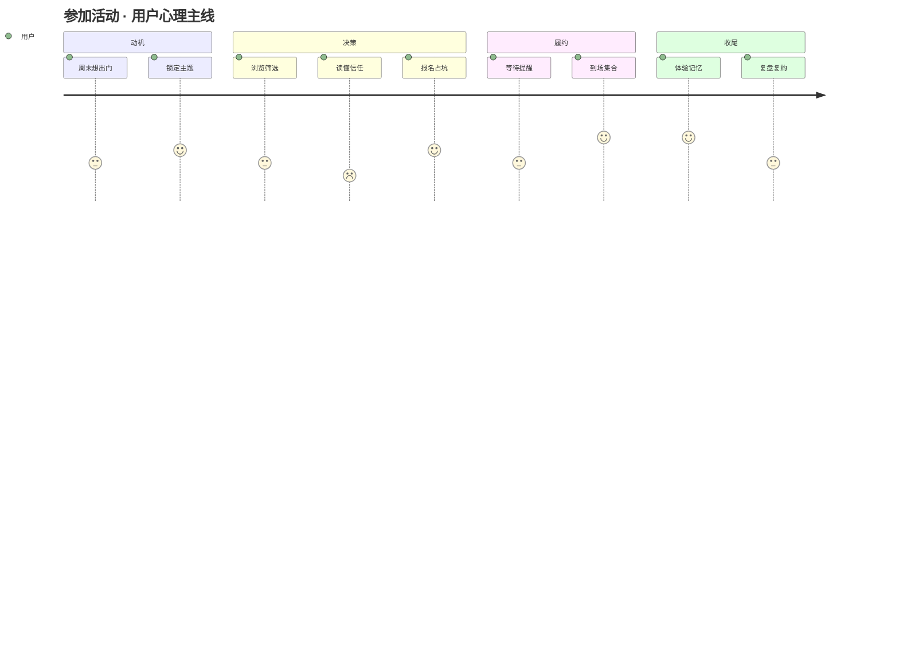
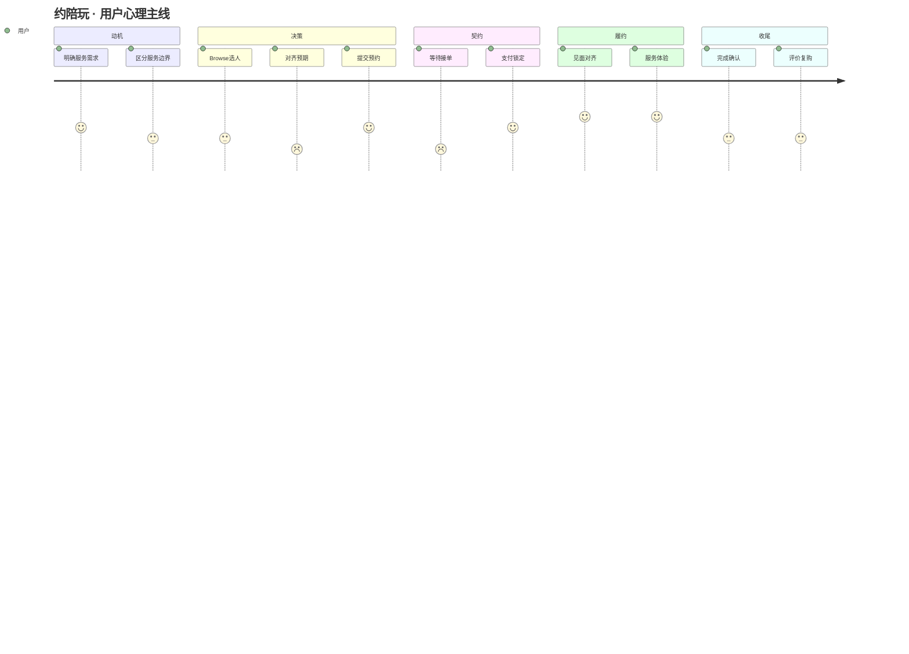

# 用户旅程与技控地图（真实生活 · 0→1）

> **本文视角**：用户 0→1 完成「参加活动」「约陪玩」的真实心理与技控节点。  
> **不绑定实现**：行业参照与 P2 愿景 ≠ V1 已交付；**落地对照**见 [PRD.md §5](PRD.md#5-技控节点对照表旅程--需求--实现)。  
> **与信任模型**：文中「评价 / 好评率」多为**行业类比**；V1 不做公开星级墙，见 [TrustBehaviorModel.md](TrustBehaviorModel.md)。

---

## 1. 什么是「技控」（对人的版本）

技控不是写代码，而是回答：**这一步用户心里在过什么关？什么情况下会放弃？产品必须在哪一刻给出确定性？**

每个节点用五问记录：

| 维度 | 问什么 |
|------|--------|
| **用户心智** | 此刻最想知道 / 最怕什么 |
| **行为** | 现实中会做什么（含 offline） |
| **情绪** | 兴奋 / 犹豫 / 焦虑 / 后悔 |
| **控制点** | 产品必须交付的「确定性」（信息、承诺、凭证、兜底） |
| **流失风险** | 不做会怎样 |

编号：`A-xx` 活动 · `B-xx` 陪玩。

---

## 2. 两件事的本质差异（先建立正确预期）

人在决定「去一场局」和「约一个人」时，**心里买的不是同一种东西**。

| | **参加活动** | **约陪玩** |
|---|-------------|-----------|
| **本质** | 买一个**时空坐标上的集体体验**（场） | 买一个**人对人的可预期陪伴/技能服务**（人） |
| **最大焦虑** | 去不去得了、坑不坑、安不安全、会不会尬 | 人靠不靠谱、价合不合理、会不会放鸽子 |
| **决策重心** | 时间地点主题 + 还有没有人 + 费用 | 这个人 + 时段 + 服务内容 + 口碑 |
| **履约形态** | 多人集合，有「到场」这一物理时刻 | 多为 1v1 或小班，强依赖提前对齐细节 |
| **事后沉淀** | 回忆、照片、复盘、可能再约 | 是否愿意复购同一个人 |
| **成熟 App 共性** | 活动页 = **决策卡**（何时何地何人何价） | 人页 = **信任栈**（照片、评价、响应、价格锚点） |

---

## 3. 流程 A：参加一场活动（真实生活 0→1）

### 3.1 人物与动机（代入）

**小林**，28 岁，同城上班族。周五刷手机，想周末别宅着——最好有具体题目（夜骑 / 羽毛球 / 看展），不想自己组局。

---

### 3.2 完整旅程（按时间线）

#### 阶段 0 · 起心动念（还没打开任何 App）

| 节点 | 用户心智 | 真实行为 | 情绪 | 控制点 | 流失 |
|------|----------|----------|------|--------|------|
| **A-01 触发** | 「周末干嘛」「想找搭子但懒得社交」 | 问朋友 / 刷小红书 / 看群消息 / 打开组局 App | 轻度无聊 | — | 继续刷短视频 |
| **A-02 意图成形** | 「我想**骑个车** / **打场球**，不是泛泛社交」 | 心里有一个**主题 + 大致时间段** | 期待 | — | 主题太模糊则放弃 |

**成熟思路**：Meetup、豆瓣同城、小红书本地都在抢 **「主题 + 时间窗口」** 这一心智，而不是「又一个社交 App」。

---

#### 阶段 1 · 发现与筛选（0→有兴趣）

| 节点 | 用户心智 | 真实行为 | 情绪 | 控制点 | 流失 |
|------|----------|----------|------|--------|------|
| **A-10 浏览列表** | 「哪个看起来**靠谱、顺路、不太贵**」 | 滑卡片，看封面、标题、时间、距离 | 好奇 | **3 秒可读**：主题 / 何时 / 多远 | 信息糊成一团 |
| **A-11 排除** | 「太远 / 太贵 / 已满 / 看起来假」 | 直接划走 | 无感 | 满员、已结束要**一眼可见** | 点进去才被告知 |
| **A-12 短list** | 「就剩 1～2 个想点开」 | 收藏 / 分享问朋友 / 对比 | 轻微兴奋 | 收藏 = 降低决策压力 | 选择疲劳 |

**成熟思路**：App Store Today / 美团「猜你喜欢」——**少而精的精选 + 可解释的推荐理由**（「2 位好友也去」「只剩 3 席」）比无限信息流更有效。

---

#### 阶段 2 · 读懂与信任（有兴趣→敢报名）

| 节点 | 用户心智 | 真实行为 | 情绪 | 控制点 | 流失 |
|------|----------|----------|------|--------|------|
| **A-20 打开详情** | 「这到底是什么局？适合我吗？」 | 读标题、看发起人、看已参加的人 | 审视 | **决策卡**：费用 / 时间 / 地点 / 名额 | 像广告页 |
| **A-21 安全与可信** | 「会不会是酒托 / 收费陷阱 / 野队不安全」 | 看发起人资料、历史活动、评价、平台认证 | 警惕 | **信任信号**：认证、成局数、规则说明 | 信任不够 |
| **A-22 执行成本** | 「我赶得上吗？装备要啥？下雨咋办？」 | 看集合时间、交通、须知、天气（常切出去查地图） | 算计 | 集合点、迟到规则、取消政策** upfront** | 成本算不清 |
| **A-23 社交成本** | 「会不会就我一个外人？」 | 看已报名头像、有没有熟人 | 社恐焦虑 | 「X 人已参加」+ 熟人标记 | 怕尬 |
| **A-24 问一句** | 「还有最后一个具体问题」 | 活动群 / 评论里问；成员 Sheet 可私信 | 犹豫 | **低摩擦提问**（活动群优先） | 问不到人 |

**成熟思路**：Eventbrite 详情 = 信息层级；Airbnb Experience = **Host 故事 + 明确包含什么**；国内组局类强调 **发起人信用 + 已参加名单**。

---

#### 阶段 3 · 决策与占坑（敢报名→真正成局）

| 节点 | 用户心智 | 真实行为 | 情绪 | 控制点 | 流失 |
|------|----------|----------|------|--------|------|
| **A-30 按按钮前** | 「再确认一次时间跟日历有没有冲突」 | 对照日历、问同事要不要一起 | 最后犹豫 | 冲突提醒（软提示即可） | 撞车 |
| **A-31 报名 / 支付** | 「占个位，别把我落下」 | 点参加；付费场选支付方式 | 紧张→释放 | **即时反馈**：成功 / 失败原因明确 | 支付失败不知咋办 |
| **A-32 占坑成功** | 「好了，这周末有安排了」 | 截图、分享、加日历 | 安心 | **凭证感**：订单 / 票 / 「已参加」 | 成功页太空 |
| **A-33 打开活动群** | 「集合细节在哪看？」 | 消息 Tab 活动群 / 行程页 nextStep | 依赖 | **自动入群 + 消息 Tab 引导 + 行程页打开活动群** | 找不到组织入口 |
| **A-34 候补** | 「满了但还想等」 | 加候补；等通知 | 不甘 | 候补排位 + 空位通知 | 静悄悄失败 |

**成熟思路（2026-09 评审后）**：报名成功页 = **打开我的行程** + 加日历；活动群在消息 Tab，集合信息在群里。履约 checklist 仅在「我的行程」。

---

#### 阶段 4 · 等待与赴约（成局→到现场）

| 节点 | 用户心智 | 真实行为 | 情绪 | 控制点 | 流失 |
|------|----------|----------|------|--------|------|
| **A-40 活动前 24h** | 「没忘吧？」 | 收到提醒；再看一眼天气和交通 | 轻度焦虑 | 推送 / 日历提醒 | 忘记 |
| **A-41 活动前 2～3h** | 「要出发了；会不会鸽」 | 看群有没有临时变动；问「还有人吗」 | 不确定 | 群内热场 / 发起人广播 | 群死寂 |
| **A-42 临出门** | 「找得到路吗」 | 导航；群里发「我到了」 | 专注 | 一键导航 / 地图 pin | 找错点 |
| **A-43 到场** | 「认人 / 签到 / 别尴尬」 | 找旗子、看头像、发起人点名 | 社交启动 | 现场识别辅助（可选） | 找不到组织 |
| **A-44 临时去不了** | 「突发情况」 | 取消；协调退款；群里道歉 | 愧疚 | **取消规则清晰 + 一键操作** | 硬取消伤信用 |

**成熟思路**：线下活动 App 的胜负手往往在 **T-24h / T-2h 两次触达**，而不是报名当下。

---

#### 阶段 5 · 进行中与结束（现场→记忆）

| 节点 | 用户心智 | 真实行为 | 情绪 | 控制点 | 流失 |
|------|----------|----------|------|--------|------|
| **A-50 进行中** | 「玩得怎样」 | 线下体验；偶尔拍照发群 | 沉浸 | 产品少打扰 | — |
| **A-51 散场** | 「下次还来吗 / 加不加热聊」 | 互加微信；群内约下次 | 满足 or 失望 | 可选：活动结束引导轻量反馈 | — |
| **A-52 事后 24h** | 「想不想写两句 / 发图」 | 发朋友圈、小红书复盘 | 表达欲 | **复盘入口**（非强制） | 无沉淀则平台无内容 |
| **A-53 评价** | 「值不值、发起人怎样」 | 打分、写评、举报 | 理性 | 评价要**具体场景**（集合准不准、组织如何） | 公评变撕逼 |
| **A-54 复购** | 「还有没有类似的局」 | 关注发起人 / 订阅主题 | 长期 | 相关推荐 / 同发起人下一场 | 一次性用户 |

**成熟思路**：豆瓣活动后「写短评」；小红书「返图」——**把线下快乐转成 UGC**，但别在用户还没爽完就弹五星。

---

### 3.3 活动链路 · 技控总图（人视角）

### 3.4 活动 · 必须守住的 5 个技控闸门

| 闸门 | 用户一句话 | 产品承诺 |
|------|-----------|----------|
| **G1 可读** | 「3 秒知道这是什么局」 | 主题 / 时间 / 地点 / 价格 / 名额 |
| **G2 可信** | 「敢付钱 / 敢去」 | 发起人信用 + 规则 + 退款边界 |
| **G3 占坑** | 「我知道自己算进去了」 | 成功反馈 + 凭证 + 进群 |
| **G4 到场** | 「找得到、不白跑」 | 提醒 + 群 + 地图 + 变更通知 |
| **G5 闭环** | 「没白来」 | 复盘 / 评价 / 下一场推荐 |

---

## 4. 流程 B：约一位陪玩（真实生活 0→1）

### 4.1 人物与动机（代入）

**小雯**，24 岁，想找人教羽毛球或同城逛展聊天。不想相亲式社交，想要**明确服务边界和价格**。

---

### 4.2 完整旅程（按时间线）

#### 阶段 0 · 起心动念

| 节点 | 用户心智 | 真实行为 | 情绪 | 控制点 | 流失 |
|------|----------|----------|------|--------|------|
| **B-01 触发** | 「一个人做不来 / 想有人带」 | 搜「羽毛球陪练」「探店搭子」 | 需求明确 | — | 继续忍受 alone |
| **B-02 边界** | 「我要的是**服务**还是**恋爱**」 | 心理区分陪玩 / 教练 / 地陪 | 谨慎 | 平台品类清晰 | 怕暧昧误会 |

**成熟思路**：比心、各类陪玩平台用 **SKU 化服务**（「1 小时陪练」「半天地陪」）降低「这到底是什么关系」的模糊感。

---

#### 阶段 1 · 发现与选人（0→心仪对象）

| 节点 | 用户心智 | 真实行为 | 情绪 | 控制点 | 流失 |
|------|----------|----------|------|--------|------|
| **B-10 浏览** | 「谁看起来专业、顺眼、价合适」 | 看照片、语音、标签、距离 | 挑选 | 封面 + 一句话定位 | 像婚介 |
| **B-11 对比** | 「几个里选一个」 | 比价格、评分、响应速度 | 理性 | **可比维度**：价 / 单量 / 好评 / 可约 | 信息不可比 |
| **B-12 进主页** | 「这人靠谱吗」 | 看评价、服务项、档期、视频 | 审视 | **信任栈**层层叠加 | 资料造假感 |
| **B-13 最后一问** | 「能接我的时间段吗」 | 看日历；或先打招呼问 | 不确定 | 可约 / 不可约 **实时** | 不可约还让人白聊 |

**成熟思路**：Airbnb 主机页 = 照片 + 评价 + 超赞房东；陪玩类 = **接单数 + 好评率 + 响应时长** 三件套。

---

#### 阶段 2 · 对齐预期（选人→敢下单）

| 节点 | 用户心智 | 真实行为 | 情绪 | 控制点 | 流失 |
|------|----------|----------|------|--------|------|
| **B-20 打招呼** | 「先探探口气、会不会冷场」 | 发几句私信；听语音 | 试探 | 安全聊天；不必立刻下单 | 被营销轰炸 |
| **B-21 议边界** | 「在哪见、干什么、多久、多少钱」 | 文字确认服务内容 | 谨慎 | 固定价 SKU 减少扯皮；议价项要明确 | 价格纠纷 |
| **B-22 选时段** | 「就约这场」 | 在日历点可约日期 + 时长 | 决心 | 冲突检测；时长阶梯清晰 | 选完被告知不行 |
| **B-23 提交意向** | 「先占上，别被抢走」 | 提交预约 / 下单申请 | 期待 | **「已提交，等待确认」** 状态可见 | 石沉大海 |

**成熟思路**：美团预约 / 闲鱼服务 = **先下单后确认** 或 **先确认后支付** 两种模型；陪玩常见 **接单 → 再付**，降低用户「付了款被放鸽子」恐惧。

---

#### 阶段 3 · 确认与支付（意向→契约成立）

| 节点 | 用户心智 | 真实行为 | 情绪 | 控制点 | 流失 |
|------|----------|----------|------|--------|------|
| **B-30 等待接单** | 「接不接？多久回？」 | 刷 App；看消息 | 焦虑 | **SLA 预期**（如 30 分钟内） | 无反馈流失 |
| **B-31 接单通知** | 「好，可以付钱了」 | 收到推送；打开支付 | 释放 | 明确「请在 X 前支付否则释放」 | 错过支付窗 |
| **B-32 支付** | 「钱交给平台比较安心」 | 平台内支付（而非私下转账） | 谨慎→信任 | 平台担保话术 + 退款规则 | 要求私下转 |
| **B-33 契约感** | 「约定了：谁、何时、何地、何服务、多少钱」 | 看订单详情 / 凭证 | 安心 | **订单摘要一页纸** | 凭证信息散 |

**成熟思路**：支付成功页 = 订单号 + 时间地点 + **「联系 TA」** + **「取消规则」**（类似机票行程单）。

---

#### 阶段 4 · 赴约与履约（契约→服务发生）

| 节点 | 用户心智 | 真实行为 | 情绪 | 控制点 | 流失 |
|------|----------|----------|------|--------|------|
| **B-40 见面前对齐** | 「到底在哪见、穿什么、带什么」 | 私信确认；发定位 | 务实 | 预约上下文带进聊天 | 重复问 |
| **B-41 提醒** | 「别迟到」 | T-30min 提醒 | — | 双向提醒（用户 + 陪玩） | 忘记 |
| **B-42 见面** | 「是不是本人 / 会不会尴尬」 | 线下相认；开始服务 | 启动期最敏感 | 可选：到达确认 | 认人不符 |
| **B-43 服务中** | 「值不值这个价」 | 体验教学 / 陪伴 | 实时评判 | 产品少打扰 | — |
| **B-44 延长或变更** | 「再加一小时？」 | 口头谈；可能补单 | — | 变更走平台补差价 | 线下加价纠纷 |
| **B-45 意外** | 「对方迟到 / 爽约 / 体验极差」 | 投诉、退款、平台介入 | 愤怒 | **一键求助 / 客服 / 退款入口** | 只能私下撕 |

**成熟思路**：网约车「行程分享」；陪玩可借鉴 **服务开始 / 服务结束** 两次确认（类似顺风车到达确认），保护双方。

---

#### 阶段 5 · 收尾与关系（服务→复购 or 拉黑）

| 节点 | 用户心智 | 真实行为 | 情绪 | 控制点 | 流失 |
|------|----------|----------|------|--------|------|
| **B-50 结束瞬间** | 「就这样结束了？」 | 道别；可能加微信（跳出平台） | 复杂 | 轻量「完成确认」 | — |
| **B-51 履约确认** | 「服务算完成了吧」 | 点「已完成」 | 中性 | 双方或单方确认机制 | 陪玩赖账说没服务 |
| **B-52 评价** | 「写不写评、写多狠」 | 星级 + 文字 + 图 | 理性 / 泄愤 | **评价维度**（专业、守时、态度） | 恶意差评 |
| **B-53 信用** | 「这人平台内信用怎样」 | 不一定公开，但影响匹配 | — | 行为信用（不一定公开展示） | — |
| **B-54 复购** | 「下次还找不找 TA」 | 收藏、再约、推荐相似人 | 满意则粘 | 「再约 TA」捷径 | 流失到微信私域 |

**成熟思路**：Uber 双向评价；Airbnb 只公开双方完成后的评价；陪玩平台常把 **复购** 做成主页「再次预约」。

---

#### 阶段 6 · 退款与纠纷（异常但必设计）

| 节点 | 用户心智 | 真实行为 | 情绪 | 控制点 | 流失 |
|------|----------|----------|------|--------|------|
| **B-60 想退** | 「能不能退、退多少」 | 查规则；提交申请 | 焦虑 | 规则**下单前可见** | 规则藏太深 |
| **B-61 处理中** | 「平台管不管」 | 等进度 | 不信任 | 进度可见 + 时间预期 | 石沉大海 |
| **B-62 结果** | 「钱回来 / 没回来」 | 接受或投诉 | 释然 or 永久流失 | 到账通知 | 一次纠纷永久 uninstall |

---

### 4.3 陪玩链路 · 技控总图（人视角）

### 4.4 陪玩 · 必须守住的 5 个技控闸门

| 闸门 | 用户一句话 | 产品承诺 |
|------|-----------|----------|
| **G1 可比** | 「几个人里我能选出最好的」 | 价 / 口碑 / 可约 / 响应 |
| **G2 可预期** | 「我知道买的是什么服务」 | SKU + 时长 + 地点类型 |
| **G3 可等待** | 「提交后有人理我」 | 状态机 + 接单 SLA + 通知 |
| **G4 可担保** | 「钱不直接给陌生人」 | 平台支付 + 退款规则 |
| **G5 可确认** | 「服务确实发生了」 | 完成确认 + 评价 + 信用 |

---

## 5. 两条链路对照 · 人真正不同的「断点」

| 断点 | 活动 | 陪玩 |
|------|------|------|
| **最大放弃点 1** | 详情看不懂 / 不信任发起人 | 主页不像真人 / 价格心里没底 |
| **最大放弃点 2** | 支付后找不到组织（没群、没集合点） | 提交后没人接单 |
| **最大放弃点 3** | 活动当天忘记 / 找错地方 | 见面前细节没对齐 |
| **最大后悔点** | 「这局货不对板」 | 「人不对 / 服务水」 |
| **最该发通知的时刻** | 报名成功 · 前 24h · 前 2h · 变更 | 接单 · 待支付 · 前 30min · 对方消息 |
| **最该给的「凭证感」** | 票 + 群 + 日历 | 订单摘要 + 聊天上下文 |

---

## 6. 成熟 App 可借鉴的产品原则（抽象层）

不抄 UI，抄**人对确定性的需求**：

### 6.1 活动向

1. **决策卡优先**：Eventbrite / 美团 — 第一屏回答 When / Where / Who / How much / Spots left。  
2. **社会证明**：Meetup — 「X 人参加」比算法解释更有用。  
3. **报名即组织**：成功页必须接 **群 + 日历 + 地图**，否则用户觉得「只扣了钱」。  
4. **时间触达**：两次提醒（远 + 近）+ 变更广播。  
5. **结束后 UGC**：小红书式复盘 > 强制五星。

### 6.2 陪玩向

1. **人 = 信任栈**：照片 / 语音 / 单量 / 评价 / 认证，层层叠加，不要一次堆完。  
2. **SKU 化**：把「约一下」变成「买 1 小时羽毛球陪练」——Airbnb Experience 逻辑。  
3. **接单再付 or 平台托管**：降低「付了见不到人」恐惧（行业两种模型，选一种讲清楚）。  
4. **聊天带上下文**：订单时间、地点、服务项自动挂在会话里，别让用户重复打字。  
5. **完成确认 + 双向评价**：网约车逻辑；公评维度要**场景化**（守时、专业），不是「人好不好看」。

---

## 7. 技控优化清单（纯产品 · 可排期）

按「用户痛」排序，**不涉及实现文件**。P0 对照 [PRD.md §5](PRD.md#5-技控节点对照表旅程--需求--实现)；P2 含 📋 未纳入 V1 项（如公开评价）。

### P0 · 不做就会掉转化

| # | 链路 | 用户痛 | 产品动作 |
|---|------|--------|----------|
| 1 | 活动 | 报名成功不知道下一步 | 成功页：**打开我的行程** + 日历；活动 Tab「下一场」Banner；群在消息 |
| 2 | 活动 | 不信任发起人 | 详情首屏信任：认证 + 成局数 + 取消规则 |
| 3 | 陪玩 | 提交后石沉大海 | 状态可见 + 接单超时 + Push |
| 4 | 陪玩 | 怕私下转账被骗 | 强调平台担保；议价也走平台 |
| 5 | 通用 | 临时去不了不知道咋办 | 取消 / 退款规则在**付费前**一页看清 |

### P1 · 体验质感

| # | 链路 | 用户痛 | 产品动作 |
|---|------|--------|----------|
| 6 | 活动 | 当天找错集合点 | 前 2h Push + 群置顶 + 一键导航 |
| 7 | 陪玩 | 见面前反复确认细节 | 订单摘要进私信；见面前 checklist |
| 8 | 活动 | 满了还想等 | 候补 + 空位 Push |
| 9 | 陪玩 | 服务完不知道要不要评 | 完成后 24h 内轻量评价（可跳过）**📋 V2；V1 用私密安全确认** |

### P2 · 留存与口碑

| # | 链路 | 用户痛 | 产品动作 |
|---|------|--------|----------|
| 10 | 活动 | 玩完就散 | 复盘模板 + 相关下一场 |
| 11 | 陪玩 | 满意想再约 | 主页「再约 TA」+ 收藏 |
| 12 | 通用 | 一次纠纷永久不信 | 退款进度透明 + 人工入口 |

---

## 8. 发布前 · 用户视角验收（Walkthrough）

找 5 个真人（含 1 个社恐、1 个从未约过陪玩），只做口述 walkthrough，不问 UI：

### 活动

1. 给你 3 张卡片，你会选哪个？为什么？（**A-10**）  
2. 打开详情，敢不敢报名？缺什么信息？（**A-20～A-22**）  
3. 假设报上了，明天活动前你期望收到什么？（**A-40～A-42**）  
4. 临时去不了，你期望怎么退？（**A-44**）

### 陪玩

1. 三个人选谁？依据是什么？（**B-10～B-12**）  
2. 下单前最后一问是什么？（**B-20～B-21**）  
3. 提交后 10 分钟没动静，你会怎样？（**B-30**）  
4. 见面出问题，第一反应找谁？（**B-45**）

---

## 9. 与「坐标系」愿景的对齐（一句话校验）

愿景：**让一起玩，变得简单、自然、可信。**

| 链路 | 「简单」 | 「自然」 | 「可信」 |
|------|----------|----------|----------|
| 活动 | 3 秒读懂、一键占坑 | 群与日历像真实组局 | 发起人信用 + 退款清楚 |
| 陪玩 | SKU 明码标价 | 聊天像约朋友但有边界 | 平台担保 + 完成确认 |

若某功能不能在三列中至少填一格，先问：**这是在帮用户完成真实生活里的哪一步？**

---

*文档定位：用户心理与技控的「真相源」。**实现对照**见 [PRD.md §5](PRD.md#5-技控节点对照表旅程--需求--实现)；代码落点见 [AppArchitecture.md](AppArchitecture.md)。*
