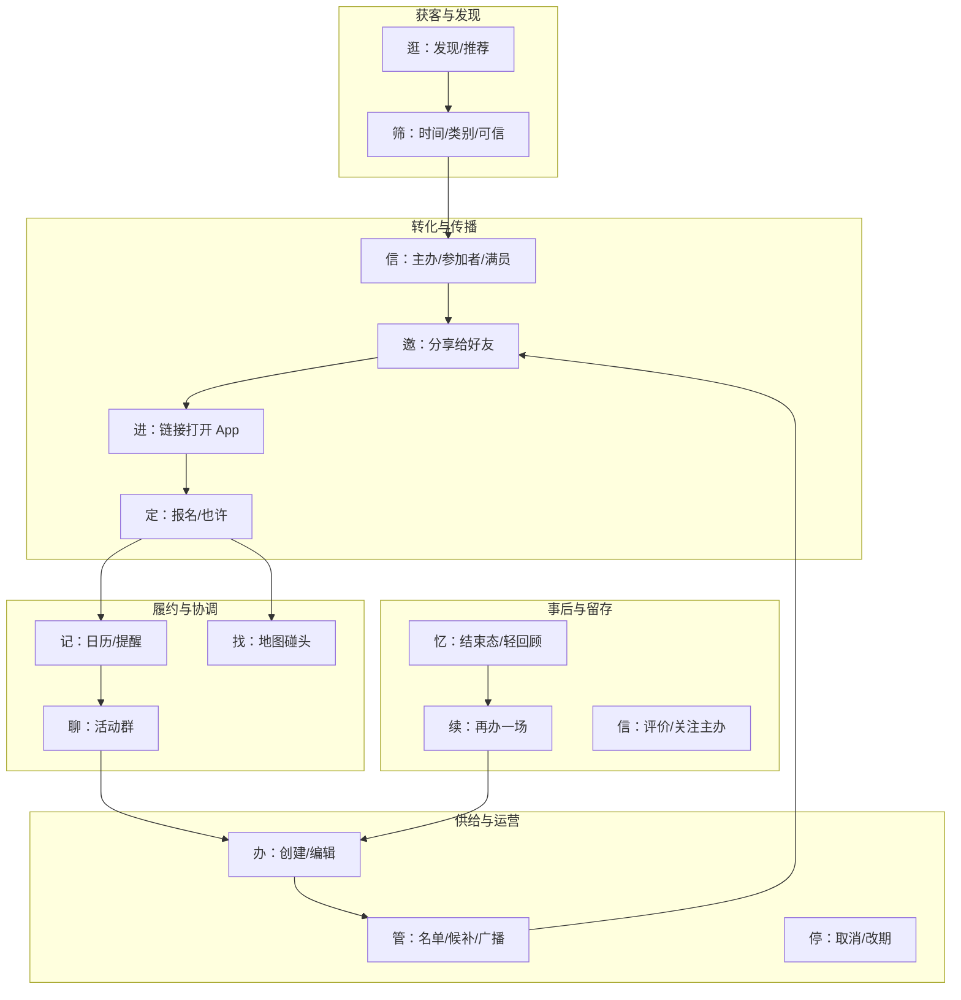
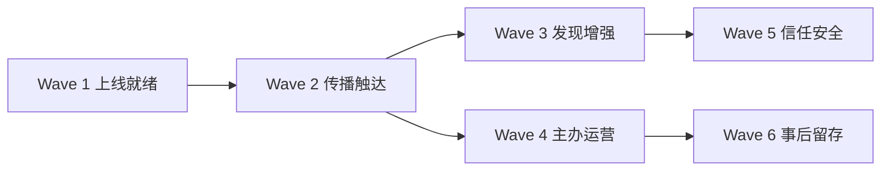

# Activity module — full-vision upgrade plan

**Status:** Active — **iOS client Phase 15–24 implemented (Mock + Live paths)**; backend Staging for 15–16 still required  
**Last updated:** 2026-06-05  
**Prerequisites:** Phases 1–14 in [DEVELOPMENT_PLAN.md](DEVELOPMENT_PLAN.md) (shipped on Mock)  
**Principles:** [DESIGN_PHILOSOPHY.md](DESIGN_PHILOSOPHY.md) · [API_CONTRACT.md](API_CONTRACT.md) · [ARCHITECTURE.md](ARCHITECTURE.md)

---

## 1. 全部构想（North Star）

用户心智中的「活动」不是单一功能，而是一条**立体社交链**：

**0→1 已落地（Phase 11–14）：** 发现逛局 → 邀友 → 报名 → 群聊 → 创建/再办；活动 Tab 收件箱承接 A/C。

**本计划（Phase 15+）：** 在不变更「形式服从功能」前提下，把四条用户路径 + 平台能力补到**可 Staging 上线、可增长、可信任**。

---

## 2. 四条路径 — 现状与目标差距

| 路径 | 角色 | 当前（Phase 14） | 全部构想目标 | 差距等级 |
|------|------|------------------|--------------|----------|
| **B** 主动发现 | 逛局者 | Discover 列表 + 详情 | 推荐/筛选/同城感/可信信号 | **中** |
| **桥** 邀友 | 传播者 | 分享+复制文案（发现详情置顶） | 微信卡片、Universal Link、站内选好友 | **高** |
| **A** 被邀请 | 受邀者 | 深链/搜索/活动 Tab + 完整 RSVP | 外链 100% 可打开、Push 改期提醒 | **中** |
| **C** 主办 | 供给方 | 创建/编辑/取消/名单统计 | 候补、审批、群发、协办 | **中** |
| **D** 事后 | 参与者 | 已结束 + 再办一场 | 轻回顾、签到、评价主办 | **低→中** |

**平台横切：** Live 后端、推送、信任安全闭环、社区/发现融合、商业化策略。

---

## 3. 升级波次（推荐顺序）

依赖关系：**先能真机跑通 → 再传播 → 再发现深度 → 再主办运营 → 再事后留存**。

| 波次 | 主题 | 对应 Phase | 业务价值 |
|------|------|------------|----------|
| **Wave 1** | 上线就绪 | 15–16 | Mock 外真实用户能走完主路径 |
| **Wave 2** | 传播触达 | 17–18 | 0→1 增长：链接与提醒 |
| **Wave 3** | 发现增强 | 19–20 | B 路径「像产品」而非「演示列表」 |
| **Wave 4** | 主办运营 | 21–22 | C 路径规模化小局 |
| **Wave 5** | 信任安全 | 23 | 陌生人局可敢去 |
| **Wave 6** | 事后留存 | 24 | D 路径复购与再供给 |

---

## Phase 15 — Live 活动 API 联调（Wave 1）

**用户故事：** 作为真实用户，我在 Staging 上可以逛发现、报名、进群，与 Mock 行为一致。

| # | 交付 | 模块 / API |
|---|------|-------------|
| 15.1 | 后端实现并部署：`browse` / `feed` / `detail` / `rsvp` / `create` / `patch` / `cancel` / `report` | Backend |
| 15.2 | `activity-threads` 与 RSVP 原子一致 | Backend + Messages |
| 15.3 | iOS Staging smoke 清单写入 [DEVELOPMENT.md](DEVELOPMENT.md) | docs |
| 15.4 | 契约回归：`make check-api-contract` 与 DTO 对齐 | `SparkActivity` |

**验收：** Staging 账号完成「发现 → 报名 → 群聊发消息」无 404/解码失败。

**不做：** 新 UI。

---

## Phase 16 — 推送与日程提醒（Wave 1）

**用户故事：** 报名后我在活动前收到提醒，主办改期/取消我能知道。

| # | 交付 | 模块 |
|---|------|------|
| 16.1 | APNs 注册 + device token 上报 | `Spark` / Backend |
| 16.2 | 事件：`activity.reminder`（前 24h/1h）、`activity.cancelled`、`activity.updated` | Backend |
| 16.3 | 点击 Push → `AppRouter` 进活动详情 | `SparkAppShell` |
| 16.4 | 设置页开关「活动提醒」（最小） | `Spark` 或 Activity 设置区 |

**验收：** TestFlight 报名后 scheduled push 可点开详情。

**不做：** 营销 Push、复杂偏好矩阵。

---

## Phase 17 — Universal Links + 落地（Wave 2）

**用户故事：** 好友在微信点开链接，未安装能看到说明，已安装直达活动详情。

| # | 交付 | 模块 |
|---|------|------|
| 17.1 | `apple-app-site-association` + `https://spark.app/a/{id}` | Web + iOS |
| 17.2 | `AppRouter` 解析 https 与 `spark://` 统一 | `SparkAppShell` |
| 17.3 | 详情分享默认用 https 链接 | `SparkActivity` |
| 17.4 | 可选：极简 H5 预览（标题/时间/主办） | Web |

**验收：** 微信内打开链接 → 安装后首次启动进对应详情。

**不做：** 完整营销落地页。

---

## Phase 18 — 微信友好分享（Wave 2）

**用户故事：** 我分享活动时，朋友在微信看到清晰卡片而非裸链。

| # | 交付 | 模块 |
|---|------|------|
| 18.1 | 系统分享增强：标题+时间+地点+链接（已部分有，统一触点） | `SparkActivity` |
| 18.2 | （可选）微信 Open SDK 分享小程序/链接 — 需合规与开放平台 | 独立评估 |
| 18.3 | 报名成功页/发现详情「邀请好友」主按钮保持单一入口 | UI 编排 |

**验收：** 复制文案含可读摘要；分享 sheet message 含 scheduleLine。

**不做：** 无 SDK 时不做假「分享到微信」按钮。

---

## Phase 19 — 发现筛选与排序（Wave 3）

**用户故事：** 我想只看本周、某类别、未结束的活动。

| # | 交付 | API |
|---|------|-----|
| 19.1 | Discover 筛选：时间（本周/本月）、类别 chips | UI（新屏，非已删的 `ActivityBrowse*`） |
| 19.2 | `GET /v1/activities/browse?category=&starts_before=` | 契约扩展（iOS 客户端尚未接入） |
| 19.3 | 空态/筛选无结果 `ContentUnavailableView` | `SparkActivity` |

**验收：** Mock 下列表随筛选变化；默认仍按 `starts_at` 升序。

**不做：** 地图选点、LBS 实时定位（隐私见 Phase 23）。

---

## Phase 20 — 发现可信信号（Wave 3）

**用户故事：** 陌生人局我也敢点进去。

| # | 交付 | API / UI |
|---|------|----------|
| 20.1 | 详情：主办简介一行 +「更多活动」进主办列表（同 host 其他局） | `GET /v1/activities?host_id=` |
| 20.2 | 参加者预览已有 → 增加「已实名」等标签位（后端字段占位） | `attendees[].verified` |
| 20.3 | 主办头像/标识（系统 SF Symbol 起步，无假图床） | UI |

**验收：** 详情能看见主办是谁、还有谁去；无数据则不显示占位徽章。

**不做：** 完整信用分、评论系统。

---

## Phase 21 — 候补与满员（Wave 4）

**用户故事：** 局满了我想排队；主办能看到候补名单。

| # | 交付 | API |
|---|------|-----|
| 21.1 | RSVP 状态 `waitlisted` 或独立 `POST .../waitlist` | 契约 |
| 21.2 | 满员时 UI：「加入候补」替代灰色参加 | `SparkActivity` |
| 21.3 | 主办区：候补列表 + 提升为参加（主办操作） | 主办 API |

**验收：** Mock 满员局可排队；主办侧看到候补 1 人。

---

## Phase 22 — 主办广播与改期（Wave 4）

**用户故事：** 主办改时间或发通知，报名者在群聊和 Push 里都知道。

| # | 交付 | 模块 |
|---|------|------|
| 22.1 | 编辑活动时若 `starts_at` 变更 → 触发 Push + 群系统消息 | Backend + Messages |
| 22.2 | 主办一键「群发通知」→ `POST .../announce` 写入群 thread | Messages API |
| 22.3 | 详情主办区「通知报名者」入口 | `SparkActivity` |

**验收：** 改期后 Mock 群聊出现系统消息；Push payload 可测。

**不做：** SMS 群发。

---

## Phase 23 — 信任与安全闭环（Wave 5）

**用户故事：** 不靠谱的活动我能举报并感到被处理；敏感 UGC 有审核。

| # | 交付 | 模块 |
|---|------|------|
| 23.1 | 举报 API 入库 + 管理端队列（后端） | Backend |
| 23.2 | 客户端举报后「已收到」+ 可选屏蔽主办 | `SparkActivity` |
| 23.3 | 创建/编辑活动文本走敏感词（客户端预检或服务端） | Backend |
| 23.4 | 隐私：地点继续**仅显示名**；查询用 geohash（后端），客户端不存 raw GPS | 架构约束 |

**验收：** 举报有 ticket id；创建含违规词被拒绝并有说明。

**不做：** 完整实名认证 UI（可接第三方，单独项目）。

---

## Phase 24 — 事后留存（Wave 6）

**用户故事：** 活动结束后我有「去过」的记录，愿意再办或关注主办。

| # | 交付 | 模块 |
|---|------|------|
| 24.1 | 活动 Tab 筛选「往期参加」或自动归档 ended | `SparkActivity` |
| 24.2 | 已结束详情：轻回顾（时间/地点/参加者快照） | UI |
| 24.3 | 「再办一场」已有 → 接 `POST create` 后自动打开邀友 | Phase 14 增强 |
| 24.4 | 可选：对主办 thumbs up/down（一次） | 轻量 API |
| 24.5 | 社区联动：活动结束后「发一条感受」链到 `Community` 发帖（deeplink 带 activity_id） | `SparkCommunity` + AppShell |

**验收：** 往期局可查；再办一场 → 创建 → 邀友；可选发社区帖。

**不做：** 相册、签到 GPS、复杂评价矩阵。

---

## 4. 横切项（贯穿多 Phase）

| 项 | 建议 Phase | 说明 |
|----|------------|------|
| Premium 策略 | 19 或独立 ADR | 发现列表是否锁第 2 条？0→1 建议**发现不锁**、收件箱可锁 |
| 分析埋点 | 15 起增量 | `activity_browse_view` / `invite_copy` / `rsvp_submit` / `activity_create` |
| 本地化 | 每 Phase | `Localizable.xcstrings` 与 `defaultValue` 同步 |
| 社区 × 活动 | 24 | 帖子类型 `activity_recap` 或链接字段 |
| 算法推荐 | 20 之后 | v1 用时间+同城 geohash；ML 单独立项 |

---

## 5. API 契约演进索引（Phase 15+）

在 [API_CONTRACT.md](API_CONTRACT.md) 按 Phase 合并前，预期新增/扩展：

| Phase | 端点 / 字段 |
|-------|-------------|
| 16 | Push 无关 REST；可选 `POST /v1/devices` |
| 17 | 无新 REST（Universal Links） |
| 19 | `browse` query：`category`, `starts_after`, `starts_before` |
| 20 | `host_id`, `host_bio`, `attendees[].verified` |
| 21 | `waitlist`, `waitlisted` count |
| 22 | `POST /v1/activities/{id}/announce` |
| 23 | `POST .../report` 响应 `report_id`；`block_user` |
| 24 | `GET feed?segment=past`；`POST .../feedback`；社区帖 `activity_id` |

---

## 6. PR 与里程碑建议

| 里程碑 | 包含 Phase | 对外说法 |
|--------|------------|----------|
| **M1 Staging 活动** | 15–16 | 「活动能真机跑」 |
| **M2 可传播** | 17–18 | 「微信能邀友」 |
| **M3 可逛可信** | 19–20 | 「发现像产品」 |
| **M4 主办工具** | 21–22 | 「办局能管人」 |
| **M5 安全留存** | 23–24 | 「敢去、愿意再来」 |

每个 Phase 仍保持 **≤400 行 / PR**，契约先行于 Live。

---

## 7. 明确不做（防止范围膨胀）

- 活动内支付/票务、发票
- 地图选点创建、实时轨迹
- 完整 Meetup 式公开主页与评论墙
- 发现 Tab 重做成 Feed 推荐流（除非 Phase 20 后单独立项）
- 装饰性动画、假在线人数、stub 语音/视频

---

## 8. 与 DEVELOPMENT_PLAN 的关系

| 文档 | 范围 |
|------|------|
| [DEVELOPMENT_PLAN.md](DEVELOPMENT_PLAN.md) | Phase 0–14 已交付记录 + 0→1 策略 |
| **本文** | Phase 15–24 全部构想升级路线图 |

实现时以 **Phase 编号** 开 PR：`feat(activity): Phase 17 universal links` 等。
