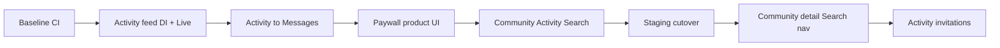

# Spark development plan

**Status:** Active  
**Last updated:** 2026-06-05  

**Activity full vision (Phase 15+):** [ACTIVITY_UPGRADE_PLAN.md](ACTIVITY_UPGRADE_PLAN.md)  
**Principles:** [DESIGN_PHILOSOPHY.md](DESIGN_PHILOSOPHY.md) · [ARCHITECTURE.md](ARCHITECTURE.md) · [DEVELOPMENT.md](DEVELOPMENT.md)

## Goal

Ship the core social loop on Mock first, then Staging Live APIs — one user journey per PR, no decorative placeholder UI.

---

## Phase 0 — Baseline (every sprint)

| Task | Command / artifact |
|------|-------------------|
| Guardrails | `make check` |
| Lint | `make lint` |
| Package tests | `make test-packages` |
| App build + tests | `make build && make test-app` |
| Branch | `feat/<scope>-<issue>` from `develop` |

---

## Phase 1 — Activity vertical slice

**User story:** As a signed-in user, I want to browse activities, so that I can join and coordinate offline.

**Status:** Done (2026-06-04) — **module:** `SparkActivity` (`ActivityRootView` inbox + detail)

| # | Deliverable | Owner module | Done |
|---|-------------|--------------|------|
| 1.1 | `ActivityFeedRepository` wired in `CompositionRoot` (Mock vs Live) | `Spark` / `SparkActivity` | ☑ |
| 1.2 | `LiveActivityFeedRepository` + DTO for `GET /v1/activities/feed` | `SparkActivity` | ☑ |
| 1.3 | `ActivityRootView` — repository injection via AppShell | `SparkActivity` | ☑ |
| 1.4 | `ActivityFeedRepositoryBox` environment (mirrors Messages) | `Spark` | ☑ |
| 1.5 | Unit tests: ViewModel empty/failure; root view init | `SparkActivityTests` | ☑ |
| 1.6 | `#Preview`: loading, loaded, empty, error | `SparkActivity` | ☑ |

**深链 / 搜索进详情：** `ActivityDetailContext.externalEntry`（邀友 CTA）；列表进详情为 `.inbox`。

**Acceptance**

- Mock host: **活动** tab loads three mock activities after login.
- Staging: `LiveActivityFeedRepository` when backend serves `/v1/activities/feed`.

---

## Phase 2 — Activity → Messages

**User story:** As a user, I want to open a conversation from an activity, so that I can coordinate offline.

**Status:** Done (2026-06-04)

| # | Deliverable | Done |
|---|-------------|------|
| 2.1 | Typed navigation: feed row → `MessageThread` via `AppRouter` + `NavigationPath` | ☑ |
| 2.2 | Align `API_CONTRACT.md` with all `Live*` paths (`MessagesAPIPath`) | ☑ |
| 2.3 | Messages failure states with retry (`SparkRetryUnavailableView`) | ☑ |
| 2.4 | Staging smoke: inbox + send message | Manual |

**Acceptance:** Activity row tap lands in conversation; unread badge updates after mark-read.

**Deep links:** `spark://messages/thread/{thread_id}` · `spark://messages?thread_id={id}`

---

## Phase 3 — Paywall

**User story:** As a user, I want to subscribe from the activity premium CTA, so that entitlements unlock paid features.

**Status:** Done (2026-06-05)

| # | Deliverable | Done |
|---|-------------|------|
| 3.1 | `PaywallView` — StoreKit 2 products + purchase | ☑ |
| 3.2 | `EntitlementManager` + `SparkFeatureFlags` / `PremiumFeature.fullActivityFeed` gating | ☑ |
| 3.3 | Localized errors + **恢复购买** (`AppStore.sync` / Mock) | ☑ |

**Kill switch:** `INFOPLIST_KEY_SPARKPremiumPaywallEnabled` (`YES` default). Set `NO` to disable paywall UI and treat all users as premium.

**Gating:** Non-subscribers see the first activity row; rows 2+ are locked and open the paywall.

**Out of scope:** Marketing animations, fake tier badges.

---

## Phase 4 — Secondary tabs (Search + Community)

**Status:** Done (2026-06-05)

| # | Deliverable | Module | Done |
|---|-------------|--------|------|
| 4.1 | `SearchRepository` Mock/Live + `GET /v1/search` | `SparkSearch` | ☑ |
| 4.2 | `SearchRootView` — suggestions, results, retry | `SparkSearch` | ☑ |
| 4.3 | `CommunityPostsRepository` Mock/Live + `GET /v1/community/posts` | `SparkCommunity` | ☑ |
| 4.4 | `CommunityRootView` — list, empty, retry | `SparkCommunity` | ☑ |
| 4.5 | `CompositionRoot` + AppShell repository injection | `Spark` / `SparkAppShell` | ☑ |
| 4.6 | API contract + ViewModel tests | docs / package tests | ☑ |

**Out of scope:** Post detail, create post, moderation UI, Discover recommendations.

**Acceptance:** Mock host — Search returns two results after query; Community shows three posts. Deep link `pendingSearchQuery` still routes query into Search tab.

---

## Phase 5 — Staging / production

**Status:** Documented (2026-06-05) — manual smoke on team Staging host

1. `Config/Secrets.xcconfig` from example — set `SPARK_API_BASE_URL` ([STAGING.md](STAGING.md)).
2. Verify Auth, Messages, activities feed, search, and community on Staging.
3. Keep Mock for previews and unit tests permanently.

| Environment | URL | iOS data layer |
|-------------|-----|----------------|
| Local | `https://mock.spark.local` | `Mock*` |
| Staging | team Staging host | `Live*` |
| Production | `https://api.spark.app` | `Live*` |

---

## Phase 6 — Community detail & search navigation

**User story:** As a user, I want to read a community post and jump there from search, so that I can follow discussions without leaving the app shell.

**Status:** Done (2026-06-05)

| # | Deliverable | Module | Done |
|---|-------------|--------|------|
| 6.1 | `fetchPost(id:)` Mock/Live + `GET /v1/community/posts/{id}` | `SparkCommunity` | ☑ |
| 6.2 | `CommunityPostDetailView` + push from feed list | `SparkCommunity` | ☑ |
| 6.3 | `AppRouter.pendingCommunityPostID` + deep link `spark://community/post/{id}` | `SparkAppShell` | ☑ |
| 6.4 | Search result tap → Community post or Activity tab | `SparkSearch` / AppShell | ☑ |

**Out of scope:** Replies thread, create post, Discover recommendations.

**Acceptance:** Mock — tap community row → detail body; search community result → detail; `spark://community/post/cp_1` opens detail after login.

---

## Phase 7 — Activity invitations (invite-app parity)

**User story:** As an invitee, I want to see when/where an activity is and RSVP, then open the group chat.

**Status:** Done (2026-06-05)

| # | Deliverable | Module | Done |
|---|-------------|--------|------|
| 7.1 | Feed fields: time, place, host, RSVP badge, capacity | `SparkActivity` | ☑ |
| 7.2 | `ActivityDetailView` + `GET /v1/activities/{id}` | `SparkActivity` | ☑ |
| 7.3 | RSVP `POST /v1/activities/{id}/rsvp` (Mock/Live) | `SparkActivity` | ☑ |
| 7.4 | List → detail → 活动群聊; search/deep link to detail | AppShell / Search | ☑ |

**Out of scope:** Calendar export, map coordinates, attendee list UI.

---

## Phase 8 — Activity full loop (invite · signup · group chat · create · share)

**User story:** Meetup-style loop — receive invite, sign up, enter activity group chat; host can create and share.

**Status:** Done (2026-06-05)

| # | Deliverable | Done |
|---|-------------|------|
| 8.1 | Activity group `thread_id` + `ensureActivityGroupThread` after 报名 | ☑ |
| 8.2 | 活动群聊 only after `going` / `maybe` / `host`; inbox refresh before open | ☑ |
| 8.3 | `CreateActivityView` + `POST /v1/activities` | ☑ |
| 8.4 | `ShareLink` + `spark://activity/{id}` deep link | ☑ |

---

## PR discipline

- One phase item group per PR (≤ ~400 lines).
- Conventional Commits: `feat(activity): wire activity feed in composition root`
- Checklist: [CONTRIBUTING.md](CONTRIBUTING.md), [UI_REVIEW.md](UI_REVIEW.md)

---

## Implementation log

| Date | Phase | Notes |
|------|-------|-------|
| 2026-06-04 | Plan | Initial plan document |
| 2026-06-04 | 1 | Activity feed DI + Live (`SparkActivity`) — shipped |
| 2026-06-04 | 2 | Activity→Messages nav, API paths, retry UI — shipped |
| 2026-06-05 | 3 | PaywallView, restore, premium gating on activity list — shipped |
| 2026-06-05 | 4 | Search + Community vertical slices, DI wiring — shipped |
| 2026-06-05 | 5 | STAGING.md, Secrets example, smoke checklist — documented |
| 2026-06-05 | 6 | Community post detail, search navigation, community deep links — shipped |
| 2026-06-05 | 7 | Activity invitation detail, RSVP, enriched feed — shipped |
| 2026-06-05 | 8 | Signup→group chat, create activity, share invite — shipped |
| 2026-06-05 | 9 | Registrant: feed filters, attendees, map, full/ended, calendar, cancel RSVP — shipped |
| 2026-06-05 | 10 | Host manage/cancel/edit, copy invite, report, API patch — shipped |
| 2026-06-05 | 11–14 | 0→1 path module: Discover feed, invite friends, create CTA, host again — shipped |

## Phase 9 — Registrant experience (joiner)

**User story:** As someone who wants to join activities, I can find my invites, decide with context, sign up, remember the plan, and cancel if needed.

| # | Task | Status |
|---|------|--------|
| 9.1 | Feed segments: 全部 / 待回复 / 即将参加 | ☑ |
| 9.2 | Detail: 参加者 preview, 地点→地图, 已满/已结束态 | ☑ |
| 9.3 | 加入日历 + 取消参加 | ☑ |
| 9.4 | API `lifecycle_status` + `attendees` (contract + Mock) | ☑ |

## Phase 10 — Host operations & safety (module completion)

**User story:** As a host, I manage signups and edit/cancel events; as a registrant, I can report unsafe invites.

| # | Task | Status |
|---|------|--------|
| 10.1 | Feed filter **我主办** | ☑ |
| 10.2 | Host: 报名名单 + RSVP 统计、编辑活动、取消活动 | ☑ |
| 10.3 | 复制邀请文案（时间/地点/链接） | ☑ |
| 10.4 | 举报活动 + API `PATCH` / `cancel` / `report` | ☑ |

**Still out of scope (post-MVP):** Push 提醒、微信 SDK 卡片、Universal Link 落地页、候补名单、主办广播消息。

---

## 0→1 策略调整（B 优先）

**主路径（获客与供给）：** 发现 Tab 逛局 → 详情决策 → **邀请好友**（传播）→ 报名/也许 → 群聊；成熟用户 → **创建活动**（供给）。

**次路径：** 外链/好友邀请（A）进入同一详情；活动 Tab = 我的邀请 + 我主办（收件箱）。

| Phase | 路径 | 目标 | Status |
|-------|------|------|--------|
| 11 | **B** 逛局（已并入活动模块） | 独立「喜欢」Tab 已移除；深链/搜索 → `ActivityRootView` + `externalEntry` | ☑ |
| 12 | **B→社交** 邀友 | 详情/发现强调「邀请好友」；复制/分享触点统一 | ☑ |
| 13 | **C** 创建入口 | 发现空态/逛后 CTA「创建活动」；与活动 Tab `+` 一致 | ☑ |
| 14 | **D** 事后 | 已结束：「再办一场」预填创建 | ☑ |
| — | **A** 被邀请 | Phase 7–10 已覆盖；降为深链/收件箱入口 | ☑ |

路径评估见对话记录；实现顺序 **11 → 12 → 13 → 14**，A 维护不重做。

| 15–24 | **全量 iOS 客户端** | Live 路径、推送/本地提醒、Universal Link、发现筛选、可信、候补、广播、安全、事后 | ☑ Mock |

**Next:** 后端 Staging（Phase 15–16）、`apple-app-site-association` 上线（Phase 17）、见 [ACTIVITY_UPGRADE_PLAN.md](ACTIVITY_UPGRADE_PLAN.md)。
