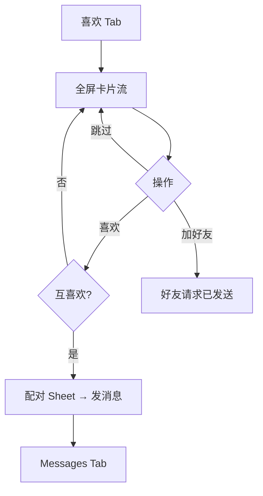

# Spark Likes（喜欢）模块开发计划

**Status:** Active  
**Last updated:** 2026-06-05  
**Principles:** [DESIGN_PHILOSOPHY.md](DESIGN_PHILOSOPHY.md) · [ARCHITECTURE.md](ARCHITECTURE.md) · [API_CONTRACT.md](API_CONTRACT.md)  
**ADR:** [adr/0001-likes-tab-social-discovery.md](adr/0001-likes-tab-social-discovery.md)

## 目标

在「喜欢」Tab 提供 **TikTok 式垂直全屏卡片流**（图/视频），用户通过 **喜欢 / 跳过 / 加好友** 发现同性或异性朋友；互喜欢 → **配对** → 进入 **消息** 会话。

**与活动模块边界：** `SparkActivity` = 局与收件箱；`SparkLikes` = 人发现。不得再在喜欢 Tab 挂载活动列表。

## 用户路径



## Phase 0 — 契约与模块（本仓库已落地）

| # | 交付 | 状态 |
|---|------|------|
| 0.1 | ADR-0001 边界 | ☑ |
| 0.2 | `API_CONTRACT` Likes 段 | ☑ |
| 0.3 | `Packages/SparkLikes` | ☑ |

## Phase 1 — 垂直卡片流 + Mock

| # | 交付 | 状态 |
|---|------|------|
| 1.1 | `LikesFeedRepository` + Mock/Live 骨架 | ☑ |
| 1.2 | `LikesRootView` 垂直分页 + `DiscoverCardView` | ☑ |
| 1.3 | 喜欢 / 跳过 底部主操作 | ☑ |
| 1.4 | Tab 接入 `SparkMainTabView` | ☑ |

## Phase 2 — 动作持久化 + 筛选

| # | 交付 | 状态 |
|---|------|------|
| 2.1 | like/pass 去重，Mock 队列推进 | ☑ |
| 2.2 | `LikesPreferences`（性别/意图）设置 Sheet | ☑ |
| 2.3 | 单元测试 VM + Mock | ☑ |

## Phase 3 — 配对 / 好友 → 消息

| # | 交付 | 状态 |
|---|------|------|
| 3.1 | `LikeActionOutcome` matched / pending | ☑ |
| 3.2 | `MatchSheetView` + `AppRouter.openConversation` | ☑ |
| 3.3 | `MessagesRepository.ensureDirectMessageThread` | ☑ |
| 3.4 | 好友请求 Mock 反馈 | ☑ |

## Phase 4 — 视频卡片

| # | 交付 | 状态 |
|---|------|------|
| 4.1 | `DiscoverMedia` image / video | ☑ |
| 4.2 | 可见卡播放，离屏 pause | ☑ |

## Phase 5 — 安全与 Live

| # | 交付 | 状态 |
|---|------|------|
| 5.1 | 举报 / 拉黑 API + Mock | ☑ |
| 5.2 | `LiveLikesFeedRepository` | ☑ |
| 5.3 | Staging smoke 项写入 [STAGING.md](STAGING.md) | ☑ |

## Phase 6 — 相册式照片展示

| # | 交付 | 状态 |
|---|------|------|
| 6.1 | 环境模糊背景 + 前景 `aspectFit`（`DiscoverAmbientImageBackdrop`） | ☑ |
| 6.2 | 双指捏合 / 双击缩放（`DiscoverPhotoZoomState`） | ☑ |
| 6.3 | 缩放时禁用垂直翻页 | ☑ |
| 6.4 | 视频全屏 `AVPlayerLayer` + 点按暂停/继续 | ☑ |
| 6.5 | 图片加载 Data 层 `DiscoverMediaImageCache` | ☑ |

## Phase 7 — Feed 完善

| # | 交付 | 状态 |
|---|------|------|
| 7.1 | `cursor` 分页 + 滑至末卡 `loadMoreIfNeeded` | ☑ |
| 7.2 | 举报原因 Sheet（`LikesReportSheet`） | ☑ |
| 7.3 | `alreadyConnected` → 直达消息 Alert | ☑ |
| 7.4 | 深链 `spark://likes` · `https://spark.app/tab/likes` 测试 | ☑ |

## 验收

```bash
make check && make test-packages && make build
```

手动：登录 Mock → 喜欢 Tab 上下滑 → 喜欢 `u_like_2` → 配对 Sheet → 发消息 → 消息 Tab 有新会话；末卡继续滑加载更多；双击/捏合缩放照片；举报 Sheet 选原因。

## 后续（不在本计划范围）

- 微信分享卡片、算法备案落地页、实名门槛与后端强校验
- 活动卡片角标弱耦合（Phase 6）
