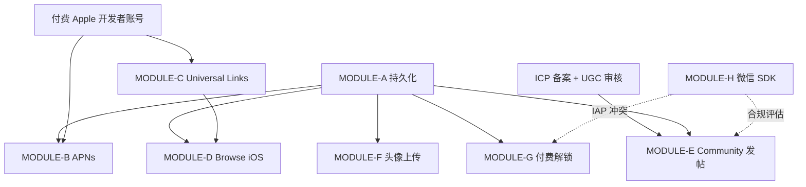

# Spark — 缺失模块立项规划（Phase 25+）

> 衍生自主计划 Out of Scope 项与 `spark_missing_modules_prompt.md` v1.0。  
> ADR 目录：`docs/adr/`。契约：`docs/API_CONTRACT.md`。

---

## 跨模块依赖图

---

## 优先级排序

| 顺序 | 模块 | 用户价值 | 技术解锁 | 合规风险 | 加权理由 |
|------|------|---------|---------|---------|---------|
| 1 | **A** 持久化 | 4 | 5 | 2 | 解锁 B/F/G；Staging 联调基础 |
| 2 | **D** Browse iOS | 4 | 3 | 1 | 后端已就绪；ADR-0003 已定入口 |
| 3 | **B** APNs | 5 | 4 | 2 | 需付费账号 + MODULE-A |
| 4 | **C** Universal Links | 4 | 3 | 3 | 传播闭环；需域名 + 付费账号 |
| 5 | **F** 头像上传 | 3 | 3 | 3 | 真实 Likes 体验；依赖 A |
| 6 | **G** 付费模糊 | 4 | 2 | 4 | StoreKit 已有；ADR-0004 待决 |
| 7 | **E** Community UGC | 3 | 2 | 5 | ICP + 审核前置重 |
| 8 | **H** 微信 SDK | 2 | 1 | 5 | 明确 Out of Scope 直至合规 Go |

---

## MODULE-A：后端持久化数据库

### 立项决策
- **建议：** Go（已 Accept，ADR-0002）
- **前置条件：** CloudBase 环境 `ais-d1gab0emob99361a0`；HTTP 云函数已部署
- **ADR 编号：** [ADR-0002](adr/0002-backend-persistence-cloudbase-nosql.md)

### 用户故事
作为 Staging 测试工程师，我希望云函数重启后活动与 RSVP 仍在，以便完成端到端冒烟而不反复造数。

### Phase 拆分
| Phase | 交付内容 | iOS | Backend | Docs | 依赖 |
|-------|---------|-----|---------|------|------|
| A.1 | `lib/persistence.js` + seed + write-through | - | ✓ | ✓ | ADR-0002 |
| A.2 | `GET /v1/activities/browse` | - | ✓ | ✓ | A.1 |
| A.3 | 设备 token 集合 `spark_devices` | - | ✓ | ✓ | MODULE-B 前置 |
| A.4 | 并发写冲突策略（乐观 `_version`） | - | ✓ | - | 压测后 |

### API_CONTRACT 变更
| 方法 | 路径 | 变更类型 | 关键字段 |
|------|------|---------|---------|
| GET | `/v1/activities/browse` | 新增 | `category`, `starts_after`, `starts_before`, `cursor` |
| GET | `/health` | 扩展 | `persistence: memory \| cloudbase` |

### 验收标准
- [ ] 创建活动 → 触发云函数冷启动 → `GET feed` 仍含该活动
- [ ] `GET /v1/activities/browse` 返回 ≥2 条 `scheduled` 活动
- [ ] `SPARK_PERSISTENCE=memory` 本地无 SDK 可启动
- [ ] 10 并发 RSVP 无 5xx（A.4 前为 best-effort）

### 风险与权衡
- **风险：** 跨集合无事务 → 活动与线程可能短暂不一致（缓解：单请求内先写活动再写线程，dirty 同请求 flush）
- **风险：** Staging 明文密码（缓解：仅测试账号，文档标注禁止生产）

### 预估 PR 数与顺序
1. `feat(api): CloudBase NoSQL persistence layer`（~350 行）— **本 PR**
2. `feat(api): activities browse endpoint`（含于上）
3. `feat(api): spark_devices collection`（MODULE-B 前）

### 明确不做
- PostgreSQL / 境外 DB
- 生产级密码哈希（另开安全 ADR）

---

## MODULE-B：Apple Push Notifications（APNs）

### 立项决策
- **建议：** 条件 Go（付费 Apple Developer Program 开通后）
- **前置条件：** MODULE-A.3 设备 token 持久化；Team 证书或 APNs Key
- **ADR 编号：** ADR-0005（待建）

### 用户故事
作为匹配成功的用户，我希望收到 Push 并一点即进对话，以便不错过互动时机。

### Phase 拆分
| Phase | 交付内容 | iOS | Backend | Docs | 依赖 |
|-------|---------|-----|---------|------|------|
| B.1 | Entitlements + `UNUserNotificationCenter` delegate | ✓ | - | ✓ | 付费账号 |
| B.2 | `POST /v1/devices` 持久化 + token CRUD | - | ✓ | ✓ | A.3 |
| B.3 | 内部 `POST /v1/notifications/send` + APNs HTTP/2 | - | ✓ | ✓ | B.2 |
| B.4 | match / message / activity_* payload 路由 | ✓ | ✓ | ✓ | LIKES Phase 13 骨架 |

### API_CONTRACT 变更
| 方法 | 路径 | 变更类型 | 关键字段 |
|------|------|---------|---------|
| POST | `/v1/devices` | 行为 | 持久化 `device_token`, `platform` |
| POST | `/v1/notifications/send` | 新增（内部） | `user_id`, `type`, `payload` |

### 验收标准
- [ ] 真机沙箱收到 match Push → 点击打开对应对话
- [ ] `activity_cancel` Push → badge 更新
- [ ] 静默推送已读同步不弹横幅

### 风险与权衡
- **风险：** 个人 Apple ID 无法真 Push（缓解：TestFlight + Team 账号）
- **风险：** CloudBase 云函数出网调 APNs 延迟（缓解：异步队列，v2）

### 预估 PR 数与顺序
1. `feat(push): notification delegate and routing`（iOS）
2. `feat(api): persist device tokens`
3. `feat(api): apns send worker`

### 明确不做
- FCM 双通道（CN 厂商通道留 MODULE-B v2）
- 富媒体 Push 大图

---

## MODULE-C：Universal Links + Deep Link 全链路

### 立项决策
- **建议：** 条件 Go（稳定 HTTPS 域名 + 付费开发者账号）
- **前置条件：** `apple-app-site-association` 托管；Associated Domains capability
- **ADR 编号：** ADR-0006（待建）

### 用户故事
作为被邀请的好友，我希望点 Safari 链接冷启动 App 并落到活动详情，以便零摩擦报名。

### Phase 拆分
| Phase | 交付内容 | iOS | Backend | Docs | 依赖 |
|-------|---------|-----|---------|------|------|
| C.1 | AASA 托管（CloudBase 静态 / 自定义域） | - | ✓ | ✓ | 域名 |
| C.2 | `SparkAppShell` Universal Link 路由表 | ✓ | - | ✓ | C.1 |
| C.3 | OG meta + 分享卡片 | - | ✓ | ✓ | - |
| C.4 | 未安装 Fallback → App Store | ✓ | ✓ | ✓ | - |

### API_CONTRACT 变更
| 方法 | 路径 | 变更类型 | 关键字段 |
|------|------|---------|---------|
| GET | `/.well-known/apple-app-site-association` | 新增（静态） | `applinks.paths` |
| GET | `/activities/:id`（Web） | 新增 | OG `title`, `image` |

### 验收标准
- [ ] `/activities/act_001` 冷启动 → ActivityDetail
- [ ] App 前台点击链接 → 正确 NavigationStack push
- [ ] 无效 path → Home Tab

### 风险与权衡
- **风险：** CloudBase 子域 AASA 缓存（缓解：自定义域 + `CDN-Cache-Control`）

### 预估 PR 数与顺序
1. `docs(links): host AASA on staging domain`
2. `feat(nav): universal link dispatcher`
3. `feat(share): activity OG preview`

### 明确不做
- 微信内打开 Universal Link（走 MODULE-H 评估）

---

## MODULE-D：`GET /v1/activities/browse` iOS 客户端

### 立项决策
- **建议：** Go（ADR-0003 Accepted）
- **前置条件：** MODULE-A.2 browse API 已部署；Activity Tab 工具栏位
- **ADR 编号：** [ADR-0003](adr/0003-activities-browse-placement.md)

### 用户故事
作为想找局的用户，我希望在活动 Tab 逛公开活动列表并按分类筛选，以便发现可参加的活动。

### Phase 拆分
| Phase | 交付内容 | iOS | Backend | Docs | 依赖 |
|-------|---------|-----|---------|------|------|
| D.1 | Contract + `ActivityAPIPath.browse` | - | - | ✓ | A.2 |
| D.2 | `MockActivityBrowseRepository` | ✓ | - | - | D.1 |
| D.3 | `LiveActivityBrowseRepository` | ✓ | - | - | D.2 |
| D.4 | Activity Tab 工具栏「逛局」→ Browse 列表 | ✓ | - | ✓ | D.3 |

### API_CONTRACT 变更
| 方法 | 路径 | 变更类型 | 关键字段 |
|------|------|---------|---------|
| GET | `/v1/activities/browse` | 已实现 | 同 feed item shape |

### 验收标准
- [ ] Browse 展示 ≥3 条活动
- [ ] `category` 筛选后列表刷新
- [ ] 点击行 → `ActivityDetailScreen`

### 风险与权衡
- **风险：** 与 Likes 人发现混淆（缓解：ADR-0003 局=Activity Tab，人=Likes Tab）

### 预估 PR 数与顺序
1. `feat(activity): browse API path and mock repo`
2. `feat(activity): live browse repository`
3. `feat(activity): browse entry on activity tab toolbar`

### 明确不做
- 第六 Tab
- Likes Tab 内 Browse 子视图

---

## MODULE-E：Community 发帖 + 回复线程

### 立项决策
- **建议：** 条件 Go（ICP 备案 + 内容审核管线就绪）
- **前置条件：** 合规清单签字；MODULE-A 持久化
- **ADR 编号：** ADR-0007（待建）

### 用户故事
作为社区用户，我希望发帖并查看回复线程，以便围绕兴趣持续讨论。

### Phase 拆分
| Phase | 交付内容 | iOS | Backend | Docs | 依赖 |
|-------|---------|-----|---------|------|------|
| E.0 | 合规文档 + 审核 SLA | - | - | ✓ | ICP |
| E.1 | 纯文字发帖 API + Mock | ✓ | ✓ | ✓ | A |
| E.2 | 回复线程 API | ✓ | ✓ | ✓ | E.1 |
| E.3 | 图文发帖 + 图片审核 | ✓ | ✓ | - | MODULE-F |
| E.4 | 举报 + 审核队列（管理员） | - | ✓ | ✓ | 第三方审核 SDK |

### API_CONTRACT 变更
| 方法 | 路径 | 变更类型 | 关键字段 |
|------|------|---------|---------|
| POST | `/v1/communities/:id/posts` | 新增 | `title`, `body` |
| GET | `/v1/communities/:id/posts` | 新增 | `cursor` |
| POST | `/v1/posts/:id/replies` | 新增 | `body` |
| DELETE | `/v1/posts/:id` | 新增 | - |
| POST | `/v1/posts/:id/report` | 新增 | `reason` |

### 验收标准
- [ ] 发帖 → 审核通过 → 列表可见
- [ ] 违规帖自动隐藏
- [ ] 举报进入审核队列

### 风险与权衡
- **风险：** UGC 合规处罚（缓解：先审后发 MVP）

### 预估 PR 数与顺序
1. `docs(compliance): community UGC checklist`
2. `feat(community): create post vertical slice`
3. `feat(community): reply thread`

### 明确不做
- 视频帖 v1
- 公开 moderation 控制台（先用 CloudBase + 表格）

---

## MODULE-F：真实头像上传（CDN + 存储）

### 立项决策
- **建议：** 条件 Go（MODULE-A 后，与 Likes 真实化同步）
- **前置条件：** CloudBase 云存储或 COS 桶；MODULE-A 用户记录
- **ADR 编号：** ADR-0008（待建）

### 用户故事
作为 Likes 用户，我希望上传真实头像并在卡片上展示，以便提高配对可信度。

### Phase 拆分
| Phase | 交付内容 | iOS | Backend | Docs | 依赖 |
|-------|---------|-----|---------|------|------|
| F.1 | 预签名 URL API | - | ✓ | ✓ | A |
| F.2 | `PhotosUI` 选择 + 压缩上传 | ✓ | - | - | F.1 |
| F.3 | `PATCH /v1/users/profile` 头像 URL | ✓ | ✓ | ✓ | F.2 |
| F.4 | 图片内容安全审核 | - | ✓ | - | 云审核 API |

### API_CONTRACT 变更
| 方法 | 路径 | 变更类型 | 关键字段 |
|------|------|---------|---------|
| POST | `/v1/users/avatar/upload-url` | 新增 | `content_type`, `expires_at` |
| PATCH | `/v1/users/profile` | 新增 | `avatar_url` |

### 验收标准
- [ ] 选图 → 上传 → Likes 卡片显示新头像
- [ ] >1MB 拒绝并提示

### 风险与权衡
- **风险：** CDN 跨境（缓解：国内桶 + 域名备案）

### 预估 PR 数与顺序
1. `feat(api): avatar presigned upload`
2. `feat(likes): avatar picker and upload UI`

### 明确不做
- 多图相册 v1

---

## MODULE-G：付费「谁喜欢我」模糊解锁

> **Status: Cancelled (2026-06-08)** — `SparkLikes` 与 `/v1/likes/*` 已移除；本模块不再适用。

### 立项决策
- **建议：** ~~条件 Go~~ **Cancelled**
- **前置条件：** StoreKit Paywall 已交付；MODULE-A 付费状态字段
- **ADR 编号：** [ADR-0004](adr/0004-premium-inbound-blur.md)（Proposed）

### 用户故事
作为免费用户，我在收件箱看到模糊喜欢我列表；付费后清晰查看并回复。

### Phase 拆分
| Phase | 交付内容 | iOS | Backend | Docs | 依赖 |
|-------|---------|-----|---------|------|------|
| G.1 | ADR 最终决策（仅 inbound 模糊） | - | - | ✓ | - |
| G.2 | `is_visible` / `is_premium` 契约字段 | - | ✓ | ✓ | A |
| G.3 | Inbound 模糊 UI + Paywall 联动 | ✓ | - | - | G.2 |
| G.4 | Feature flag A/B | ✓ | ✓ | - | Remote config |

### API_CONTRACT 变更
| 方法 | 路径 | 变更类型 | 关键字段 |
|------|------|---------|---------|
| GET | `/v1/likes/inbound` | 扩展 | `items[].is_visible` |

### 验收标准
- [ ] 免费用户 inbound 卡片模糊
- [ ] 购买后即时清晰 + 轻量解锁反馈
- [ ] 退款后重新模糊

### 风险与权衡
- **风险：** App Review 误导性付费墙（缓解：明确文案 + 恢复购买）

### 预估 PR 数与顺序
1. `docs(adr): finalize inbound blur decision`
2. `feat(likes): inbound blur and paywall unlock`

### 明确不做
- 发现流锁卡（ADR-0004 倾向拒绝）

---

## MODULE-H：微信 Open SDK（合规评估）

### 立项决策
- **建议：** No-Go（直至产品明确 CN 分发 + 合规签字）
- **前置条件：** 微信开放平台企业主体；ICP；IAP 策略澄清
- **ADR 编号：** ADR-0009（待建，评估档）

### 用户故事
（待定）作为 CN 用户，我希望用微信登录/分享活动，以便符合本地习惯。

### Phase 拆分
| Phase | 交付内容 | iOS | Backend | Docs | 依赖 |
|-------|---------|-----|---------|------|------|
| H.0 | 合规 Go/No-Go 评估报告 | - | - | ✓ | 法务 |
| H.1 | 微信登录 POC | ✓ | ✓ | - | H.0 Go |
| H.2 | 微信分享卡片 | ✓ | - | - | H.1 |
| H.3 | 微信支付 | - | - | - | **与 IAP 冲突，默认 No** |

### API_CONTRACT 变更
| 方法 | 路径 | 变更类型 | 关键字段 |
|------|------|---------|---------|
| POST | `/v1/auth/wechat` | 草案 | `code` |

### 验收标准
- [ ] H.0 输出 Go/No-Go 与 IAP 冲突书面结论

### 风险与权衡
- **风险：** 微信支付 vs StoreKit 3.1.1（缓解：数字内容仅 IAP）
- **风险：** ObjC 静态库 SPM 封装成本

### 预估 PR 数与顺序
1. `docs(wechat): compliance assessment only`（默认唯一 PR）

### 明确不做
- 微信支付替代 Premium（App Store 数字商品）
- 未评估前任何 SDK 依赖

---

## 与主计划同步

| 主计划 Phase | 本规划模块 |
|-------------|-----------|
| 15–16 Staging API | MODULE-A（进行中） |
| 17 Universal Links | MODULE-C |
| 19 Browse | MODULE-D |
| LIKES 12+ Premium blur | MODULE-G |
| Push / 微信 | MODULE-B / MODULE-H |

更新 `docs/DEVELOPMENT_PLAN.md` 时引用本文档为 Phase 25+ 索引。

---

*Version 1.0 — 2026-06-05*
