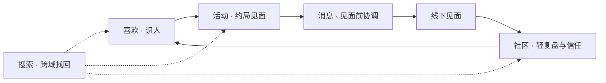
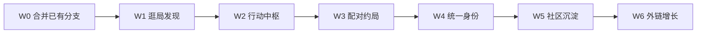

# Spark 产品整合方案与投资人审视

**Status:** Shipped on `main` · Staging verified 2026-06-07 (`staging-smoke.sh` incl. trust + recap)  
**Last updated:** 2026-06-07  
**Audience:** 产品、工程、融资讨论  
**Prerequisites:** [DEVELOPMENT_PLAN.md](DEVELOPMENT_PLAN.md) · [ACTIVITY_UPGRADE_PLAN.md](ACTIVITY_UPGRADE_PLAN.md) · [LIKES_DEVELOPMENT_PLAN.md](LIKES_DEVELOPMENT_PLAN.md) · [adr/0001-likes-tab-social-discovery.md](adr/0001-likes-tab-social-discovery.md)  
**Principles:** [DESIGN_PHILOSOPHY.md](DESIGN_PHILOSOPHY.md) · [ARCHITECTURE.md](ARCHITECTURE.md)

---

## 0. 摘要（Executive Summary）

Spark 在 **iOS 工程与模块化** 上已达到可演示的 MVP 广度：五 Tab（喜欢 / 社区 / 消息 / 活动 / 搜索）、Mock/Live 双轨、深链与单元测试骨架齐全。但在 **产品整合度** 上，五个模块更像「垂直切片集合」，缺少一根用户可感知的 **「线下见面」脊柱**，模块间联动停留在导航跳转，尚未形成可量化的转化闭环。

本方案提出：

1. **产品叙事收敛**：「用真实线下局，认识可信的人」
2. **六根整合支柱**：逛局发现 · 行动中枢 · 配对约局 · 统一身份 · 社区沉淀 · 外链增长
3. **六波落地顺序（W0–W6）**，与现有 Phase 15+ 对齐，不推翻 ADR 边界
4. **四条核心指标** 衡量联动是否真实有效，而非功能数量

**投资人视角结论（先行给出，详见 §7）：**

| 维度 | 判断 |
|------|------|
| 技术执行与工程纪律 | **偏强** — 可支撑快速迭代 |
| 产品差异化清晰度 | **中等偏弱** — 双引擎（人发现 + 局）尚未拧成一股绳 |
| 市场与竞争 | **高风险** — 赛道拥挤，需明确细分切口与留存证据 |
| 当前融资叙事完整度 | **不足** — 缺 Staging 真实数据、留存、单位经济模型 |
| 本方案可信度 | **中等** — 方向合理，但需用实验验证假设，避免「功能整合幻觉」 |

---

## 1. 问题陈述：完整度、契合度、联动性

### 1.1 五 Tab 现状矩阵

| Tab | 用户心智 | 工程完整度（main） | 跨模块联动 | 主要缺口 |
|-----|----------|-------------------|------------|----------|
| 喜欢 | 刷人、配对 | 高（Likes Phase 0–13） | 弱：共同活动一行 → 跳详情 | 配对后无「约局」闭环 |
| 活动 | 我的局、主办 | 高（Activity Phase 1–14） | 中：RSVP → 群聊、分享链 | **公开逛局 UI 在 main 缺失** |
| 消息 | 聊天 | 低：纯 thread 列表 | 被动承接 DM/群聊 | 无待办中枢 |
| 社区 | 看帖子 | 低：列表 + 详情 | 弱：recap 有 router 钩子未产品化 | 与局/人关系断裂 |
| 搜索 | 找东西 | 中：建议 + 结果 | 中：可跳转实体 | 工具属性强，非发现入口 |

### 1.2 联动现状：导航有，关系无

`AppRouter` 已支持 Tab 切换 + pending 深链（活动详情、社区帖、Inbound、会话等），属于 **导航级联动**。缺失的是 **关系级联动**：

- 同一个人在喜欢、活动参加者、社区作者、消息头像中 **身份与信任信号不一致**
- 配对成功 ≠ 有共同行动建议；报名成功 ≠ 见面前社交证明充分
- 社区发帖动机弱：活动结束后未形成「轻复盘 → 信任 → 下一场」习惯

### 1.3 战略文档与产品现实的裂缝

[DEVELOPMENT_PLAN.md](DEVELOPMENT_PLAN.md) 0→1 策略写明：**逛局 → 邀友 → 报名 → 群聊** 为主路径。  
[adr/0001-likes-tab-social-discovery.md](adr/0001-likes-tab-social-discovery.md) 正确地将「人发现」迁至 `SparkLikes`，但 **`GET /v1/activities/browse` 在 main 上无 UI**。结果是：

- **获客路径（B）** 在可运行 App 中几乎不可见
- **供给路径（主办创建局）** 有入口，但 **需求侧（逛局者）** 弱，双边市场冷启动风险放大

### 1.4 未合并分支提示

`origin/feat/community-tab-upgrade` 含社区升级、统一收件箱、HIG/iPad 等 12 个超前提交。整合方案 W0 建议优先评估合并，避免「方案基于已写但未上线的能力」或「重复造轮子」。

---

## 2. 北极星：产品叙事与模块角色

### 2.1 一句话定位

> **用真实线下局，认识可信的人。**

### 2.2 五 Tab 在叙事中的位置（不是五个产品）



| 模块 | 角色 | 成功的用户感受 |
|------|------|----------------|
| 喜欢 | 降低「认识陌生人」成本 | 「这人靠谱，想见面」 |
| 活动 | 把线上关系拉到线下 | 「这周末有局，敢报名」 |
| 消息 | 行动与协调，不是纯聊天 | 「今天要处理的事在这里」 |
| 社区 | 见面后的信任沉淀 | 「办得好不好，有据可查」 |
| 搜索 | 找回人与局 | 「上次那个局/人，一下找到」 |

### 2.3 设计约束（不可违背）

- **形式服从功能** — 不为整合而加装饰 Tab 或 hero 动画
- **ADR 边界** — 喜欢 Tab 不挂活动列表；逛局走活动/社区子导航 + 新 ADR
- **最小可验证增量** — 每波一个假设 + 一个指标，而非大而全 PR

---

## 3. 整合方案：六根支柱

### 支柱 A — 逛局发现（脊柱 · 供给与获客）

**用户痛点：** 不知道 App 能干什么；主办创建了局却没人看见。  
**爽感参考：** Meetup / 豆瓣同城 — 刷到「周末羽毛球」立刻想报名。

| 项 | 交付 | 模块 / API |
|----|------|------------|
| A.1 | 活动 Tab 双轴：`我的` + `发现` | `SparkActivity` |
| A.2 | `GET /v1/activities/browse` UI（时间窗、类别筛选可渐进） | 契约已有规划 |
| A.3 | 发现卡片：主办可信度、报名人数、共同兴趣（字段渐进） | Backend + DTO |
| A.4 | 新 ADR：逛局 UI 挂载点（不违反 ADR-0001） | `docs/adr/` |

**不做：** 第六个 Tab；在喜欢 Tab 复挂活动流。

---

### 支柱 B — 行动中枢（联动枢纽）

**用户痛点：** Inbound、待 RSVP、改期分散在三个 Tab，焦虑高、行动慢。  
**爽感参考：** 微信服务通知 + 集中收件箱 — 打开即知「今天要处理什么」。

| 项 | 交付 | 模块 |
|----|------|------|
| B.1 | 消息 Tab 顶部 Action Items（待 RSVP / Inbound / 改期 / 待破冰） | 新域 `InboxItem` 或扩 `SparkMessages` |
| B.2 | 每项一键主操作 + `AppRouter` 路由 | `SparkAppShell` |
| B.3 | Push 点击落入行动项（Phase 16 对齐） | `SparkAppDelegate` |

**架构建议：** 各 Repository 暴露 `fetchPendingActions()`；`CompositionRoot` 聚合，**不把各业务逻辑塞进 Messages 包**。

**优先合并：** `feat/community-tab-upgrade` 中 unified inbox 相关提交。

---

### 支柱 C — 配对 → 约局闭环（差异化爽感）

**用户痛点：** 配对后尬聊，7 日留存低（行业通病）。  
**爽感参考：** Bumble 活动建议、Timeleft 陌生人饭局 — 「一起去做点什么」。

| 项 | 交付 |
|----|------|
| C.1 | `MatchSheetView` 第二 CTA：「看共同活动 / 推荐一局」 |
| C.2 | 无共同活动时：推荐公开小局或「3 人咖啡局」轻量模板（复用 `CreateActivityView`） |
| C.3 | 配对首条消息支持 activity 卡片预览（富文本/链接） |

**核心指标：** `match_to_rsvp_7d`（见 §5）

---

### 支柱 D — 统一身份层（完整度基础）

**用户痛点：** 同一个人在不同模块呈现不一致，信任感碎裂。  
**爽感参考：** 「我们怎么认识的」时间线 — 共同局、共同群、是否配对。

| 项 | 交付 |
|----|------|
| D.1 | `SparkProfile`（或 `SparkIdentity`）包 — 最小 `UserProfileCard` |
| D.2 | 活动参加者 / 社区作者 / 喜欢卡片 / 消息头像统一跳转 |
| D.3 | API：`GET /v1/users/{id}/context`（关系上下文） |

**CTA 动态：** 发消息 / 邀请参加活动 / 喜欢回去 — 按关系状态切换。

---

### 支柱 E — 社区 = 见面后信任沉淀

**用户痛点：** 社区与局割裂，用户无理由发帖。  
**爽感参考：** 小红书轻笔记、Google Maps 评价 — 活动结束后 3 图复盘。

| 项 | 交付 |
|----|------|
| E.1 | 活动「已结束」强 CTA：写复盘（产品化 `pendingCommunityRecapActivityID`） |
| E.2 | 社区筛选：参加过的局 / 关注的主办 |
| E.3 | 帖子详情关联活动卡片 → 可报名下一场 |

**不做：** 重型 UGC、无限推荐流、长视频。

---

### 支柱 F — 搜索与外链（增长杠杆）

| 项 | 交付 | 对齐 Phase |
|----|------|------------|
| F.1 | 搜索分 **人 / 局 / 帖**；各 Tab 内嵌局部搜索 | API 扩展 |
| F.2 | Universal Link `https://spark.app/a/{id}` | Phase 17 |
| F.3 | 分享卡片带动态信息（时间/地点/N 人已报名） | Phase 17–18 |
| F.4 | Push：活动提醒、Inbound、改期 | Phase 16 |

---

### 支柱 G — 商业化再对齐（可选，W6 后）

**现状问题：** 非订阅用户「活动列表第 2 行起锁定」 — 惩罚感大于价值感。

**建议方向：**

| 免费 | 付费 |
|------|------|
| 完整逛局 + 每月 N 次报名 + 基础喜欢 | 谁喜欢我、无限 Rewind、主办工具（候补/群发）、推广位 |

付费锚点：**提高见面成功率**，而非藏列表。

---

## 4. 落地波次（W0–W6）



| Wave | 主题 | 关键交付 | 验证假设 | 预估工期* |
|------|------|----------|----------|-----------|
| **W0** | 减债合并 | 评估合并 `feat/community-tab-upgrade` | 已有能力可上线 | ✅ |
| **W1** | 脊柱 | 活动 browse sheet + RSVP | 用户能找到局并 RSVP | ✅ |
| **W2** | 中枢 | Action Items + unified inbox | 待办完成率上升 | ✅ |
| **W3** | 闭环 | Match → 三人咖啡局 | 配对后 7 日内报名率 | ✅ |
| **W4** | 身份 | Profile + Trust | 信任信号提升报名转化 | ✅ |
| **W5** | 沉淀 | 活动复盘 + 筛选 UI | 主办复购 / 再办一场 | ✅ |
| **W6** | 增长 | Universal Link + 分享文案 | 邀请链路转化 | ✅ |

\* 含 iOS + 契约；后端 Staging 并行，不含后端从零建设。

**PR 纪律：** 每波 ≤ ~400 行 diff；Conventional Commits：`feat(integration): W1 activity browse tab`。

**与现有 Phase 映射：**

| 本方案 | 现有文档 |
|--------|----------|
| W1 | ACTIVITY_UPGRADE Phase 19（发现增强）提前 |
| W2 | Phase 16 Push + 新 Inbox 域 |
| W6 | Phase 17–18 |
| W4–W5 | Phase 23–24 信任与事后 |

---

## 5. 成功指标（必须可测量）

整合是否成功，不看功能数，看 **跨模块转化率**。

| 指标 | 定义 | W1 目标（Mock→Staging） | 说明 |
|------|------|-------------------------|------|
| `browse_to_rsvp` | 发现页曝光 → 报名 | ≥ 8%（行业需校准） | 逛局脊柱是否成立 |
| `match_to_rsvp_7d` | 配对后 7 日内双方任一方报名同一局 | ≥ 15% | 差异化闭环 |
| `rsvp_to_group_msg_24h` | 报名后 24h 活动群发言 | ≥ 40% | 协调是否发生 |
| `activity_end_to_recap` | 结束后 7 日内发社区复盘 | ≥ 10% | 信任沉淀 |
| `d1_retention` / `d7_retention` | 次日 / 7 日留存 | 基线建立后 +5pp | 整体健康度 |
| `invite_link_to_rsvp` | 分享链打开 → 报名 | Staging 实测 | 增长杠杆 |

**实验方法：** 每波上线后 2 周看指标；不达标则回滚或改假设，不堆下一波功能。

**iOS 埋点（`IntegrationTelemetry` in SparkCore）：** `integration_browse_impression` · `integration_browse_to_rsvp` · `integration_match_to_activity_intent` · `integration_rsvp_completed` · `integration_group_msg_after_rsvp` · `integration_activity_end_to_recap` · `integration_invite_link_opened` · `integration_invite_link_to_rsvp` — 结构化 OSLog，无 PII。

---

## 6. 风险与缓解

| 风险 | 影响 | 缓解 |
|------|------|------|
| 双边市场冷启动 | 无局无人、无人无局 | W1 逛局 + 运营种子局；主办工具简化 |
| 功能整合幻觉 | 跳转多了，留存不变 | 强制每波绑定 §5 单一指标 |
| 赛道同质化 | 像 Tinder + Meetup 拼装 | 咬住「线下局 = 信任锚点」叙事与数据 |
| 后端 Staging 滞后 | iOS Mock 无法验证真转化 | Phase 15 与 W1 并行，禁止长期 Mock-only |
| 合规（CN） | 实名、算法备案、UGC 审核 | 私信/报名门槛、内容审核管线单独 ADR |
| 分支债务 | main 与 feature 分叉 | W0 强制合并评审 |
|  scope 膨胀 | 六根支柱同时开工 | 严格 W0→W1→W2 顺序，W4+ 可并行后端 |

---

## 7. 投资人视角：公正审视

> 以下按 **早期消费社交 / 活动交友** 赛道常见投资框架撰写，不代表任何具体机构立场。目的是 **公平呈现亮点与硬伤**，便于团队自检融资叙事。

### 7.1 投资 thesis 可能长什么样

**看涨叙事（Bull Case）：**

Spark 试图解决 dating app「只聊不见面」和活动平台「只局不认识人」的断层，用 **线下局作为信任与转化的中间层**，在中国社交生态里若打通微信传播 + 本地化运营，有机会在 **细分类目（如城市青年线下局 / 兴趣局）** 占据心智。

**看跌叙事（Bear Case）：**

产品同时做 **人发现（喜欢）** 和 **活动平台**，是两条都做了、两条都重的路径；赛道已有 Soul、青藤、各类小程序活动群、小红书同城等，**没有清晰证据表明 Spark 的留存或供给密度优于替代品**。当前主要是 **可演示的 iOS 客户端**，离 **可规模化的双边网络** 仍有距离。

**客观判断：** 两种叙事都成立一部分；融资成败取决于团队能否在 **90 天内** 用 Staging/real users 证明 **某一细分场景** 的 `browse_to_rsvp` 与 `d7_retention`，而非证明「功能很全」。

---

### 7.2 对 Spark 项目现状的 investor due diligence 式评估

#### 优势（会被加分项）

| 项 | 证据 | 投资含义 |
|----|------|----------|
| 工程纪律 | SPM 模块化、Mock/Live、CI、`make check`、ADR、契约文档 | 降低迭代成本，适合小团队快试 |
| MVP 广度 | 五 Tab 主路径在 Mock 上可跑通 | 可做 TestFlight 定性访谈 |
| 产品哲学清晰 | 反装饰 UI、形式服从功能 | 控制 burn rate，避免无效工时 |
| 中国区意识 | 文档提及合规、微信、备案 | 团队有 reality check |
| 技术选型主流 | Swift 6、SwiftUI、StoreKit 2 | 招聘与维护友好 |

#### 劣势与红旗（投资人会直接问）

| 项 | 现状 | 严重程度 |
|----|------|----------|
| **无 Staging 真实数据** | 后端 Phase 15–16 待部署 | ⛔ 高 — 无法验证留存与转化 |
| **双边网络未证明** | 逛局 UI 在 main 缺失 | ⛔ 高 — 供给/需求循环未闭环 |
| **定位宽泛** | 交友 + 活动 + 社区 | ⚠️ 中高 — 易被归为「又一个社交 App」 |
| **护城河不清晰** | 深度链接、卡片流、RSVP 均可复制 | ⚠️ 中 — 需运营/数据/合规壁垒故事 |
| **单位经济未建模** | 付费墙锁第 2 行活动 | ⚠️ 中 — ARPU/LTV 假设弱 |
| **main 与 feature 分叉** | 12 commits 未合并 | 💡 中 — 执行与发布节奏风险 |
| **团队规模未知** | 代码库不能证明运营能力 | ❓ — 线下局重度依赖运营 |

#### 竞品参照（投资人会用来压估值）

| 竞品 / 替代 | 优势 | Spark 需回答的问题 |
|-------------|------|-------------------|
| Soul / 探探 / 青藤 | 人发现成熟、存量大 | 用户为何来 Spark 见面而非继续聊？ |
| 豆瓣同城 / 活动行 / 小程序 | 活动供给与习惯 | Spark 供给密度能否更高？ |
| 微信群 + 私域 | 零成本、强信任 | Spark 比微信群多什么？（日历、信任、陌生人扩圈） |
| 小红书 | 内容信任 → 线下 | 社区是否必要，还是分散焦点？ |

**公正结论：** Spark 目前更像 **「技术完成度较高的原型」**，而非 **「已验证 PMF 的产品」**。这对 **天使 / 种子前** 是合理阶段；对 **A 轮** 通常需要留存曲线与供给密度数据。

---

### 7.3 对本整合方案的 investor 式审视

#### 方案中 **值得投资** 的部分

1. **W1 逛局脊柱** — 直接修补文档战略与产品现实的裂缝；若只做一件事，ROI 最高。  
2. **W2 行动中枢** — 降低多 Tab 焦虑，对 D7 留存有理论支撑，且复用未合并分支工作。  
3. **§5 指标驱动** — 符合投资人要的「可 falsify 假设」，比「加功能」叙事可信。  
4. **叙事收敛** — 「线下局认识人」比「五 Tab 全能」更易讲清且易聚焦运营。  
5. **不做清单明确** — 控制 scope，对资本效率友好。

#### 方案中 **会被挑战** 的部分

| 论点 | 投资人质疑 | 理性回应 |
|------|------------|----------|
| 「六根支柱都要做」 | 6 个月烧多少？聚焦呢？ | 承认 W4–W6 可延后；**W1+W2 为融资 MVP** |
| 「配对 → 约局」差异化 | Bumble 做过，失败过不少 | 需 A/B：仅对 **intent=friends / 同城** 开启 |
| 「社区复盘」 | 小红书已满足 | 仅服务 **参加过局** 的人，不做公域内容 |
| 「统一 Profile」 | 3–4 周是否低估？ | 可砍到只读卡片 MVP，无编辑 |
| 「付费改模型」 | 收入何时出现？ | 需单独财务模型；W6 后再动商业化 |

#### 方案盲点（本方案刻意未覆盖、但投资相关）

1. **运营 playbook** — 种子城市、每周几场局、主办激励、线下安全预案  
2. **获客成本（CAC）** — 微信裂变系数、Universal Link 转化实测  
3. **信任与安全成本** — 实名、审核、保险、法务  
4. **后端与数据团队** — iOS 领先时，估值需打折除非后端并行  
5. **退出叙事** — 战略收购（腾讯/字节/美团本地生活）vs 独立 IPO 极难

---

### 7.4 融资阶段建议（客观）

| 阶段 | Spark 现状匹配度 | 建议叙事重点 | 建议暂缓声称 |
|------|------------------|--------------|--------------|
| **天使 / Pre-seed** | 较匹配 | 团队、原型、细分场景假设、W1 实验设计 | 「已 PMF」「百万用户」 |
| **Seed** | 需补数据 | 1 城 TestFlight、留存、供给密度、邀请转化 | 全国扩张、全模块整合 |
| **Series A** | 目前不匹配 | — | 需 DAU、留存、收入或明确增长曲线 |

**若 6 个月内只能交付两波：** 选 **W1 + W2**，用 §5 前三项指标出报告，比完成 W0–W6 更能说服理性投资人。

---

### 7.5 对创始团队的直接建议（非仅对产品）

1. **选一个城市、一个场景**（如「上海周末咖啡局」或「同城徒步」），不要全国泛社交。  
2. **Staging 与运营同步上线** — 投资人看的是「局密度」，不是 Mock 卡片数。  
3. **合并 feature 分支或废弃** — 分叉是执行红旗。  
4. **准备一页纸单位经济** — 即使假设：CAC、每场局主办成本、付费转化率。  
5. **诚实讲失败预案** — 若 `match_to_rsvp_7d` 不达标，是否砍掉喜欢 Tab、纯做活动平台？有 pivot 计划反而增信。

---

## 8. 决策记录与后续文档

| 决策 | 建议 |
|------|------|
| 逛局 UI 挂载点 | 新开 ADR-0002，提议活动 Tab `发现` 子导航 |
| Inbox 域边界 | 新开 ADR-0003，`InboxItem` 聚合 vs Messages 内嵌 |
| W0 合并范围 | 技术评审 `feat/community-tab-upgrade` 逐 commit |

**后续更新：**

- 实验结果回填 §5 目标列  
- Staging 数据就绪后修订 §7.4 阶段匹配度  
- 与 [ACTIVITY_UPGRADE_PLAN.md](ACTIVITY_UPGRADE_PLAN.md) 冲突时，以 **指标验证结果** 为准调整 Phase 顺序

---

## 9. 附录：验证命令

```bash
make check && make lint && make test-packages && make build
```

Manual（W1 后）：Mock 登录 → 活动「发现」→ 报名 → 群聊发言 → 消息 Action Items 出现待办 → 指标埋点（`LikesTelemetry` / 活动 signpost 扩展）。

---

*本文档为战略与融资讨论稿，不替代 [DEVELOPMENT_PLAN.md](DEVELOPMENT_PLAN.md) 中的工程验收条款。实施前须经产品与技术评审确认 W0 合并范围与后端并行计划。*
