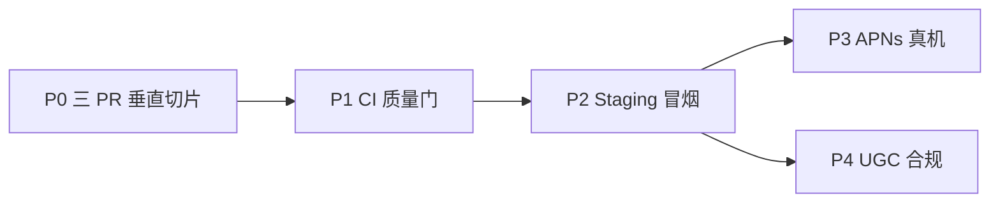

# Spark — 开发进程计划（Sprint 2026-06）

**Status:** Active  
**Last updated:** 2026-06-05  
**基线：** [DEVELOPMENT_PLAN.md](DEVELOPMENT_PLAN.md) Phase 0–14 ☑ · Phase 25+ 部分交付  
**原则：** [DESIGN_PHILOSOPHY.md](DESIGN_PHILOSOPHY.md) — 形式服从功能；一 PR 一用户旅程

---

## 目标

将工作区中已实现的 **消息统一收件箱**、**逛局时间筛选**、**头像上传接线**、**Push 路由扩展** 按优先级拆成可 review 的垂直切片，通过 CI 与 Staging 冒烟后合并；外部依赖项（真 Push、UGC 合规）单独立项不阻塞本 Sprint。



---

## P0 — 拆 PR 并交付（本 Sprint 核心）

### PR-1：`feat(messages): unified inbox with action items`

**用户故事：** 作为用户，我想在消息 Tab 一眼看到待处理邀请、新配对和会话，以便优先处理高价值互动。

| # | 交付物 | 模块 | 状态 |
|---|--------|------|------|
| 1.1 | `GET /v1/messages/inbox` + dismiss + invite respond | `cloudfunctions/spark-api` | ☑ |
| 1.2 | `migrate-inbox-state.js` 冷启动合并 seed | Backend | ☑ |
| 1.3 | Domain：`MessagesInbox`、`ActionItem`、`ConversationPreview` | `SparkMessages` | ☑ |
| 1.4 | UseCase：`FetchInbox`、`DismissActionItem`、`RespondToActivityInvite`、`EnsureDirectMessageThread` | `SparkMessages` | ☑ |
| 1.5 | UI：行动卡 / 新配对轮播 / DM·群聊 / 归档 | `SparkMessages/Presentation/Inbox/` | ☑ |
| 1.6 | `MessagesRootView` 三栏 + `ConversationDetailView` 气泡 | `SparkMessages` | ☑ |
| 1.7 | `API_CONTRACT.md` inbox 契约 | docs | ☑ |
| 1.8 | ViewModel / DTO / Mock 测试 | `SparkMessagesTests` | ☑ |
| 1.9 | `staging-smoke.sh` inbox + dismiss | scripts | ☑ |

**验收：**

- Mock：消息 Tab 显示行动卡 ≥1、新配对轮播、DM/群聊分区；dismiss 后卡片消失
- Staging：`scripts/staging-smoke.sh` inbox 段通过
- `make test-packages` 中 `SparkMessagesTests` 全绿

**明确不做：** WebSocket 实时收件箱、行动卡动画、自定义 Tab 角标样式

---

### PR-2：`feat(activity): browse time window filter`

**用户故事：** 作为逛局用户，我想按「本周 / 本月」筛选公开活动，以便快速找到近期局。

| # | 交付物 | 模块 | 状态 |
|---|--------|------|------|
| 2.1 | `ActivityBrowseTimeWindow`（all / thisWeek / thisMonth） | `SparkActivity` | ☑ |
| 2.2 | ViewModel `selectedTimeWindow` → `ActivityBrowseQuery` | `SparkActivity` | ☑ |
| 2.3 | `ActivityBrowseFilterBar` + `ActivityBrowseContent`（发现内嵌） | `SparkActivity` | ☑ |
| 2.4 | 后端 `starts_after` / `starts_before` 查询 | `spark-api` | ☑ |
| 2.5 | `ActivityBrowseViewModelTests` | `SparkActivityTests` | ☑ |
| 2.6 | Staging smoke browse 时间筛选 | `staging-smoke.sh` | ☑ |

**验收：**

- Mock：切换「本周」后列表 reload，`startsAfter`/`startsBefore` 非 nil
- Staging：带时间 query 的 browse 返回 ≤ 全量条数

---

### PR-3：`feat(likes): avatar upload wiring + push payloads`

**用户故事：** 作为用户，我想上传头像并在收到消息/社区 Push 时直达对应页面。

| # | 交付物 | 模块 | 状态 |
|---|--------|------|------|
| 3.1 | `AvatarUploadPrepared` + `AvatarUploadTransport.put` | `SparkLikes` | ☑ |
| 3.2 | `RequestAvatarUploadUseCase` + `LikesFeedViewModel.uploadAvatarJPEG` | `SparkLikes` | ☑ |
| 3.3 | `POST /v1/users/avatar/upload-url` | Backend | ☑ |
| 3.4 | `MessagesPushPayload` / `CommunityPushPayload` | `SparkAppShell` | ☑ |
| 3.5 | `SparkAppDelegate` 路由扩展 | `Spark` | ☑ |
| 3.6 | Payload 单元测试 | `SparkAppShellTests` | ☑ |
| 3.7 | Staging smoke upload-url | `staging-smoke.sh` | ☑ |

**验收：**

- Mock：`upload_url == nil` 时跳过 PUT，仅保存 `avatar_url`
- Live：`upload_url` 存在时 PUT JPEG 后 `saveViewerProfile` 成功
- Push：`messages.new` → `openConversation`；`community.reply` → `openCommunityPost`

**明确不做（MODULE-F 续）：** COS 生产密钥、图片内容审核、多尺寸裁切

---

## P1 — 质量门（合并前必过）

| 命令 | 用途 | 通过标准 |
|------|------|----------|
| `make check` | secrets / UI / API contract guardrails | 0 失败 |
| `make lint` | SwiftLint strict | 0 violations |
| `make test-packages` | 12 个 `Spark*` 包单元测试 | 全绿 |
| `make ci` | lint + test-packages + build + test-app | 全绿（发 PR 前推荐） |

**PR 纪律：** 每 PR ≤ ~400 行；Conventional Commits；[CONTRIBUTING.md](CONTRIBUTING.md) checklist

---

## P2 — Staging 验证（合并后 / 发版前）

1. 重部署 `cloudfunctions/spark-api`（含 `migrate-inbox-state.js`）
2. 运行：

```bash
SPARK_API_BASE_URL=https://<team-host> ./scripts/staging-smoke.sh
```

3. 手动 spot-check（Simulator + Staging xcconfig）：
   - 消息 Tab 三栏布局
   - 活动 Tab → 逛局 → 时间筛选
   - 喜欢 Tab → 头像选择（Mock 跳过 PUT）

---

## P3 — APNs 真机（外部依赖，不阻塞 P0）

| 前置 | 动作 |
|------|------|
| Apple Developer Program 付费 Team | 配置云函数 `APNS_KEY_ID` / `APNS_TEAM_ID` / `APNS_PRIVATE_KEY` / `APNS_BUNDLE_ID` |
| TestFlight 或 Debug 真机 | 沙箱 Push：match → 对话；`messages.new` → 线程 |
| 文档 | [ADR-0005](adr/0005-apns-http2-delivery.md) · [STAGING.md](STAGING.md) § APNs |

---

## P4 — Community UGC 合规（外部依赖，不阻塞 P0）

| 前置 | 动作 |
|------|------|
| E.0 合规清单签字 | [COMMUNITY_UGC_COMPLIANCE.md](COMMUNITY_UGC_COMPLIANCE.md) |
| ICP / 内容审核 pipeline | E.3 图文帖 + 自动审核 |
| 微信 SDK | MODULE-H 维持 No-Go |

---

## 实施顺序（工程师执行清单）

| 天 | 任务 | 产出 |
|----|------|------|
| D1 | 提交 PR-2（最小 diff） | `feat(activity): browse time window filter` |
| D1 | 提交 PR-3 | `feat(likes): avatar upload + push payloads` |
| D2 | 提交 PR-1（最大） | `feat(messages): unified inbox` |
| D2 | `make ci` 全绿 | CI 截图 / 日志 |
| D3 | Staging 重部署 + smoke | `staging-smoke.sh` 全 PASS |
| D3+ | P3 / P4 按依赖排期 | 独立 PR，不混入 inbox |

---

## 风险与回滚

| 风险 | 缓解 |
|------|------|
| Inbox API 404 旧 Staging | iOS `LiveMessagesRepository` 回退 `GET /v1/messages/threads` 派生最小 inbox |
| 迁移脚本误删用户线程 | `migrate-inbox-state.js` 仅删 legacy `th_001`；Staging 专用 |
| PR-1 过大难 review | 先 land PR-2/3，再 rebase PR-1 |

**Kill switch：** inbox 问题可暂时让客户端走 threads 回退（契约已文档化）；时间筛选与 Push payload 为增量，可独立 revert。

---

## 相关文档

| 主题 | 文件 |
|------|------|
| 总路线图 | [DEVELOPMENT_PLAN.md](DEVELOPMENT_PLAN.md) |
| 缺失模块 | [MISSING_MODULES_PLAN.md](MISSING_MODULES_PLAN.md) |
| HTTP 契约 | [API_CONTRACT.md](API_CONTRACT.md) |
| Staging | [STAGING.md](STAGING.md) |
| ~~喜欢升级~~ | SparkLikes 模块已移除（2026-06-08） |
